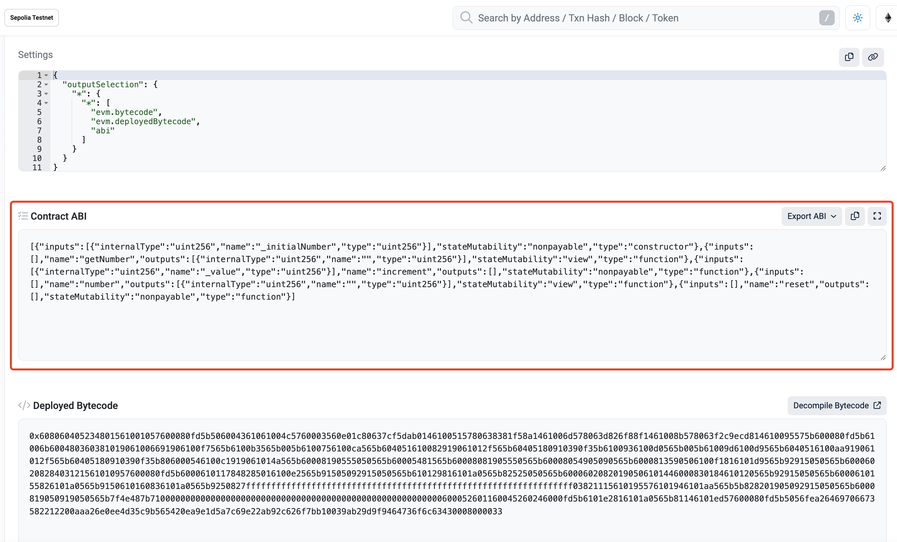
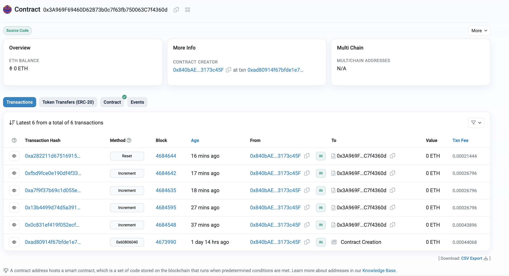

# Abstract 前言

Through this basic task, you can learn the processes of compiling and deploying a smart contract.通过本样例代码，使开发者了解合约编译，部署的基本流程。

# Preparation 准备
Ensure successful publication of section 001.确保001章节发布成功。

# interactWithChain.js

## Define Provider

```javascript
const providerRPC = {
  development: "https://sepolia.infura.io/v3/" + process.env.INFURA_ID,
};
const web3 = new Web3(providerRPC.development); //Change to correct network
```

## Get abi & bin



## Call Contract Interface getNumber

```javascript
let incrementer = new web3.eth.Contract(abi, contractAddress);
  await incrementer.methods
    .getNumber()
    .call()
    .then((result) => {
      console.log("返回值:", result);
    })
    .catch((error) => {
      console.error("读取数据时出错:", error);
    });
```

## Call Contract Interface increment

```javascript
 // Sign with Pk
  let incrementTransaction = await web3.eth.accounts.signTransaction(
    {
      from: account.address,
      to: contractAddress,
      data: incrementTx.encodeABI(),
      gas: 43896 * 2,
      gasPrice: 10000000000,
    },
    account_from.privateKey
  );
  // Send Transactoin and Get TransactionHash
  const incrementReceipt = await web3.eth.sendSignedTransaction(
    incrementTransaction.rawTransaction
  );
```

## Call Contract Interface reset

```javascript
 const resetTx = incrementer.methods.reset();
 const resetTransaction = await web3.eth.accounts.signTransaction(
    {
      from: account.address,
      to: contractAddress,
      data: resetTx.encodeABI(),
      gas: 8000000,
      gasPrice: 10000000000,
    },
    account_from.privateKey
  );

  const resetcReceipt = await web3.eth.sendSignedTransaction(
    resetTransaction.rawTransaction
  );
  console.log(`Tx successful with hash: ${resetcReceipt.transactionHash}`);
  number = await incrementer.methods.getNumber().call();
  console.log(`After reset, the current number stored is: ${number}`);
```



