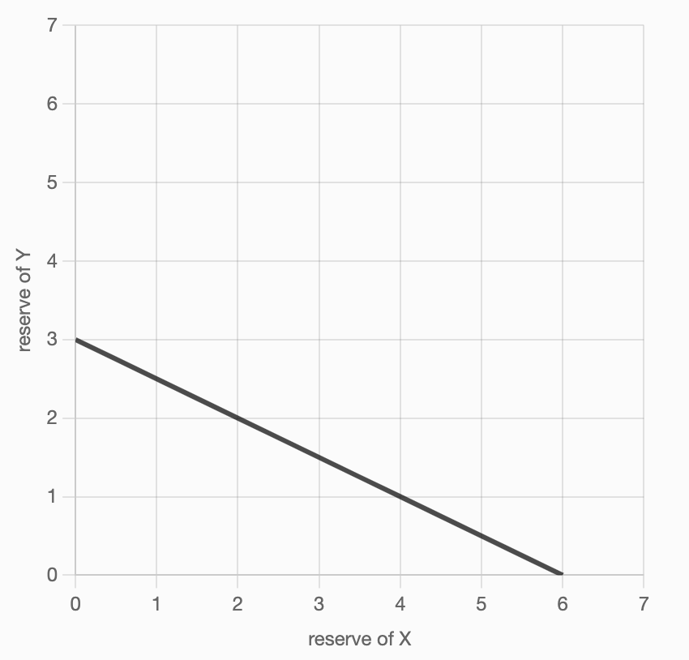
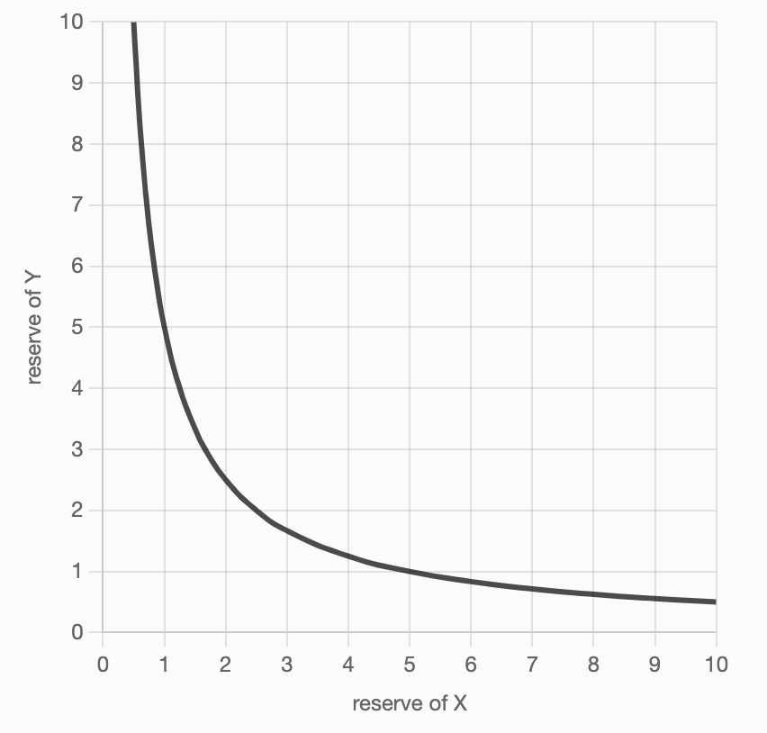

# Programming DeFi: Uniswap. Part 1

Extracted from: 摘自：

https://jeiwan.net/posts/programming-defi-uniswap-1/

## Introduction 介绍

The best way to learn something is to teach others. Second best way to learn something is to do it yourself. I decided to combine the two ways and teach myself and you how to program DeFi services on Ethereum (and any other blockchains based on EVM – Ethereum Virtual Machine).

学习某样东西的最好方法就是教别人。 学习某事的第二个最佳方法是自己动手。 我决定将这两种方法结合起来，教我自己和你如何在以太坊（以及基于 EVM - 以太坊虚拟机的任何其他区块链）上编写 DeFi 服务。

Our main focus will be on how those services work, we’ll try to understand the economical mechanics that make them what they are (and they all based on economical mechanics). We’ll find out, decompose, learn, and build their core mechanisms.

我们的主要关注点将是这些服务如何运作，我们将尝试了解使它们成为现实的经济机制（并且它们都基于经济机制）。 我们将找出、分解、学习并构建它们的核心机制。

However, we’ll only work on smart contracts: building front-end for smart-contracts is also a big and interesting task, but it’s out of the scope of this series.

然而，我们只会研究智能合约：为智能合约构建前端也是一项艰巨而有趣的任务，但这超出了本系列的范围。

Let’s begin our journey with Uniswap.让我们开始 Uniswap 之旅。

A lot of us might have been in a situation wherein we had a brilliant idea, may it be of a product or an event, but just didn’t have the funds to bring it to life. This is where crowdfunding comes in.

我们中的很多人可能都遇到过这样的情况：我们有一个绝妙的想法，可能是一个产品或一个活动，但只是没有资金将其变为现实。 这就是众筹的用武之地。

## Different versions of Uniswap 不同版本的Uniswap

As of June 2021, three versions of Uniswap have been launched.

截至 2021 年 6 月，Uniswap 已推出三个版本。

First version was launched in November 2018 and it allowed only swaps between ether and a token. Chained swaps were also possible to allow token-token swaps.

第一个版本于 2018 年 11 月推出，仅允许以太币和代币之间的交换。 链式交换也可以允许代币之间的交换。

V2 was launched in March 2020 and it was a huge improvement of V1 that allowed direct swaps between any ERC20 tokens, as well as chained swaps between any pairs.

V2 于 2020 年 3 月推出，它是 V1 的巨大改进，允许任何 ERC20 代币之间直接交换，以及任何货币对之间的链式交换。

V3 was launched in May 2021 and it significantly improved capital efficiency, which allowed liquidity providers to remove a bigger portion of their liquidity from pools and still keep getting the same rewards (or squeeze the capital in smaller price ranges and get up to 4000x of profits).

V3 于 2021 年 5 月推出，显着提高了资本效率，这使得流动性提供者可以从池中移走更大一部分流动性，并仍然获得相同的奖励（或者将资本压缩在较小的价格范围内，并获得高达 4000 倍的利润） ）。

In this series, we’ll dig into each of the versions and will try to build simplified copies of each of them from scratch.

在本系列中，我们将深入研究每个版本，并尝试从头开始构建每个版本的简化副本。

**This blog post specifically focuses on Uniswap V1** to respect the chronological order and better understand how previous solutions were improved.

**这篇博文特别关注 Uniswap V1**，以尊重时间顺序并更好地了解以前的解决方案是如何改进的。

## What is Uniswap?

In simple terms, [Uniswap](https://uniswap.org/) is a decentralized exchange (DEX) that aims to be an alternative to centralized exchanges. It’s running on the Ethereum blockchain and it’s fully automated: there are no admins, managers, or users with privileged access.

简单来说，Uniswap 是一个去中心化交易所（DEX），旨在成为中心化交易所的替代品。 它在以太坊区块链上运行并且完全自动化：没有管理员、经理或具有特权访问权限的用户。

On the lower lever, it’s an algorithm that allows to make pools, or token pairs, and fill them with liquidity to let users exchange tokens using this liquidity. Such algorithm is called *automated market maker* or *automated liquidity provider*.

在较低的杠杆上，它是一种算法，允许创建池或代币对，并为其填充流动性，以便用户使用这种流动性交换代币。 这种算法被称为自动做市商或自动流动性提供者。

Let’s learn more about market makers.让我们更多地了解做市商。

Market makers are entities that provide liquidity (trading assets) to markets. Liquidity is what makes trades possible: if you want to sell something but no one is buying it, there won’t be a trade. Some trading pairs have high liquidity (e.g. BTC-USDT), but some have low or no liquidity at all (like some scammy or shady altcoins).

做市商是向市场提供流动性（交易资产）的实体。流动性使交易成为可能：如果你想出售某种东西但没人购买，那么就不会进行交易。有些交易具有较高的流动性（例如BTC-USDT），但有些交易的流动性较低或根本没有流动性（例如一些诈骗或可疑的山寨币）。

A DEX must have enough (or a lot of) liquidity to function and serve as an alternative to centralized exchanges. One way to get that liquidity is for the developers of the DEX to put their own money (or money of their investors) in it and become market makers. However, this is not a realistic solution because they would need a lot of money to provide enough liquidity for all pairs, considering that DEXes allow exchanges between any tokens. Moreover, this would make the DEX centralized: as the only market makers, the developers would have a lot of power in their hands.

DEX 必须拥有足够（或大量）的流动性才能发挥作用并作为中心化交易所的替代品。 获得流动性的一种方法是 DEX 开发商将自己的资金（或投资者的资金）投入其中并成为做市商。 然而，这不是一个现实的解决方案，因为考虑到 DEX 允许任何代币之间的交换，他们需要大量资金来为所有货币对提供足够的流动性。 此外，这将使 DEX 中心化：作为唯一的做市商，开发商手中将拥有很大的权力。

A better solution is to allow **anyone to be a market maker**, and this is what makes Uniswap an automated market maker: any user can deposit their funds into a trading pair (and benefit from that).

更好的解决方案是允许任何人成为做市商，这就是 Uniswap 成为自动化做市商的原因：任何用户都可以将资金存入交易对（并从中受益）。

Another important role that Uniswap plays is **price oracle**. Price oracles are services that fetch token prices from centralized exchanges and provide them to smart contracts – such prices are usually hard to manipulate because volumes on centralized exchanges are often very big. However, while not having that big volumes, Uniswap can still serve as a price oracle.

Uniswap 扮演的另一个重要角色是价格预言机。 价格预言机是从中心化交易所获取代币价格并将其提供给智能合约的服务——此类价格通常很难操纵，因为中心化交易所的交易量通常非常大。 然而，尽管 Uniswap 的交易量没有那么大，但它仍然可以充当价格预言机。

Uniswap acts as a secondary market that attracts arbitrageurs who make profit on differences in prices between Uniswap and centralized exchanges. This makes prices on Uniswap pools as close as possible to those on bigger exchanges. And that wouldn’t have been possible without proper pricing and reserves balancing functions.

Uniswap 作为二级市场，吸引了套利者，他们通过 Uniswap 和中心化交易所之间的价格差异获利。 这使得 Uniswap 池上的价格尽可能接近大型交易所的价格。 如果没有适当的定价和储备平衡功能，这是不可能的。

## Constant product market maker

You probably have already heard this definition, let’s see what it means.

您可能已经听说过这个定义，让我们看看它的意思。

Automated market maker is a general term that embraces different decentralized market maker algorithms. The most popular ones (and those that gave birth to the term) are related to prediction markets - markets that allow to make profit on predictions. Uniswap and other on-chain exchanges are a continuation of those algorithms.

自动做市商是一个通用术语，包含不同的去中心化做市商算法。 最受欢迎的市场（以及诞生该术语的市场）与预测市场有关 - 允许通过预测获利的市场。 Uniswap 和其他链上交易所是这些算法的延续。

At the core of Uniswap is the constant product function:

Uniswap 的核心是恒定乘积函数：
$$
x * y = k
$$


Where *x* is ether reserve, y is token reserve (or vice versa), and *k* is a constant. Uniswap requires that *k* remains the same no matter how much of reserves of x or *y* there are. When you trade ether for tokens you deposit your ethers into the contract and get some amount of tokens in return. Uniswap ensures that after each trade *k* remains the same (this is not really true, we’ll see later why).

其中 *x* 是以太储备，y 是代币储备（反之亦然），*k* 是常数。 Uniswap 要求无论 x 或 *y* 有多少储备，*k* 保持不变。 当您用以太币交易代币时，您将以太币存入合约并获得一定数量的代币作为回报。 Uniswap 确保每次交易后 *k* 保持不变（这不是真的，我们稍后会看到原因）。

This formula is also responsible for pricing calculations, and we’ll soon see how.

这个公式还负责定价计算，我们很快就会看到如何进行。

## Smart contracts development

To really understand how Uniswap works we’ll build a copy of it. We’ll write smart contracts in [Solidity](https://soliditylang.org/) and will use [HardHat](https://hardhat.org/) as our development environment. HardHat is a really nice tool that greatly simplifies development, testing, and deployment of smart contracts. Highly recommended!

为了真正了解 Uniswap 的工作原理，我们将构建一个它的副本。 我们将在 [Solidity](https://soliditylang.org/) 中编写智能合约，并将使用 [HardHat](https://hardhat.org/) 作为我们的开发环境。 HardHat 是一个非常好的工具，它极大地简化了智能合约的开发、测试和部署。 强烈推荐！

If you’re new to smart contracts development, I highly recommend you to finish [this course](https://cryptozombies.io/en/course/) (at least the basic path) – that’ll be a huge help to you!

如果您是智能合约开发的新手，我强烈建议您完成[本课程](https://cryptozombies.io/en/course/)（至少是基本路径）——这将对您有很大帮助 你！

### Setting up the project

First, create an empty directory (I called mine `zuniswap`), `cd` into it and install HardHat:

```bash
$ mkdir zuniswap && cd $_
$ yarn add -D hardhat
```


We’ll also need a token contract, let’s use ERC20 contracts provided by [OpenZeppelin](https://openzeppelin.com/).

```bash
$ yarn add -D @openzeppelin/contracts
```

Initialize a HardHat project and remove everything from `contract`, `script`, and `test` folders.

```bash
$ yarn hardhat
...follow the instructions...
$ rm ...
$ tree -a
.
├── .gitignore
├── contracts
├── hardhat.config.js
├── scripts
└── test
```

Final touch: we’ll use the latest version of Solidity, which is 0.8.4 at the time of writing . Open your `hardhat.config.js` and update Solidity version at the bottom of it.

### Token contract

Uniswap V1 supports only ether-token swaps. To make them possible we need an ERC20 token contract. Let’s write it!

Uniswap V1 仅支持以太币交换。 为了使它们成为可能，我们需要 ERC20 代币合约。 我们来写吧！

```solidity
// contracts/Token.sol
pragma solidity ^0.8.0;

import "@openzeppelin/contracts/token/ERC20/ERC20.sol";

contract Token is ERC20 {
  constructor(
    string memory name,
    string memory symbol,
    uint256 initialSupply
  ) ERC20(name, symbol) {
    _mint(msg.sender, initialSupply);
  }
}
```

This is all we need: we’re extending the ERC20 contract provided by OpenZeppelin and defining our own constructor that allows us to set token name, symbol, and initial supply. The constructor also mints `initialSupply` of tokens and sends them to token creator’s address.

这就是我们所需要的：我们扩展 OpenZeppelin 提供的 ERC20 合约并定义我们自己的构造函数，该构造函数允许我们设置代币名称、符号和初始供应量。 构造函数还铸造“initialSupply”代币并将其发送到代币创建者的地址。

Now, the most interesting part begins!现在，最有趣的部分开始了！

### Exchange contract

Uniswap V1 has only two contracts: Factory and Exchange.

Uniswap V1 只有两个合约：Factory 和 Exchange。

Factory is a registry contract that allows to create exchanges and keeps track of all deployed exchanges, allowing to find exchange address by token address and vice versa. Exchange contract actually defines exchanging logic. Each pair (eth-token) is deployed as an exchange contract and allows to exchange ether to/from only one token.

Factory 是一个注册合约，允许创建交易所并跟踪所有已部署的交易所，允许通过代币地址查找交易所地址，反之亦然。 交换合约实际上定义了交换逻辑。 每对（eth-token）都被部署为交换合约，并允许仅与一个代币交换以太币。

We’ll build Exchange contract and leave Factory to a later blog post.

我们将构建 Exchange 合约并将 Factory 留给稍后的博客文章。

Let’s create a new blank contract:

让我们创建一个新的空白合约：

```solidity
// contracts/Exchange.sol
pragma solidity ^0.8.0;

contract Exchange {}
```

Since every exchange allows swaps with only one token, we need to connect Exchange with a token address:

由于每个交易所只允许使用一种代币进行交换，因此我们需要将交易所与代币地址连接：

```solidity
contract Exchange {
  address public tokenAddress;

  constructor(address _token) {
    require(_token != address(0), "invalid token address");

    tokenAddress = _token;
  }
}
```

Token address is a state variable which makes it accessible from any other contract function. Making it public allows users and developers to read it and to find out what token this exchange is linked to. In the constructor, we’re checking that provided token is valid (not the zero address) and save it to the state variable.

代币地址是一个状态变量，可以从任何其他合约函数访问它。 公开它可以让用户和开发人员阅读它并找出该交易所链接到的代币。 在构造函数中，我们检查提供的令牌是否有效（不是零地址）并将其保存到状态变量中。

### Providing liquidity 提供流动性

As we have already learned, liquidity makes trades possible. Thus, we need a way to add liquidity to the exchange contract:

正如我们已经了解到的，流动性使交易成为可能。 因此，我们需要一种方法来增加交易合约的流动性：

```solidity
import "@openzeppelin/contracts/token/ERC20/IERC20.sol";

contract Exchange {
    ...

    function addLiquidity(uint256 _tokenAmount) public payable {
        IERC20 token = IERC20(tokenAddress);
        token.transferFrom(msg.sender, address(this), _tokenAmount);
    }
}
```


By default, contracts cannot receive ethers, which can be fixed via the `payable` modifier that enables ethers receiving in a function: any ethers sent along with a function call are added to contract’s balance.

默认情况下，合约无法接收以太币，这可以通过“payable”修饰符来修复，该修饰符允许在函数中接收以太币：任何与函数调用一起发送的以太币都会添加到合约的余额中。

Depositing tokens is a different thing: since token balances are stored on token contracts, we have to use `transferFrom` function (as defined by the ERC20 standard) to transfer tokens from transaction sender’s address to the contract. Also, transaction sender would have to call `approve` function on the token contract to allow our exchange contract to get their tokens.

存入代币是另一回事：由于代币余额存储在代币合约上，我们必须使用“transferFrom”函数（由 ERC20 标准定义）将代币从交易发送者的地址转移到合约。 此外，交易发送者必须在代币合约上调用“approve”函数，以允许我们的交易合约获取他们的代币。

> This implementation of `addLiquidity` is not complete. I intentionally made it so to focus more on pricing functions. We’ll fill the gap in a later part.
>
> 这个 `addLiquidity` 的实现并不完整。 我故意这样做是为了更多地关注定价功能。 我们将在后面的部分填补空白。

Let’s also add a helper function that returns token balance of an exchange:

我们还添加一个返回交易所代币余额的辅助函数：

```solidity
function getReserve() public view returns (uint256) {
  return IERC20(tokenAddress).balanceOf(address(this));
}
```

And we can now test `addLiquidity` to ensure everything’s correct:

```javascript
describe("addLiquidity", async () => {
  it("adds liquidity", async () => {
    await token.approve(exchange.address, toWei(200));
    await exchange.addLiquidity(toWei(200), { value: toWei(100) });

    expect(await getBalance(exchange.address)).to.equal(toWei(100));
    expect(await exchange.getReserve()).to.equal(toWei(200));
  });
});
```

First, we let the exchange contract spend 200 of our tokens by calling `approve`. Then, we call `addLiquidity` to deposit 200 tokens (the exchange contract calls `transferFrom` to get them) and 100 ethers, which are sent along with the function call. We then ensure that the exchange did in fact receive them.

首先，我们通过调用approve让交易合约花费200个代币。 然后，我们调用addLiquidity存入200个代币（交易合约调用transferFrom来获取它们）和100个以太币，这些代币随函数调用一起发送。 然后我们确保交易所确实收到了它们。

> I’ve omitted a lot of boilerplate code in tests for brevity. Please check [full source code](https://github.com/Jeiwan/zuniswap/tree/part_1) if something is not clear.
>
> 为了简洁起见，我在测试中省略了很多样板代码。 如果有不清楚的地方，请检查完整的源代码。

### Pricing function

Now, lets think about how we would calculate exchange prices.

现在，让我们考虑一下如何计算汇率。

It might be tempting to think that price is simply a relation of reserves, e.g.:

人们可能会认为价格只是储备的关系，例如：
$$
Px = \frac{y}{x},Py = \frac {x}{y}
$$
And this makes sense: exchange contracts don’t interact with centralized exchanges or any other external price oracle, so they cannot know the right price. In fact, exchange contract is a price oracle. Everything they know is ether and token reserves, and this is the only information we have to calculate prices.

这是有道理的：交易合约不与中心化交易所或任何其他外部价格预言机交互，因此它们无法知道正确的价格。 事实上，兑换合约就是一个价格预言机。 他们所知道的一切都是以太币和代币储备，这是我们计算价格的唯一信息。

Let’s stick to this idea and build a pricing function:

让我们坚持这个想法并构建一个定价函数：

```solidity
function getPrice(uint256 inputReserve, uint256 outputReserve)
  public
  pure
  returns (uint256)
{
  require(inputReserve > 0 && outputReserve > 0, "invalid reserves");

  return inputReserve / outputReserve;
}
```

And let’s test it:

```javascript
describe("getPrice", async () => {
  it("returns correct prices", async () => {
    await token.approve(exchange.address, toWei(2000));
    await exchange.addLiquidity(toWei(2000), { value: toWei(1000) });

    const tokenReserve = await exchange.getReserve();
    const etherReserve = await getBalance(exchange.address);

    // ETH per token
    expect(
      (await exchange.getPrice(etherReserve, tokenReserve)).toString()
    ).to.eq("0.5");

    // token per ETH
    expect(await exchange.getPrice(tokenReserve, etherReserve)).to.eq(2);
  });
});
```

We deposited 2000 tokens and 1000 ethers and we’re expecting the price of token to be 0.5 ethers and the price of ether to be 2 tokens. However, the test fails: it says we’re getting 0 ethers in exchange for our tokens. Why is that?

我们存入了 2000 个代币和 1000 个以太币，预计代币的价格为 0.5 个以太币，以太币的价格为 2 个代币。 然而，测试失败了：它说我们用代币换取了 0 个以太币。 这是为什么？

The reason is that Solidity supports integer division with only floor rounding. The price of 0.5 gets rounded to 0! Let’s fix that by increasing the precision:

原因是 Solidity 支持仅进行舍入的整数除法。 0.5 的价格取整为 0！ 让我们通过提高精度来解决这个问题：

```solidity
function getPrice(uint256 inputReserve, uint256 outputReserve)
  public
  pure
  returns (uint256)
{
    ...

  return (inputReserve * 1000) / outputReserve;
}
```

After updating the test, it’ll pass:

更新后测试，会通过：

```javascript
// ETH per token
expect(await exchange.getPrice(etherReserve, tokenReserve)).to.eq(500);

// token per ETH
expect(await exchange.getPrice(tokenReserve, etherReserve)).to.eq(2000);
```

So, now 1 token equals to 0.5 ethers and 1 ether equals to 2 tokens.

所以，现在 1 个代币等于 0.5 个以太币，1 个以太币等于 2 个代币。

Everything looks correct but what will happen if we swap 2000 tokens for ether? We’ll get 1000 ethers and this is everything we have on the contract! **The exchange would be drained!**

一切看起来都是正确的，但如果我们将 2000 个代币换成以太币会发生什么？ 我们将获得 1000 个以太币，这就是我们合同上的全部内容！ **交易所将被耗尽！**

Apparently, something is wrong with the pricing function: it allows to drain an exchange, and this is not something we want to happen.

显然，定价功能出了问题：它导致交易所耗尽，而这不是我们希望发生的事情。

The reason of that is that the pricing function belongs to a constant **sum** formula, which defines *k* as a constant sum of *x* and *y*. The function of this constant sum formula is a straight line:

原因是定价函数属于常数 **sum** 公式，该公式将 *k* 定义为 *x* 和 *y* 的常数和。 这个常和公式的函数是一条直线：



It crosses *x* and *y* axes, which means it allows 0 in any of them! We definitely don’t want that.

它跨越了*x*和*y*轴，这意味着它允许其中任何一个为0！我们绝对不想那样。

### Correct pricing function 正确的价格函数

Let’s recall that Uniswap is a constant product market maker, which means it’s based on a constant product formula:

让我们回想一下，Uniswap 是一个恒定乘积做市商，这意味着它基于恒定乘积公式：
$$
x*y=k
$$
Does this formula produce a better pricing function? Let’s see.

这个公式能产生更好的定价函数吗？ 让我们来看看。

The formula states that *k* remains constant no matter what reserves (*x* and *y*) are. Every trade increases a reserve of either ether or token and decreases a reserve of either token or ether – let’s put that logic in a formula:

该公式表明，无论储备（*x* 和 *y*）是多少，*k* 都保持不变。 每笔交易都会增加以太币或代币的储备，并减少代币或以太币的储备——让我们将这个逻辑放入一个公式中：
$$
(x+\Delta x)(y-\Delta y) = xy
$$
Where Δ*x* is the amount of ethers or tokens we’re trading for Δ*y*, amount of tokens or ethers we’re getting in exchange. Having this formula we can now find Δ*y*:

其中 Δ*x* 是我们要交易的以太币或代币数量，而 Δ*y* 是我们要交换的代币或以太币数量。 有了这个公式，我们现在可以找到 Δ*y*：
$$
\Delta y = \frac {y\Delta x}{x+\Delta x}
$$
This looks interesting: the function now respects input amount. Let’s try to program it, but note that we’re now dealing with amounts, not prices.

这看起来很有趣：该函数现在考虑输入量。 让我们尝试对其进行编程，但请注意，我们现在处理的是金额，而不是价格。

```solidity
function getAmount(
  uint256 inputAmount,
  uint256 inputReserve,
  uint256 outputReserve
) private pure returns (uint256) {
  require(inputReserve > 0 && outputReserve > 0, "invalid reserves");

  return (inputAmount * outputReserve) / (inputReserve + inputAmount);
}
```

This is a low-level function, so let it be private. Let’s make two high-level wrapper functions to simplify calculations:

```solidity
function getTokenAmount(uint256 _ethSold) public view returns (uint256) {
  require(_ethSold > 0, "ethSold is too small");

  uint256 tokenReserve = getReserve();

  return getAmount(_ethSold, address(this).balance, tokenReserve);
}

function getEthAmount(uint256 _tokenSold) public view returns (uint256) {
  require(_tokenSold > 0, "tokenSold is too small");

  uint256 tokenReserve = getReserve();

  return getAmount(_tokenSold, tokenReserve, address(this).balance);
}
```

And test them:

```javascript
describe("getTokenAmount", async () => {
  it("returns correct token amount", async () => {
    ... addLiquidity ...

    let tokensOut = await exchange.getTokenAmount(toWei(1));
    expect(fromWei(tokensOut)).to.equal("1.998001998001998001");
  });
});

describe("getEthAmount", async () => {
  it("returns correct eth amount", async () => {
    ... addLiquidity ...

    let ethOut = await exchange.getEthAmount(toWei(2));
    expect(fromWei(ethOut)).to.equal("0.999000999000999");
  });
});
```

So, now we’re getting 1.998 tokens for 1 ether and 0.999 ether for 2 tokens. Those amounts are very close to the ones produced by the previous pricing function. However, they’re slightly smaller. Why is that?

The constant product formula we based our prices calculations on is, in fact, a hyperbola:



Hyperbola never crosses *x* or *y*, thus neither of the reserves is ever 0. **This makes reserves infinite!**

And there’s another interesting implication: the price function causes price slippage. The bigger the amount of tokens traded in relative to reserves, the higher the price would be.

This is what we saw in the tests: we got slightly less than we expected. This might be seemed as a drawback of constant product market makers (since every trade has a slippage), however this is the same mechanism that protects pools from being drained. This also aligns with the law of supply and demand: the higher the demand (the bigger output amount you want to get) relative to the supply (the reserves), the higher the price (the less you get).

Let’ improve our tests to see how slippage affects prices:

```javascript
describe("getTokenAmount", async () => {
  it("returns correct token amount", async () => {
    ... addLiquidity ...

    let tokensOut = await exchange.getTokenAmount(toWei(1));
    expect(fromWei(tokensOut)).to.equal("1.998001998001998001");

    tokensOut = await exchange.getTokenAmount(toWei(100));
    expect(fromWei(tokensOut)).to.equal("181.818181818181818181");

    tokensOut = await exchange.getTokenAmount(toWei(1000));
    expect(fromWei(tokensOut)).to.equal("1000.0");
  });
});

describe("getEthAmount", async () => {
  it("returns correct ether amount", async () => {
    ... addLiquidity ...

    let ethOut = await exchange.getEthAmount(toWei(2));
    expect(fromWei(ethOut)).to.equal("0.999000999000999");

    ethOut = await exchange.getEthAmount(toWei(100));
    expect(fromWei(ethOut)).to.equal("47.619047619047619047");

    ethOut = await exchange.getEthAmount(toWei(2000));
    expect(fromWei(ethOut)).to.equal("500.0");
  });
});
```


As you can see, when we’re trying to drain the pool, we’re getting only a half of what we’d expect.

A final thing to note here: our initial, reserves ratio based, pricing function wasn’t wrong. In fact, it’s correct when the amount of tokens we’re trading in is very small compared to reserves. But to make an AMM we need something more sophisticated.

### Swapping functions

Now, we’re ready to implement swapping.

```solidity
function ethToTokenSwap(uint256 _minTokens) public payable {
  uint256 tokenReserve = getReserve();
  uint256 tokensBought = getAmount(
    msg.value,
    address(this).balance - msg.value,
    tokenReserve
  );

  require(tokensBought >= _minTokens, "insufficient output amount");

  IERC20(tokenAddress).transfer(msg.sender, tokensBought);
}
```


Swapping ethers for tokens means sending some amount of ethers (stored in `msg.value` variable) to a payable contract function and getting tokens in return. Note that we need to subtract `msg.value` from contract’s balance because by the time the function is called the ethers sent have already been added to its balance.

Another important variable here is `__minTokens` – this is a minimal amount of tokens the user wants to get in exchange for their ethers. This amount is calculated in UI and always includes slippage tolerance; user agrees to get at least that much but not less. This is a very important mechanism that protects users from front-running bots that try to intercept their transactions and modify pool balances to for their profit.

Finally, the last piece of code for today:

```solidity
function tokenToEthSwap(uint256 _tokensSold, uint256 _minEth) public {
  uint256 tokenReserve = getReserve();
  uint256 ethBought = getAmount(
    _tokensSold,
    tokenReserve,
    address(this).balance
  );

  require(ethBought >= _minEth, "insufficient output amount");

  IERC20(tokenAddress).transferFrom(msg.sender, address(this), _tokensSold);
  payable(msg.sender).transfer(ethBought);
}
```


The function basically transfers `_tokensSold` of tokens from user’s balance and sends them `ethBought` of ethers in exchange.

## Conclusion

That’s it for today! We’re not done yet, but we did a lot. Our Exchange contract can accept liquidity from users, calculate prices in a way that protects from draining, and allows users to swap eth for tokens and back. This is a lot, but some important pieces are still missing:

1. Adding new liquidity can cause huge price changes.
2. Liquidity providers are not rewarded; all swaps are free.
3. There’s no way to remove liquidity.
4. No way to swap ERC20 tokens (chained swaps).
5. Factory is still not implemented.

We’ll do these in a future part!

## Useful links

1. [Introduction to Smart Contracts](https://docs.soliditylang.org/en/latest/introduction-to-smart-contracts.html) a lot of fundamental information about smart contracts, blockchains, and EVM, to learn before beginning developing smart contracts.
2. [Let’s run on-chain decentralized exchanges the way we run prediction markets](https://www.reddit.com/r/ethereum/comments/55m04x/lets_run_onchain_decentralized_exchanges_the_way/), a post on Reddit from Vitalik Buterin where he proposed to use the mechanics of prediction markets to build decentralized exchanges. This gave an idea to use a constant product formula.
3. [Uniswap V1 Documentation](https://uniswap.org/docs/v1/)
4. [Uniswap V1 Whitepaper](https://hackmd.io/@HaydenAdams/HJ9jLsfTz)
5. [Constant Function Market Makers: DeFi’s “Zero to One” Innovation](https://medium.com/bollinger-investment-group/constant-function-market-makers-defis-zero-to-one-innovation-968f77022159)
6. [Automated Market Making: Theory and Practice](http://reports-archive.adm.cs.cmu.edu/anon/2012/CMU-CS-12-123.pdf)


