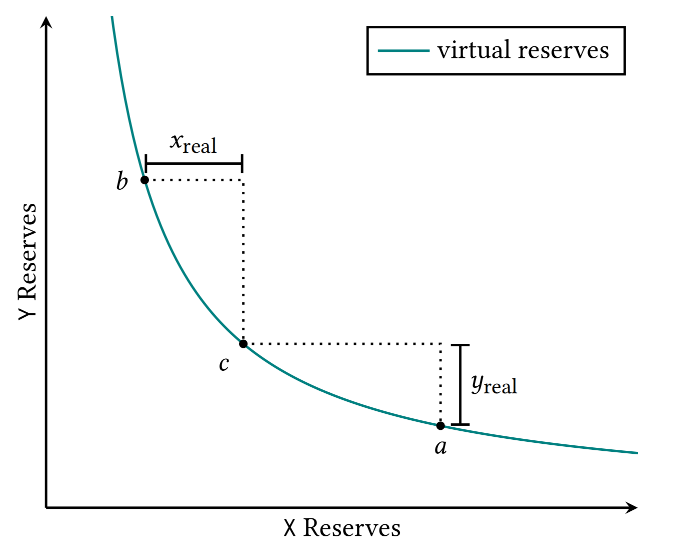
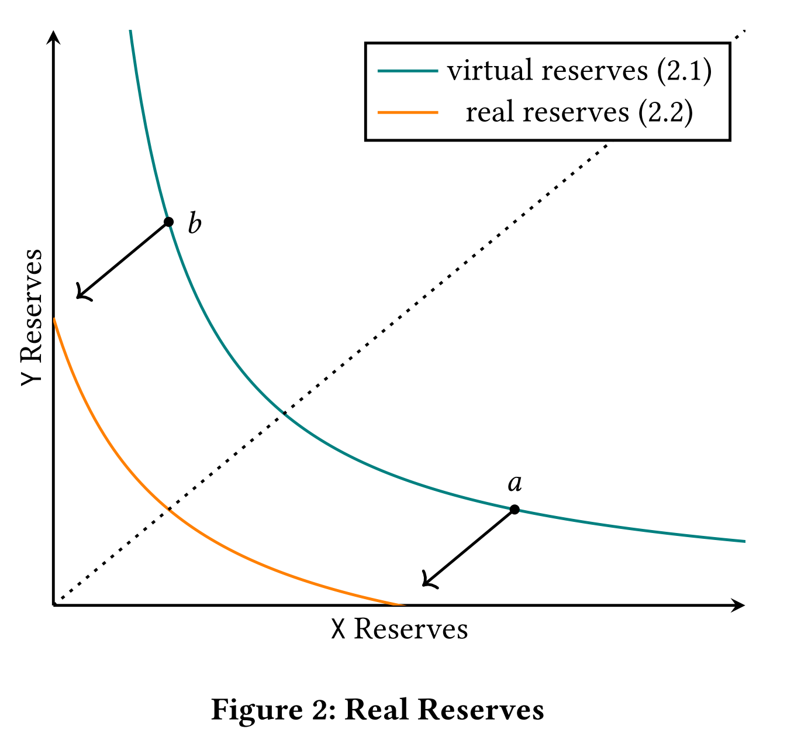
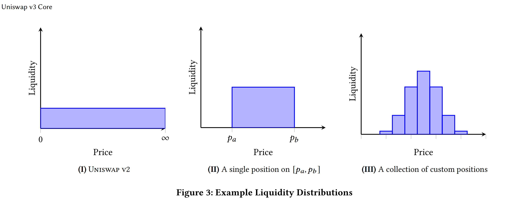
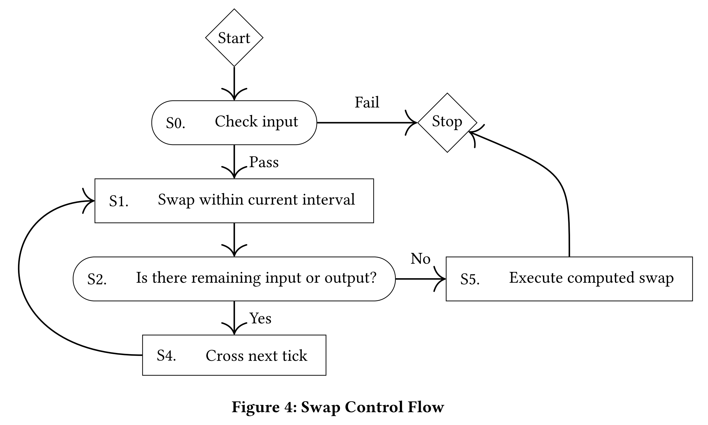
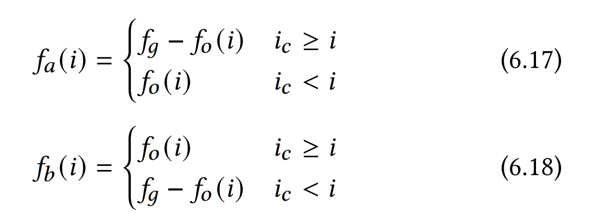
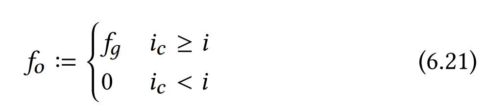
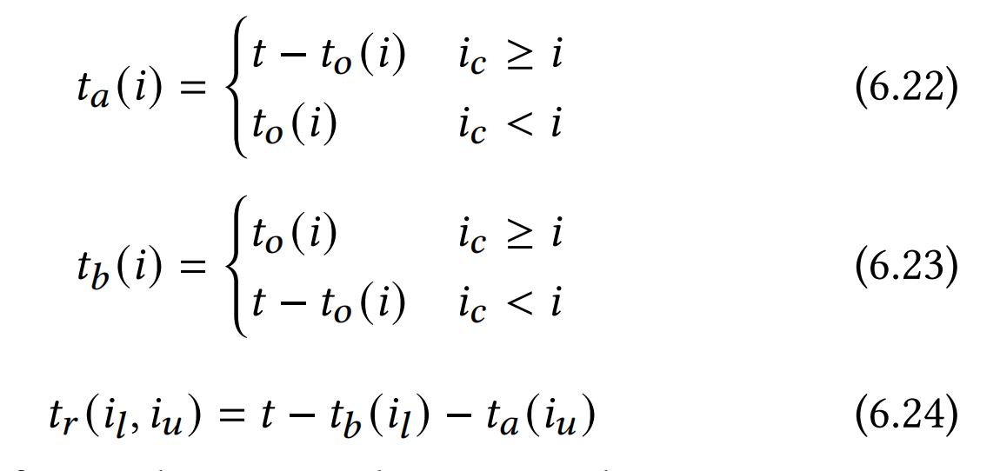
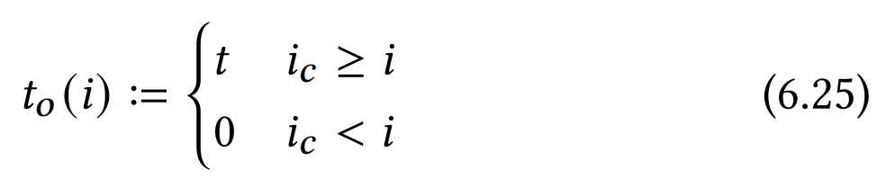
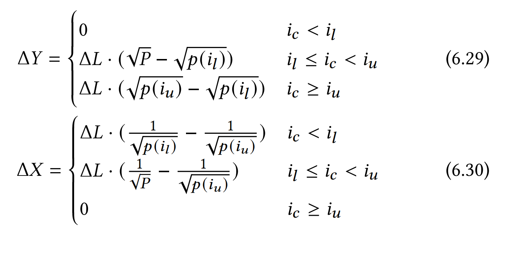

# **Uniswap v3 Core**

## ABSTRACT 概述

Uniswap v3 is a noncustodial automated market maker implemented for the Ethereum Virtual Machine.In comparison to earlier versions of the protocol,Uniswap v3 provides increased capital  efficiency and fine-tuned control to liquidity providers,improves the accuracy and convenience of the price oracle,and has a more flexible fee structure.

Uniswap v3是一个基于以太坊虚拟机（EVM）实现的无监管自动做市商（AMM）。与之前的版本相比，Uniswap v3提高了资金利用率，赋予流动性提供者更多控制能力，改进了价格预言机的准确性和便利性，同时增加了更灵活的手续费结构。

## **1INTRODUCTION** 介绍

Automated market makers (AMMs) are agents that pool liquidity  and make it available to traders according to an algorithm[5].Constant function market makers (CFMMs), a broad class of AMMs of which Uniswap is a member,have seen widespread use in the context of decentralized finance,where they are typically implemented as smart contracts that trade tokens on a permissionless blockchain [2].

自动做市商（AMMs）是集中流动性，并基于算法将其开放给交易者的代理商。常值函数做市商（CFMMs）（Uniswap也是成员之一）作为AMM中的一个常见类别，已被广泛应用于去中心化金融场景，他们一般都在无需许可的区块链上以交易代币的智能合约的形式实现。

CFMMs as they are implemented today are often capital inefficient.In the constant product market maker formula used by Uniswapv1 and v2,only a fraction of the assets in the pool are available at a given price.This is inefficient,particularly when assets are expected to trade close to a particular price at all times.

当前市场上的常值函数做市商大多存在资金利用率不高的问题。在Uniswap v1/v2使用的恒定乘积做市商公式中，对于给定价格，池子中仅部分资金参与做市。这显得十分低效，特别是当代币总是在特定价格附近交易时。

Prior attempts to address this capital efficiency issue,such as Curve[3] and YieldSpace[4],have involved building pools that use different functions to describe the relation between reserves.This requires all liquidity providers in a given pool to adhere to a single  formula,and could result in liquidity fragmentation if liquidity  providers want to provide liquidity within different price ranges.

之前解决这个资本效率问题的尝试，例如 Curve[3] 和 YieldSpace[4]，都涉及建立使用不同函数来描述储备之间关系的池。这要求给定池中的所有流动性提供者都遵守单一的规则。 如果流动性提供者希望在不同的价格范围内提供流动性，则可能会导致流动性碎片化。

In this paper,we present Uniswap v3,a novel AMM that gives liquidity providers more control over the price ranges in which their capital is used,with limited effect on liquidity fragmentation and gas ineffciency.This design does not depend on any shared assumption about the price behavior of the tokens.Uniswap v3 is based on the same constant product reserves curve as earlier versions[1],but offers several significant new features:

在本文中，我们提出了 Uniswap v3，这是一种新颖的 AMM，它使流动性提供者能够更好地控制其资本使用的价格范围，对流动性碎片化和 Gas 效率低下的影响有限。这种设计不依赖于任何关于流动性的共同假设 代币的价格行为。Uniswap v3 基于与早期版本[1]相同的恒定产品储备曲线，但提供了几个重要的新功能：

- *Concentrated Liquidity*：Liquidity providers(LPs) are given the ability to concentrate their liquidity by “bounding" it  within an arbitrary price range.This improves the pool’s capital effciency and allows LPs to approximate their preferred reserves curve,while still being effciently aggregated  with the rest of the pool.We describe this feature in section 2 and its implementation in Section 6.   *集中流动性*：流动性提供者（LP）能够通过将其流动性“限制”在任意价格范围内来集中其流动性。这提高了资金池的资本效率，并允许 LP 接近其首选准备金曲线，同时仍然有效聚合 与池的其余部分。我们在第 2 节中描述此功能，并在第 6 节中描述其实现。

  

- Fliexible Fees:The swap fee is nolonger locked at 0*.*30%.Rather,the fee tier for each pool(of which there can be multiple per asset pair) is set on initialization(Section 3.1).The initially supported fee tiers are 0.05%, 0.30%, and1%.UNI governance is able to add additional values to this set.

  费用灵活：互换费用不再锁定在0*.*30%。而是在初始化时设置每个池（每个资产对可以有多个）的费用等级（第3.1节）。最初支持的费用等级 分别是 0.05%、0.30% 和 1%。UNI 治理能够为该集合添加额外的值。

  

- Improved Price Oracle:Uniswap v3 provides a way for users to query recent price accumulator values, thus avoiding the need to check point the accumulator value at the exact beginning and end of the period for which a  TWAP is being measured.(Section5.1).

  改进的价格预言机：Uniswap v3 为用户提供了一种查询最近价格累加器值的方法，从而避免了在测量 TWAP 期间的确切开始和结束时检查累加器值的需要。（第 5.1 节） 。

  

- Liquidity Oracle: The contracts expose a time-weighted average liquidity oracle(Section 5.3).

  流动性预言机：合约公开了时间加权平均流动性预言机（第 5.3 节）。

  The Uniswap v2 core contracts are non-upgradeable by design,so Uniswap v3 is implemented as an entirely new set of contracts, available here.The Uniswap v3 core contracts are also non-upgradeable,with some parameters controlled by governance as described in Section 4.

  Uniswap v2 核心合约在设计上是不可升级的，因此 Uniswap v3 是作为一套全新的合约实现的，可在此处获取。Uniswap v3 核心合约也是不可升级的，一些参数由治理控制，如第 4 节所述 。

  

## 2 CONCENTRATED LIQUIDITY 集中流动性

The defning idea of Uniswap v3 is that of *concentrated liquidity*:liquidity bounded within some price range.

Uniswap v3 的定义理念是“集中流动性”：流动性限制在某个价格范围内。

In earlier versions,liquidity was distributed uniformly along the
$$
x*y=k
$$
reserves curve,where x and y are the respective reserves of two assets X and Y,and K is a constant[1].In other words,earlier versions were designed to provide liquidity across the entire price range(0,∞).This is simple to implement and allows liquidity to be efficiently aggregated,but means that much of the assets held in a pool are never touched.

在早期版本中，流动性沿着准备金曲线均匀分布，其中x和y分别是两种资产X和Y的准备金，K是一个常数[1]。换句话说，早期版本旨在提供跨资产流动性 整个价格范围（0，∞）。这很容易实现，并且可以有效地聚合流动性，但这意味着池中持有的大部分资产从未被触及。

​                           **Figure 1: Simulation of Virtual Liquidity**

​     Having considered this, it seems reasonable to allow LPs to concentrate their liquidity to smaller price ranges than (0*,* ∞).We call liquidity concentrated to a finite range a *position*. A position only needs to maintain enough reserves to support trading within    its range, and therefore can act like a constant product pool with larger reserves (we call these the *virtual reserves*) within that range.

​      考虑到这一点，允许 LP 将其流动性集中到小于 (0*,* ∞) 的价格范围似乎是合理的。我们将流动性集中到有限范围称为“头寸”。 头寸只需要维持足够的准备金来支持其范围内的交易，因此可以像一个恒定的产品池一样，在该范围内拥有更大的准备金（我们称之为“虚拟准备金”）。

Specifically, a position only needs to hold enough of asset $X$ to cover price movement to its upper bound, because upwards price movement1 corresponds to depletion of the $X$ reserves. Similarly, it only needs to hold enough of asset $Y$ to cover price movement to its lower bound. Fig. 1 depicts this relationship for a position on a range  $[p_a,p_b]$ and a current price  $p_c ∈ [p_a,p_b]$.  $𝑥_{real}$and $𝑦_{real} $ denote the position’s real reserves. When the price exits a position’s range, the position’s liquidity is no longer active, and no longer earns fees. At that point, its liquidity is composed entirely of a single asset, because the reserves of the other asset must have been entirely depleted. If the price ever reenters the range, the liquidity becomes active again.

具体来说，头寸只需要持有足够的资产 X 来覆盖价格变动至其上限，因为向上的价格变动 1 对应于 $X$ 储备的耗尽。 同样，它只需要持有足够的资产 $Y$来覆盖价格变动至其下限。 图 1 描述了 $[p_a,p_b]$ 范围内的仓位与当前价格 $p_c ∈ [p_a,p_b]$。 $𝑥_{real}$ 和  $𝑦_{real} $  表示头寸的实际储备。 当价格退出仓位范围时，该仓位的流动性不再活跃，也不再赚取费用。 到那时，它的流动性完全由单一资产组成，因为其他资产的储备肯定已经完全耗尽。 如果价格重新进入该范围，流动性就会再次活跃。

The amount of liquidity provided can be measured by the value $L$, which is equal to$\sqrt{k}$. The real reserves of a position are described by the curve:

提供的流动性数量可以用*𝐿*的值来衡量，它等于$\sqrt{k}$。 头寸的实际储备由曲线描述：
$$
（x{\frac{L}{\sqrt{P_b}}}）(y+L\sqrt{P_a}) = L^2
$$
This curve is a translation of formula 2.1 such that the position is solvent exactly within its range (Fig. 2).

该曲线是公式 2.1 的翻译，使得该位置恰好在其范围内（图 2）。

Liquidity providers are free to create as many positions as they see fit, each on its own price range. In this way, LPs can approximate any desired distribution of liquidity on the price space (see Fig. 3 for a few examples). Moreover, this serves as a mechanism to let the market decide where liquidity should be allocated. Rational LPs can reduce their capital costs by concentrating their liquidity in a narrow band around the current price, and adding or removing tokens as the price moves to keep their liquidity active.

流动性提供者可以自由地创建他们认为合适的任意数量的头寸，每个头寸都有自己的价格范围。 通过这种方式，有限合伙人可以在价格空间上近似任何期望的流动性分布（参见图 3 中的几个示例）。 此外，这是一种让市场决定流动性配置的机制。 理性有限合伙人可以通过将流动性集中在当前价格附近的狭窄区间内，并随着价格变动添加或删除代币以保持流动性活跃来降低资本成本。

### **2.1 Range Orders** 范围订单

Positions on very small ranges act similarly to limit orders—if the range is crossed, the position flips from being composed entirely of one asset, to being composed entirely of the other asset (plus accrued fees). There are two differences between this *range order* and a traditional limit order:

范围非常小的头寸的作用类似于限价单——如果超出范围，头寸就会从完全由一种资产组成，转变为完全由另一种资产组成（加上应计费用）。 此*范围订单*与传统限价订单之间有两个区别：

- There is a limit to how narrow a position’s range can be.While the price is within that range, the limit order might be partially executed.

​		头寸范围的狭窄程度是有限制的。当价格在该范围内时，限价单可能会被部分执行。

- When the position has been crossed, it needs to be with drawn. If it is not, and the price crosses back across that range, the position will be traded back, effectively reversing the trade.

​		当仓位被交叉时，需要平仓。 如果不是，并且价格重新穿越该范围，则头寸将被交易回来，从而有效地逆转交易。

## **3 ARCHITECTURAL CHANGES** 架构更改

Uniswap v3 makes a number of architectural changes, some of which are necessitated by the inclusion of concentrated liquidity,and some of which are independent improvements.

Uniswap v3 进行了许多架构更改，其中一些是由于包含集中流动性而必需的，还有一些是独立的改进。

### **3.1 Multiple Pools Per Pair**

In Uniswap v1 and v2, every pair of tokens corresponds to a single liquidity pool, which applies a uniform fee of 0*.*30% to all swaps. While this default fee tier historically worked well enough for many tokens, it is likely too high for some pools (such as pools between two stablecoins), and too low for others (such as pools that include highly volatile or rarely traded tokens).

在 Uniswap v1 和 v2 中，每对代币对应一个流动性池，该池对所有互换统一收取 0*.*30% 的费用。 虽然这种默认费用等级历来对于许多代币来说效果很好，但对于某些矿池（例如两个稳定币之间的矿池）来说可能太高，而对于其他矿池（例如包含高波动性或很少交易代币的矿池）来说可能太低。

Uniswap v3 introduces multiple pools for each pair of tokens, each with a different swap fee. All pools are created by the same factory contract. The factory contract initially allows pools to be created at three fee tiers: 0*.*05%, 0*.*30%, and 1%. Additional fee tiers can be enabled by UNI governance.

Uniswap v3 为每对代币引入了多个池，每个池都有不同的交换费用。 所有池都是由同一个工厂合约创建的。 工厂合约最初允许以三个费用等级创建矿池：0*.*05%、0*.*30% 和 1%。 UNI 治理可以启用额外的费用等级。

### **3.2 Non-Fungible Liquidity**

*3.2.1 Non-Compounding Fees.* 非复利费用

 Fees earned in earlier versions were continuously deposited in the pool as liquidity. This meant that liquidity in the pool would grow over time, even without explicit deposits, and that fee earnings compounded.

早期版本中赚取的费用会作为流动性持续存入池中。 这意味着，即使没有明确的存款，资金池中的流动性也会随着时间的推移而增长，并且费用收入也会增加。

In Uniswap v3, due to the non-fungible nature of positions, this is no longer possible. Instead, fee earnings are stored separately and held as the tokens in which the fees are paid (see Section 6.2.2).

在 Uniswap v3 中，由于头寸的不可替代性，这不再可能。 相反，费用收入单独存储并作为支付费用的代币持有（参见第 6.2.2 节）。

*3.2.2 Removal of Native Liquidity Tokens.* 移除原生流动性代币。

In Uniswap v1 and v2, the pool contract is also an ERC-20 token contract, whose tokens represent liquidity held in the pool. While this is convenient, it actually sits uneasily with the Uniswap v2 philosophy that anything that does not need to be in the core contracts should be in the periphery, and blessing one “canonical" ERC-20 implementation discourages the creation of improved ERC-20 token wrappers. Arguably, the ERC-20 token implementation should have been in the periphery, as a wrapper on a single liquidity position in the core contract.

在 Uniswap v1 和 v2 中，池合约也是 ERC-20 代币合约，其代币代表池中持有的流动性。 虽然这很方便，但它实际上与 Uniswap v2 的理念不一致，即任何不需要在核心合约中的东西都应该在外围，并且祝福一个“规范”的 ERC-20 实现会阻碍创建改进的 ERC-20 代币包装器：可以说，ERC-20 代币实施应该在外围，作为核心合约中单个流动性头寸的包装器。

The changes made in Uniswap v3 force this issue by making completely fungible liquidity tokens impossible. Due to the custom liquidity provision feature, fees are now collected and held by the pool as individual tokens, rather than automatically reinvested as liquidity in the pool.

Uniswap v3 中所做的更改使完全可替代的流动性代币成为不可能，从而迫使这个问题出现。 由于自定义流动性提供功能，费用现在由矿池作为单独的代币收取和持有，而不是自动作为流动性再投资于矿池中。

As a result, in v3, the pool contract does not implement the ERC-20 standard. Anyone can create an ERC-20 token contract in the periphery that makes a liquidity position more fungible, but it will have to have additional logic to handle distribution of, or reinvestment of, collected fees. Alternatively, anyone could create a periphery contract that wraps an individual liquidity position (including collected fees) in an ERC-721 non-fungible token.

因此，在 v3 中，矿池合约并未实现 ERC-20 标准。 任何人都可以在外围创建 ERC-20 代币合约，使流动性头寸更具可替代性，但它必须有额外的逻辑来处理所收取费用的分配或再投资。 或者，任何人都可以创建一个外围合约，将个人流动性头寸（包括收取的费用）包装在 ERC-721 不可替代代币中。

## **4 GOVERNANCE**

The factory has an owner, which is initially controlled by UNI tokenholders.2 The owner does not have the ability to halt the operation of any of the core contracts.

工厂有一个所有者，最初由 UNI 代币持有者控制。2 所有者没有能力停止任何核心合约的运行。

As in Uniswap v2, Uniswap v3 has a protocol fee that can be turned on by UNI governance. In Uniswap v3, UNI governance has more flexibility in choosing the fraction of swap fees that go to the protocol, and is able to choose any fraction $\frac{1}{N}$ where 4 ≤ *𝑁* ≤ 10,or 0. This parameter can be set on a per-pool basis.

与 Uniswap v2 一样，Uniswap v3 也有协议费用，可以通过 UNI 治理来开启。 在 Uniswap v3 中，UNI 治理在选择进入协议的掉期费用比例方面具有更大的灵活性，并且能够选择任何比例 $\frac{1}{N}$，其中 4 ≤ *𝑁* ≤ 10，或 0 . 该参数可以针对每个池进行设置。

UNI governance also has the ability to add additional fee tiers.When it adds a new fee tier, it can also define the tickSpacing (see Section 6.1) corresponding to that fee tier. Once a fee tier is added to the factory, it cannot be removed (and the tickSpacing cannot be changed). The initial fee tiers and tick spacings supported are 0*.*05% (with a tick spacing of 10, approximately 0*.*10% between initializable ticks), 0*.*30% (with a tick spacing of 60, approximately 0*.*60% between initializable ticks), and 1% (with a tick spacing of 200, approximately 2*.*02% between ticks.

UNI治理还具有添加额外费用等级的能力。当它添加新的费用等级时，它还可以定义与该费用等级相对应的tickSpacing（参见第6.1节）。 一旦费用等级被添加到工厂中，就无法将其删除（并且tickSpacing也无法更改）。 支持的初始费用等级和刻度间距为 0*.*05%（刻度间距为 10，可初始化刻度之间大约为 0*.*10%）、0*.*30%（刻度间距为 60，大约为 0*.*10%）。可初始化刻度之间的 0*.*60%）和 1%（刻度间距为 200，刻度之间大约为 2*.*02%。

Finally, UNI governance has the power to transfer ownership to another address.

最后，UNI 治理有权将所有权转移到另一个地址。

## **5 ORACLE UPGRADES**

Uniswap v3 includes three significant changes to the time-weighted average price (TWAP) oracle that was introduced by Uniswap v2.

Uniswap v3 对 Uniswap v2 引入的时间加权平均价格 (TWAP) 预言机进行了三项重大更改。

Most significantly, Uniswap v3 removes the need for users of the oracle to track previous values of the accumulator externally.

最重要的是，Uniswap v3 消除了预言机用户在外部跟踪累加器先前值的需要。

Uniswap v2 requires users to checkpoint the accumulator value at both the beginning and end of the time period for which they  wanted to compute a TWAP. Uniswap v3 brings the accumulator checkpoints into core, allowing external contracts to compute on chain TWAPs over recent periods without storing checkpoints of the accumulator value.

Uniswap v2 要求用户在想要计算 TWAP 的时间段的开始和结束时对累加器值进行检查点。 Uniswap v3 将累加器检查点引入核心，允许外部合约在最近一段时间内在链上 TWAP 上进行计算，而无需存储累加器值的检查点。

Another change is that instead of accumulating the sum of prices,allowing users to compute the arithmetic mean TWAP, Uniswap v3 tracks the sum of *log* prices, allowing users to compute the *geometric mean* TWAP.

另一个变化是，Uniswap v3 不再累加价格总和，允许用户计算算术平均 TWAP，而是跟踪 *log* 价格总和，允许用户计算 *几何平均 * TWAP。

Finally, Uniswap v3 adds a liquidity accumulator that is tracked alongside the price accumulator, which accumulates $\frac{1}{L}$ for each second. This liquidity accumulator is useful for external contracts that want to implement liquidity mining on top of Uniswap v3. It can also be used by other contracts to inform a decision on which of the pools corresponding to a pair (see section 3.1) will have the most reliable TWAP.

最后，Uniswap v3 添加了一个与价格累加器一起跟踪的流动性累加器，每秒累加 $\frac{1}{L}$。 该流动性累加器对于想要在 Uniswap v3 之上实施流动性挖矿的外部合约非常有用。 其他合约也可以使用它来决定对应于一对（参见第 3.1 节）的哪个池将具有最可靠的 TWAP。

### **5.1 Oracle Observations**

As in Uniswap v2, Uniswap v3 tracks a running accumulator of the price at the beginning of each block, multiplied by the number of seconds since the last block.

与 Uniswap v2 一样，Uniswap v3 跟踪每个块开始时价格的运行累加器，乘以自上一个块以来的秒数。

A pool in Uniswap v2 stores only the most recent value of this price accumulator—that is, the value as of the last block in which a swap occurred. When computing average prices in Uniswap v2, it is the responsibility of the external caller to provide the previous value of the price accumulator. With many users, each will have to provide their own methodology for checkpointing previous values of the accumulator, or coordinate on a shared method to reduce costs. And there is no way to guarantee that every block in which the pool is touched will be reflected in the accumulator.

Uniswap v2 中的池仅存储该价格累加器的最新值，即发生交换的最后一个块的值。 在 Uniswap v2 中计算平均价格时，外部调用者有责任提供价格累加器的先前值。 对于许多用户，每个用户都必须提供自己的方法来检查累加器的先前值，或者协调共享方法以降低成本。 并且无法保证每个触及池的块都会反映在累加器中。

In Uniswap v3, the pool stores a list of previous values for the price accumulator (as well as the liquidity accumulator described in section 5.3). It does this by automatically checkpointing the accumulator value every time the pool is touched for the first time in a block, cycling through an array where the oldest checkpoint is eventually overwritten by a new one, similar to a circular buffer.

在 Uniswap v3 中，池存储价格累加器（以及第 5.3 节中描述的流动性累加器）的先前值列表。 它通过每次在块中第一次接触池时自动对累加器值设置检查点来实现这一点，循环遍历一个数组，其中最旧的检查点最终被新的检查点覆盖，类似于循环缓冲区。

While this array initially only has room for a single checkpoint, anyone can initialize additional storage slots to lengthen the array, extending to as many as 65,536 checkpoints.3 This imposes the one-time gas cost of initializing additional storage slots for this array on whoever wants this pair to checkpoint more slots.

虽然这个阵列最初只有一个检查点的空间，但任何人都可以初始化额外的存储槽来延长阵列，最多可扩展至 65,536 个检查点。3 这会给任何人带来为此阵列初始化额外存储槽的一次性 Gas 成本。 希望这一对检查更多的位置。

The pool exposes the array of past observations to users, as well as a convenience function for finding the (interpolated) accumulator value at any historical timestamp within the checkpointed period.

该池向用户公开过去观察的数组，以及用于查找检查点期间内任何历史时间戳的（插值）累加器值的便利函数。

### **5.2 Geometric Mean Price Oracle**几何平均价格预言机

Uniswap v2 maintains two price accumulators—one for the price of token0 in terms of token1, and one for the price of token1 in terms of token0. Users can compute the time-weighted arithmetic mean of the prices over any period, by subtracting the accumulator value at the beginning of the period from the accumulator at the end of the period, then dividing the difference by the number of seconds in the period. Note that accumulators for token0 and token1 are tracked separately, since the time-weighted arithmetic mean price  of token0 is not equivalent to the reciprocal of the time-weighted arithmetic mean price of token1.

Uniswap v2 维护两个价格累加器——一个用于以 token1 表示的 token0 的价格，另一个用于以 token0 表示的 token1 的价格。 用户可以通过从周期结束时的累加器值中减去周期开始时的累加器值，然后将差值除以该周期内的秒数来计算任何周期内价格的时间加权算术平均值。 请注意，token0 和 token1 的累加器是单独跟踪的，因为 token0 的时间加权算术平均价格不等于 token1 的时间加权算术平均价格的倒数。

Using the time-weighted *geometric* mean price, as Uniswap v3 does, avoids the need to track separate accumulators for these ratios. The geometric mean of a set of ratios is the reciprocal of the geometric mean of their reciprocals. It is also easy to implement in Uniswap v3 because of its implementation of custom liquidity provision, as described in section 6. In addition, the accumulator can be stored in a smaller number of bits, since it trackslog *𝑃* rather than *𝑃*, and log *𝑃* can represent a wide range of prices with consistent precision.4 Finally, there is a theoretical argument that the time weighted geometric mean price should be a truer representation of the average price.5

使用时间加权*几何*平均价格（如 Uniswap v3 所做的那样）可以避免跟踪这些比率的单独累加器的需要。 一组比率的几何平均值是它们倒数的几何平均值的倒数。 它在 Uniswap v3 中也很容易实现，因为它实现了自定义流动性提供，如第 6 节所述。此外，累加器可以存储在更少的位数中，因为它跟踪 log *𝑃* 而不是 *𝑃* ，而 log *𝑃* 可以以一致的精度表示大范围的价格。4 最后，有一个理论论证认为时间加权几何平均价格应该是平均价格的更真实的表示。5

Instead of tracking the cumulative sum of the price *𝑃*, Uniswap v3 accumulates the cumulative sum of the current tick index (*𝑙𝑜𝑔*1*.*0001*𝑃*, the logarithm of price for base 1*.*0001, which is precise up to 1 basis point). The accumulator at any given time is equal to the sum of *𝑙𝑜𝑔*1*.*0001 (*𝑃*) for every second in the history of the contract:

Uniswap v3 不是跟踪价格*𝑃* 的累积总和，而是累积当前报价指数的累积总和（*𝑙𝑜𝑔*1*.*0001*𝑃*，以 1*.*0001 为底的价格对数，其中 精确到 1 个基点）。 任何给定时间的累加器等于合约历史记录中每一秒的 *𝑙𝑜𝑔*1*.*0001 (*𝑃*) 之和：
$$
a_t=\sum_{i=1}^{t}log_{1.0001}(P_i)
$$

We want to estimate the geometric mean time-weighted average price ($P_{t1,t2}$ ) over any period *𝑡*1 to *𝑡*2.

我们想要估计任何时期 *𝑡*1 到 *𝑡*2 的几何平均时间加权平均价格 ($P_{t1,t2}$ )。
$$
P_{t1,t2} = (\prod_{i=t1}^{t_2})^\frac{1}{t2-t1}
$$

To compute this, you can look at the accumulator’s value at *𝑡*1 and at *𝑡*2, subtract the first value from the second, divide by the number of seconds elapsed, and compute 1*.*0001*𝑥* to compute the time weighted geometric mean price.

要计算此值，您可以查看 *𝑡*1 和 *𝑡*2 处累加器的值，用第二个值减去第一个值，除以经过的秒数，然后计算 1*.*0001*𝑥* 至 计算时间加权几何平均价格。

$$
log_{1.0001}(p_{t1,t2}) =\frac{\sum_{i-t_1}^{t_2}log_{1.0001}{P_i}}{t_2-t_1}
$$

$$
log_{1.0001}(P_{t_1,t_2})=\frac{a_{t_2}-a_{t_1}}{t_2-t_1}
$$

$$
P_{t_1,t_2} = 1.0001^{\frac{a_{t_1}-a_{t_1}}{t_2-t_1}}
$$

### **5.3 Liquidity Oracle** 

In addition to the seconds-weighted accumulator of log1*.*0001 *𝑝𝑟𝑖𝑐𝑒*,Uniswap v3 also tracks a seconds-weighted accumulator of ($\frac{1}{L}$)(the reciprocal of the virtual liquidity currently in range) at the beginning of each block: secondsPerLiquidityCumulative ($s_{pl}$).

除了 log1*.*0001 *𝑝𝑟𝑖𝑐𝑒* 的秒加权累加器外，Uniswap v3 还跟踪 ($\frac{1}{L}$) 的秒加权累加器（当前范围内虚拟流动性的倒数） ）在每个块的开头：secondsPerLiquidityCumulative ($s_{pl}$)。

This can be used by external liquidity mining contracts to fairly allocate rewards. If an external contract wants to distribute rewards at an even rate of *𝑅* tokens per second to all active liquidity in the contract, and a position with *𝐿* liquidity was active from *𝑡*0 to *𝑡*1,then its rewards for that period would be $R.L.(s_{pl}(t_1)-s_{pl}(t_0))$.

这可以被外部流动性挖矿合约用来公平分配奖励。 如果外部合约希望以每秒 *𝑅* 代币的均匀速率向合约中所有活跃的流动性分配奖励，并且具有 *𝐿* 流动性的头寸在 *𝑡*0 到 *𝑡*1 期间处于活跃状态，那么其 该时期的奖励将为 $R.L.(s_{pl}(t_1)-s_{pl}(t_0))$。

In order to extend this so that concentrated liquidity is rewarded only when it is in range, Uniswap v3 stores a computed checkpoint based on this value every time a tick is crossed, as described in section 6.3.

为了扩展这一点，以便集中的流动性仅在范围内时获得奖励，Uniswap v3 在每次价格变动时都会根据该值存储计算的检查点，如第 6.3 节所述。

This accumulator can also be used by on-chain contracts to make their oracles stronger (such as by evaluating which fee-tier pool to use the oracle from).

链上合约还可以使用该累加器来增强其预言机（例如通过评估使用哪个费用层池的预言机）。

##  **6 IMPLEMENTING CONCENTRATED LIQUIDITY** 

The rest of this paper describes how concentrated liquidity provision works, and gives a high-level description of how it is implemented in the contracts.

本文的其余部分描述了集中流动性供应如何运作，并对其如何在合约中实施进行了高级描述。

### **6.1 Ticks and Ranges**

To implement custom liquidity provision, the space of possible prices is demarcated by discrete *ticks*. Liquidity providers can provide liquidity in a range between any two ticks (which need not be adjacent).

为了实现自定义流动性供应，可能的价格空间由离散的*刻度*划分。 流动性提供者可以在任意两个报价之间（不必相邻）的范围内提供流动性。

Each range can be specified as a pair of signed integer *tick indices*:a lower tick (*𝑖* *𝑙* ) and an upper tick (*𝑖**𝑢*). Ticks represent prices at which the virtual liquidity of the contract can change. We will assume that prices are always expressed as the price of one of the tokens—called token0—in terms of the other token—token1. The assignment of the two tokens to token0 and token1 is arbitrary and does not affect the logic of the contract (other than through possible rounding errors).

每个范围都可以指定为一对有符号整数 *刻度索引*：下刻度 (*𝑖* *𝑙* ) 和上刻度 (*𝑖**𝑢*)。 价格变动代表合约虚拟流动性可能发生变化的价格。 我们假设价格始终表示为一种代币（称为 token0）相对于另一种代币（称为 token1）的价格。 将两个代币分配给 token0 和 token1 是任意的，不会影响合约的逻辑（除了可能的舍入错误）。

Conceptually, there is a tick at every price *𝑝* that is an integer power of 1*.*0001. Identifying ticks by an integer index *𝑖*, the price at each is given by:

从概念上讲，每个价格 *𝑝* 都有一个刻度，它是 1*.*0001 的整数次方。 通过整数索引 *𝑖* 识别价格变动，每个价格由以下公式给出：
$$
p(i)=1.0001^i
$$
This has the desirable property of each tick being a .01% (1 basis point) price movement away from each of its neighboring ticks.

这具有每个价格变动的理想属性，即与其相邻价格变动的价格变动为 0.01%（1 个基点）。

For technical reasons explained in 6.2.1, however, pools actually track ticks at every *square root price* that is an integer power of $\sqrt{1.0001}$. Consider the above equation, transformed into square root price space:

然而，由于 6.2.1 中解释的技术原因，池实际上跟踪每个*平方根价格*（$\sqrt{1.0001}$ 的整数次方）的价格变动。 考虑上面的方程，转换为平方根价格空间：
$$
\sqrt{p}(i)=\sqrt{1.0001}^i=1.0001^\frac{i}{2}
$$
As an example, $\sqrt{p}(0)$—the square root price at tick 0—is 1, $\sqrt{p}(1)$ $\sqrt{1.0001}$ ≈ 1*.*00005, and $\sqrt{p}(-1)$ is $\frac{1}{\sqrt{1.0001}}$≈ 0*.*99995.

When liquidity is added to a range, if one or both of the ticks is not already used as a bound in an existing position, that tick is *initialized*.

当流动性添加到某个范围时，如果一个或两个价格变动尚未用作现有头寸的界限，则该价格变动将被*初始化*。

Not every tick can be initialized. The pool is instantiated with a parameter, tickSpacing ($t_s$); only ticks with indexes that are divisible by tickSpacing can be initialized. For example, if tickSpacing is 2, then only even ticks (...-4, -2, 0, 2, 4...) can be initialized. Small choices for tickSpacing allow tighter and more precise ranges, but may cause swaps to be more gas-intensive (since each initialized tick that a swap crosses imposes a gas cost on the swapper).

并非每个刻度都可以初始化。 该池通过参数tickSpacing($t_s$)实例化； 只能初始化索引可被tickSpacing整除的刻度。 例如，如果tickSpacing为2，则只能初始化偶数刻度(...-4, -2, 0, 2, 4...)。 对tickSpacing的小选择允许更严格和更精确的范围，但可能会导致交换更加消耗gas（因为交换交叉的每个初始化tick都会对交换器施加gas成本）。

Whenever the price crosses an initialized tick, virtual liquidity is kicked in or out. The gas cost of an initialized tick crossing is constant, and is not dependent on the number of positions being kicked in or out at that tick.

每当价格跨越初始化刻度时，虚拟流动性就会被启动或退出。 初始化的价格变动交叉的 Gas 成本是恒定的，并且不依赖于该价格变动时进出的仓位数量。

Ensuring that the right amount of liquidity is kicked in and out of the pool when ticks are crossed, and ensuring that each position earns its proportional share of the fees that were accrued while it was within range, requires some accounting within the pool.

确保在交叉报价时从池中注入和流出适量的流动性，并确保每个头寸在范围内赚取相应比例的应计费用，需要在池中进行一些会计处理。

The pool contract uses storage variables to track state at a *global* (per-pool) level, at a *per-tick* level, and at a *per-position* level.

矿池合约使用存储变量来跟踪*全局*（每个池）级别、*每个报价*级别和*每个位置*级别的状态。

### **6.2 Global State**

The global state of the contract includes seven storage variables relevant to swaps and liquidity provision. (It has other storage variables that are used for the oracle, as described in section 5.)

合约的全局状态包括七个与掉期和流动性提供相关的存储变量。 （它还有其他用于预言机的存储变量，如第 5 节所述。）

| Type    | Variable Name        | Notation   |
| ------- | -------------------- | ---------- |
| uint128 | liquidity            | $L$        |
| uint160 | sqrtPriceX96         | $\sqrt{P}$ |
| int24   | tick                 | $i_c$      |
| uint256 | feeGrowthGlobal0X128 | $f_{g,0}$  |
| uint256 | feeGrowthGlobal1X128 | $f_{g,1}$  |
| uint128 | protocolFees.token0  | $f_{p,0}$  |
| uint128 | protocolFees.token1  | $f_{p,1}$  |

**Table 1: Global State**

#### *6.2.1 Price and Liquidity.* 

In Uniswap v2, each pool contract tracks the pool’s current reserves, *𝑥* and *𝑦*. In Uniswap v3, the contract could be thought of as having *virtual reserves*—values for *𝑥* and *𝑦* that allow you to describe the contract’s behavior (between two adjacent ticks) as if it followed the constant product formula.

Instead of tracking those virtual reserves, however, the pool contract tracks two different values: liquidity (*𝐿*) and sqrtPrice ( √ *𝑃*). These could be computed from the virtual reserves with the following formulas:
$$
L=\sqrt{xy}
$$

$$
\sqrt{P}=\sqrt{\frac{y}{x}} 
$$

Conversely, these values could be used to compute the virtual reserves:
$$
x = \frac{1}{\sqrt{P}}
$$

$$
y=L.\sqrt{P}
$$

Using *𝐿* and $\sqrt{P}$ is convenient because only one of them changes at a time. Price (and thus $\sqrt{P}$) changes when swapping within a tick; liquidity changes when crossing a tick, or when minting or burning liquidity. This avoids some rounding errors that could be encountered if tracking virtual reserves.

You may notice that the formula for liquidity (based on virtual reserves) is similar to the formula used to initialize the quantity of liquidity tokens (based on actual reserves) in Uniswap v2. before any fees have been earned. In some ways, liquidity can be thought of as virtual liquidity tokens.

Alternatively, liquidity can be thought of as the amount that token1  reserves (either actual or virtual) changes for a given change in  $\sqrt{P}$ *?*
$$
L=\frac{\Delta{Y}}{\Delta{\sqrt{P}}}
$$

We track  $\sqrt{P}$  instead of *𝑃* to take advantage of this relationship,and to avoid having to take any square roots when computing swaps, as described in section 6.2.3.

The global state also tracks the current tick index as tick ($i_c$ ), a signed integer representing the current tick (more specifically, the nearest tick below the current price). This is an optimization (and a way of avoiding precision issues with logarithms), since at any time, you should be able to compute the current tick based on the current sqrtPrice. Specifically, at any given time, the following equation should be true:
$$
i_c=[log_{\sqrt{1.0001}}\sqrt{P}]
$$

#### *6.2.2 Fees.* 

Each pool is initialized with an immutable value, fee(*𝛾*), representing the fee paid by swappers in units of hundredths of a basis point (0*.*0001%).

It also tracks the current protocol fee, *𝜙* (which is initialized to zero, but can changed by UNI governance).6 This number gives you the fraction of the fees paid by swappers that currently goes to the protocol rather than to liquidity providers. *𝜙* only has a limited set of permitted values: 0, 1/4, 1/5, 1/6, 1/7, 1/8, 1 /9, or 1/10.

The global state also tracks two numbers: feeGrowthGlobal0 ($f_{g,0}$) and feeGrowthGlobal1 ($f_{g,1}$). These represent the total amount of fees that have been earned per unit of virtual liquidity (*𝐿*), over the entire history of the contract. You can think of them as the total amount of fees that would have been earned by 1 unit of unbounded liquidity that was deposited when the contract was first initialized. They are stored as fixed-point unsigned 128x128 numbers. Note that in Uniswap v3, fees are collected in the tokens themselves

rather than in liquidity, for reasons explained in section 3.2.1.

Finally, the global state tracks the total accumulated uncollected protocol fee in each token, protocolFees0 ($f_{p,0}$) and protocolFees1 ($f_{p,1}$). This is an unsigned uint128. The accumulated protocol fees can be collected by UNI governance, by calling the collectProtocol function.

#### *6.2.3 Swapping Within a Single Tick.* 

For small enough swaps, that do not move the price past a tick, the contracts act like an *𝑥* · *𝑦* = *𝑘* pool. Suppose *𝛾* is the fee, i.e., 0.003, and$y_{in}$ as the amount of token1 sent in.

First, feeGrowthGlobal1 and protocolFees1 are incremented:
$$
\Delta{f_{g,1}} = y_{in}.\gamma.(1-\phi)
$$

$$
\Delta{f_{p,1}}=y_{in}.\gamma.\phi
$$

Δ*𝑦* is the increase in *𝑦* (after the fee is taken out).

$$
\Delta{y}=y_{in}.(1-\gamma)
$$
If you used the computed virtual reserves (*𝑥* and*𝑦*) for the token0 and token1 balances, then this formula could be used to find the amount of token0 sent out:
$$
x_{end}=\frac{x.y}{y+\Delta{y}}
$$

But remember that in v3, the contract actually tracks liquidity (*𝐿*) and square root of price ($\sqrt{P}$) instead of *𝑥* and *𝑦*. We could compute*𝑥* and *𝑦* from those values, and then use those to calculate the execution price of the trade. But it turns out that there are simple formulas that describe the relationship between$\Delta{\sqrt{P}}$ and $\Delta{y}$, for a given *𝐿* (which can be derived from formula 6.7):
$$
\Delta{\sqrt{P}}=\frac{\Delta{y}}{L}
$$

$$
\Delta{x} = \Delta{\frac{1}{\sqrt{P}}}.L
$$
When swapping one token for the other, the pool contract can first compute the new $\sqrt{P}$ using formula 6.13 or 6.15, and then can compute the amount of token0 or token1 to send out using formula 6.14 or 6.16.

These formulas will work for any swap that does not push $\sqrt{P}$ past the price of the next initialized tick. If the computed $\Delta{\sqrt{P}}$would cause $\sqrt{P}$to move past that next initialized tick, the contract must only cross up to that tick—using up only part of the swap—and then cross the tick, as described in section 6.3.1, before continuing with the rest of the swap.

#### *6.2.4 Initialized Tick Bitmap.*

 If a tick is not used as the endpoint of a range with any liquidity in it—that is, if the tick is uninitialized—then that tick can be skipped during swaps.

As an optimization to make finding the next initialized tick more efficient, the pool tracks a bitmap tickBitmap of initialized ticks. The position in the bitmap that corresponds to the tick index is set to 1 if the tick is initialized, and 0 if it is not initialized.

When a tick is used as an endpoint for a new position, and that tick is not currently used by any other liquidity, the tick is initialized, and the corresponding bit in the bitmap is set to 1. An initialized tick can become uninitialized again if all of the liquidity for which it is an endpoint is removed, in which case that tick’s position on the bitmap is zeroed out.

### **6.3 Tick-Indexed State**

The contract needs to store information about each tick in order to track the amount of net liquidity that should be added or removed when the tick is crossed, as well as to track the fees earned above and below that tick.

The contract stores a mapping from tick indexes (int24) to the following seven values:

| Type    | Variable Name                  | Notation    |
| ------- | ------------------------------ | ----------- |
| int128  | liquidityNet                   | $\Delta{L}$ |
| uint128 | liquidityGross                 | $L_g$       |
| uint256 | feeGrowthOutside0X128          | $f_{o,0}$   |
| uint256 | feeGrowthOutside1X128          | $f_{o,1}$   |
| uint256 | secondsOutside                 | $s_o$       |
| uint256 | tickCumulativeOutside          | $i_o$       |
| uint256 | secondsPerLiquidityOutsideX128 | $s_{lo}$    |

**Table 2: Tick-Indexed State**

Each tick tracks Δ*𝐿*, the total amount of liquidity that should be kicked in or out when the tick is crossed. The tick only needs to track one signed integer: the amount of liquidity added (or, if negative, removed) when the tick is crossed going left to right. This value does not need to be updated when the tick is crossed (but only when a position with a bound at that tick is updated).

We want to be able to uninitialize a tick when there is no longer any liquidity referencing that tick. Since Δ*𝐿* is a net value, it’s necessary to track a gross tally of liquidity referencing the tick,liquidityGross. This value ensures that even if net liquidity at a tick is 0, we can still know if a tick is referenced by at least one underlying position or not, which tells us whether to update the tick bitmap.

feeGrowthOutside{0,1} are used to track how many fees were accumulated within a given range. Since the formulas are the same for the fees collected in token0 and token1, we will omit that sub script for the rest of this section.

You can compute the fees earned per unit of liquidity in token 0 above ($f_a$) and below ($f_b$) a tick *𝑖* with a formula that depends on whether the price is currently within or outside that range—that is, whether the current tick index $i_c$ is greater than or equal to *𝑖*:

We can use these functions to compute the total amount of cumulative fees per share $f_r$ in the range between two ticks—a lower tick $i_l$ and an upper tick $i_u$:
$$
f_r=f_g-f_b(i_l)-f_a(i_u)
$$
$f_o$needs to be updated each time the tick is crossed. Specifically,as a tick *𝑖* is crossed in either direction, its $f_o$ (for each token) should be updated as follows:
$$
f_o(i):=f_g-f_o(i)
$$
$f_o$ is only needed for ticks that are used as either the lower or upper bound for at least one position. As a result, for efficiency, $f_o$ is not initialized (and thus does not need to be updated when crossed)until a position is created that has that tick as one of its bounds. When $f_o$ is initialized for a tick *𝑖*, the value—by convention—is chosen as if all of the fees earned to date had occurred below that

tick:

Note that since$f_o$ values for different ticks could be initialized at different times, comparisons of the $f_o$ values for different ticks are not meaningful, and there is no guarantee that values for $f_o$ will be consistent. This does not cause a problem for per-position accounting, since, as described below, all the position needs to know is the growth in *𝑔* within a given range since that position was last touched.

Finally, the contract also stores secondsOutside ($s_o$ ),secondsPerLiquidityOutside, and tickCumulativeOutside for each tick. These values are not used within the contract, but are tracked for the benefit of external contracts that need more fine grained information about the pool’s behavior (for purposes like liquidity mining).

All three of these indexes work similarly to the fee growth in dexes described above. But where the feeGrowthOutside{0,1} indexes track feeGrowthGlobal{0,1}, the secondsOutside index tracks seconds (that is, the current timestamp), secondsPerLiquidityOutside tracks the 1/*𝐿* accumulator (secondsPerLiquidityCumulative) described in section 5.3, and tickCumulativeOutside tracks the log1*.*0001 *𝑃* accumulator described in section 5.2.

For example, the seconds spent above ($s_a$) and below ($s_b$ ) a given tick is computed differently based on whether the current price is within that range, and the seconds spent within a range ($s_r$) can be computed using the values of $s_a$ and $s_b$ :

The number of seconds spent within a range between two times $t_1$ and $t_2$ can be computed by recording the value of $s_r(i_l,i_u)$ at $t_1$and at $t_2$, and subtracting the former from the latter.

Like$f_o$ , $s_o$does not need to be tracked for ticks that are not on the edge of any position. Therefore, it is not initialized until a position is created that is bounded by that tick. By convention, it is initialized as if every second since the Unix timestamp 0 had been spent below that tick:

As with$f_o$ values, $t_o$values are not meaningfully comparable across different ticks.  $t_o$ is only meaningful in computing the number of seconds that liquidity was within some particular range between some defined start time (which must be after  $t_o$was ini

tialized for both ticks) and some end time.

#### *6.3.1 Crossing a Tick.* 

As described in section 6.2.3, Uniswap v3 acts like it obeys the constant product formula when swapping between initialized ticks. When a swap crosses an initialized tick,however, the contract needs to add or remove liquidity, to ensure that no liquidity provider is insolvent. This means the Δ*𝐿* is fetched from the tick, and applied to the global *𝐿*.

The contract also needs to update the tick’s own state, in order to track the fees earned (and seconds spent) within ranges bounded by this tick. The feeGrowthOutside{0,1} and secondsOutside values are updated to both reflect current values, as well as the proper orientation relative to the current tick:
$$
f_o:=f_g-f_o
$$

$$
t_o:=t-t_o
$$

Once a tick is crossed, the swap can continue as described in section 6.2.3 until it reaches the next initialized tick.

### **6.4 Position-Indexed State**

The contract has a mapping from user (an address), lower bound (a tick index, int24), and upper bound (a tick index, int24) to a specific Position struct. Each Position tracks three values:

| Type    | Variable Name            | Notation     |
| ------- | ------------------------ | ------------ |
| uint128 | liquidity                | $l$          |
| uint256 | feeGrowthInside0LastX128 | $f_r,0(t_0)$ |
| uint256 | feeGrowthInside1LastX128 | $f_r,1(t_0)$ |

**Table 3: Position-Indexed State**

liquidity (*𝑙*) means the amount of virtual liquidity that the position represented the last time this position was touched. Specifically, liquidity could be thought of as √ *𝑥* · *𝑦*, where  *𝑥* and *𝑦*  are the respective amounts of virtual token0 and virtual  token1  that this liquidity contributes to the pool at any time that it is within range. Unlike pool shares in Uniswap v2 (where the value of each share grows over time), the units for liquidity do not change as fees are accumulated; it is always measured as √ *𝑥* · *𝑦*, where *𝑥* and *𝑦* are quantities of token0 and token1, respectively.

This liquidity number does not reflect the fees that have been accumulated since the contract was last touched, which we will call *uncollected fees*. Computing these uncollected fees requires additional stored values on the position, feeGrowthInside0Last ($f_{r,1}(t_0)$) and feeGrowthInside1Last , ($f_{r,1}(t_0)$) as described be low.

#### *6.4.1 setPosition.* 

The setPosition function allows a liquidity provider to update their position.

Two of the arguments to setPosition —lowerTick and upperTick— when combined with the msg.sender, together specify a position.

The function takes one additional parameter, liquidityDelta, to specify how much virtual liquidity the user wants to add or (if negative) remove.

First, the function computes the uncollected fees ($f_u$) that the position is entitled to, in each token.7 The amount collected in fees is credited to the user and netted against the amount that they would send in or out for their virtual liquidity deposit.

To compute uncollected fees of a token, you need to know how much $f_r$ for the position’s range (calculated from the range’s $i_l$ and  $i_r$  as described in section 6.3) has grown since the last time fees were collected for that position. The growth in fees in a given range per unit of liquidity over between times $t_0$ and $t_1$ is simply $f_r(t_1)-f_r(t_0)$(where $f_r(t_1)$) is stored in the position as feeGrowthInside{0,1}Last, and $f_r(t_1)$ can be computed from

the current state of the ticks). Multiplying this by the position’s liquidity gives us the total uncollected fees in token 0 for this position:
$$
f_u=l.(f_r(t_1)-f_r(t_0))
$$
Then, the contract updates the position’s liquidity by adding liquidityDelta. It also adds liquidityDelta to the liquidityNet value for the tick at the bottom end of the range, and subtracts it from the liquidityNet at the upper tick (to reflect that this new liquidity would be added when the price crosses the lower tick going up, and subtracted when the price crosses the upper tick going up). If the pool’s current price is within the range of this position, the contract also adds liquidityDelta to the contract’s global liquidity value.

Finally, the pool transfers tokens from (or, if liquidityDelta is negative, to) the user, corresponding to the amount of liquidity burned or minted.

The amount of token0 (Δ*𝑋*) or token1 (Δ*𝑌*) that needs to be deposited can be thought of as the amount that would be sold from the position if the price were to move from the current price (*𝑃*) to the upper tick or lower tick (for token0 or token1, respectively).

These formulas can be derived from formulas 6.14 and 6.16, and depend on whether the current price is below, within, or above the range of the position:

## **REFERENCES**

[1] Hayden Adams, Noah Zinsmeister, and Dan Robinson. 2020. *Uniswap v2 Core*.

Retrieved Feb 24, 2021 from https://uniswap.org/whitepaper.pdf

[2] Guillermo Angeris and Tarun Chitra. 2020. Improved Price Oracles: Constant

Function Market Makers. In *Proceedings of the 2nd ACM Conference on Advances*

*in Financial Technologies (AFT ’20)*. Association for Computing Machinery, New

York, NY, United States, 80–91. https://doi.org/10.1145/3419614.3423251

[3] Michael Egorov. 2019. *StableSwap - Efficient Mechanism for Stablecoin Liquidity*.

Retrieved Feb 24, 2021 from https://www.curve.fi/stableswap-paper.pdf

[4] Allan Niemerg, Dan Robinson, and Lev Livnev. 2020. *YieldSpace: An Automated*

*Liquidity Provider for Fixed Yield Tokens*. Retrieved Feb 24, 2021 from https:

//yield.is/YieldSpace.pdf

[5] Abraham Othman. 2012. *Automated Market Making: Theory and Practice*. Ph.D.

Dissertation. Carnegie Mellon University

## **DISCLAIMER**

This paper is for general information purposes only. It does not constitute investment advice or a recommendation or solicitation to buy or sell any investment and should not be used in the evaluation of the merits of making any investment decision. It should not be relied upon for accounting, legal or tax advice or investment recommendations. This paper reflects current opinions of the authors and is not made on behalf of Uniswap Labs, Paradigm, or their affiliates and does not necessarily reflect the opinions of Uniswap Labs, Paradigm, their affiliates or individuals associated with them. The opinions reflected herein are subject to change without being updated.

