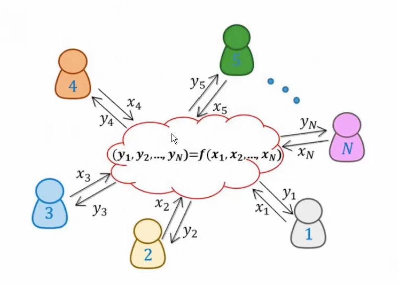
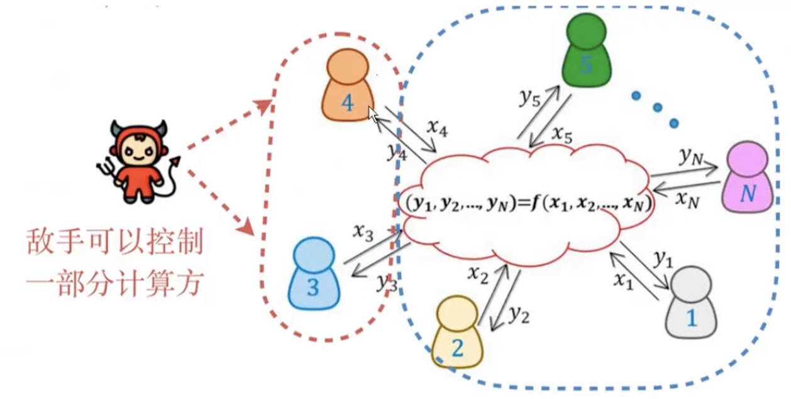
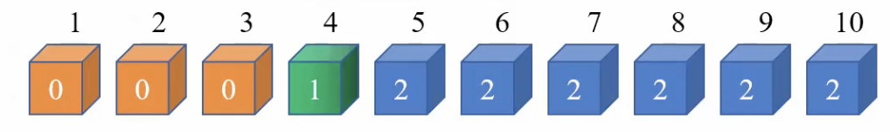
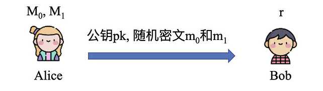
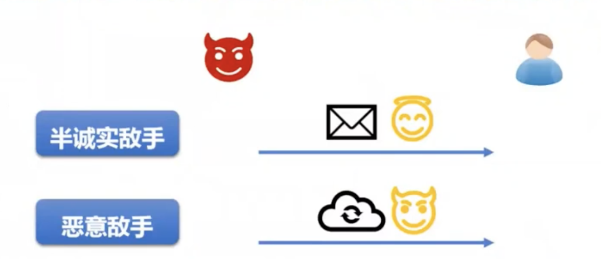
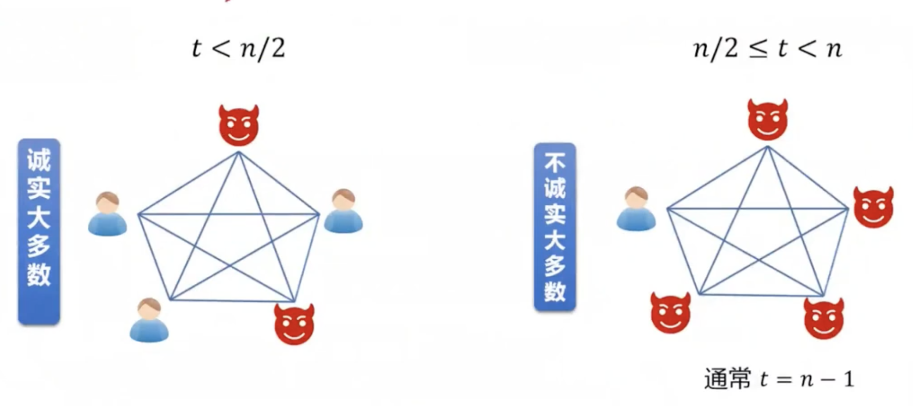
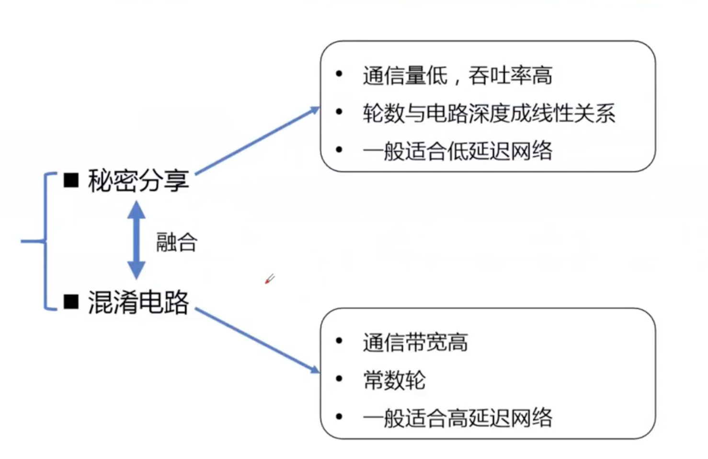
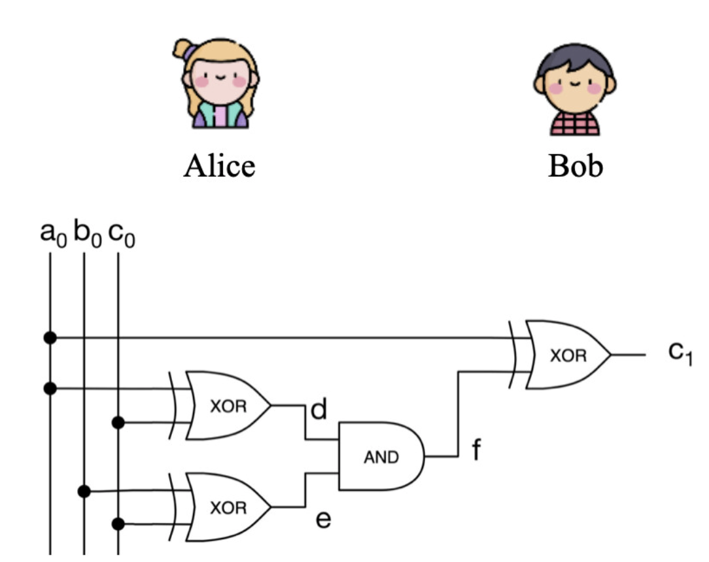
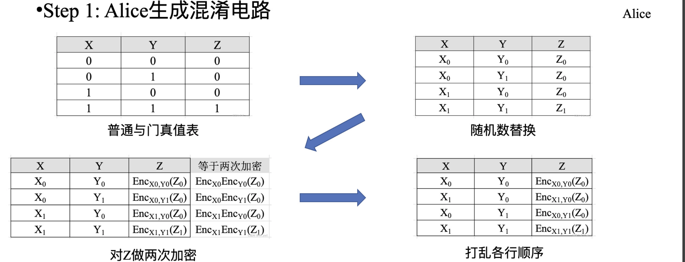

## 1.什么是MPC?

[Secure Muti-Party Compution ,MPC/SMC/SMPC]

（互不信任、且不信任任何trusted party的）多方共同计算某个函数，除了各自的私有输入以及函数输出（及可以从其输入和输出中推断出的信息）之外，不能获知任何额外信息。

举例：百万富翁问题

- 私有输入：自己钱的金额
- 函数输出：数额大小的比较结果
- 可推断出对方钱数范围（比自己的大/小），但无法获知具体的数额。

1. 两个人都是富翁
2. 双方都想知道谁的钱多
3. 都不想暴漏自己的财产

举例：私密拍卖

- 私有输入：自己的出价价格
- 函数输出：自己是否竞拍成功
- 可以推断出自己的出价是否最大，但无法获知他人的出价价格，如果自己未拍成功也无法知道其他人是否拍成功。

## 2.MPC的安全定义

各方之间使用P2P安全信道进行通信

[直觉性的安全定义]

Privacy:不应获得除了输入以外的信息

Correctness：输出应该是正确的

Independence：各方的输入是独立的

Guaranteed Delivery:各方收到输出不应该被阻止

Fairness:输出的交付应该是公平的

基于【模拟/Real-Ideal Paradigm】的安全定义

定义一个理想世界，证明协议至少和某个理想中的可信方一样安全

明确威胁模型

- 敌手的行为

  半诚实（被动）：诚实执行协议但尝试获取诚实方的输入信息

  恶意（主动）：不遵守协议，可执行任意操作-

- 敌手可控制的计算方数量

  t<n/2   /   t>=n/2 （或n/3,n/4...）

Ideal World:

存在一个理想、不可被破坏的Trusted party,接收各方输入，城市的计算某个functionality

Real World：

现实世界，不存在trusted party，只有各方之间根据协议进行交互。

- 半诚实模型

Party的view：自己的输入，随机数，收到的消息

敌手的view：包括所有其控制的parities的view

定义理想世界中的trusted party（ideal functionality）接收各方的输入，诚实计算输出，发送给各方  ---->  构造一个simulator（理想世界中的敌手），证明其view与现实世界敌手的view不可区分  ----> "协议安全的实现定义的functionality"

- 恶意模型

敌手的输入不再是well-defined

敌手可能在获得输出后，使诚实方无法获得输出

定义functionality：在计算法完成后，现将输出发送给敌手，根据敌手的指令选择是否发送给城市方

构造的simulator需要首先【提取】出现实世界中的敌手输入，以模拟现实世界输入的影响

3.不经意传输

Yao's百万富翁问题：

Alice和Bob是两个百万富翁，他们相比较谁更有钱，但都不泄露自己填有多少钱，如何比较？

一个简易的方案：

Step1：Alice准备10个箱子，表示10种价值，大于则放入2，小于则放入0

Step2：Bob选择自己的财富对等的箱子，抹去序号，和Alice一起打开

0表示Alice更有钱，1表示一样，2表示Bob更有钱

公私钥加密实现 1-out-of-2 OT

- 首先，Alice有两个明文信息$M_0$和$M_1$,Bob想要$M_r$（r=0 or 1）
- Alice创建公私钥对pk，sk，生成两个随机密文$m_0$和$m_1$
- Alice发送公钥pk，随机密文$m_0$和$m_1$给Bob

- Bob生成一段随机的明文k
- Bob将$q=Encode_{pk}(k)+m_r$发送给Alice

- Alice计算$k_i'=Decode_{sk}(q-m_i),i={0,1}$      $q=Encode_{pk}(k)+m_r$
- Alice将 {$M_0$^$k_0'$ , $M_1$^$k_1'$}发送给Bob
- 假设r=0，Alice发送的内容为 { $M_0$^$k$ , $M_1$^rand },Bob对k做异或，可以拿到 $M_0$

## 安全计算的分类

### (1)敌手行为

- 半诚实模型（按照协议描述执行，但试图从协议记录中获取信息）
- 恶意敌手（可以执行任何攻击，发送任何的消息）

### (2)腐化门限 $t$

###  (3)输出可达性

- 中止安全（Security with abort）: 腐化实体获得输出后，可以阻止诚实实体获得输出
- 公平性（Fairness）: 要腐化实体和诚实实体均获得输出，要么他们均没输出
- 保证输出传送（Guaranteed output delivery）：所有诚实实体总是获得输出

一般而言：

- 不诚实大多数情况（$n/2 <= t <n$）仅能达到终止安全[Cle86] (Coin-tossing协议不能满足公平性)
- 诚实大多数情况（$t<n/2$）能达到公平性和保证输出传送

### （4）计算模型

- 布尔电路：由AND、XOR、NOT等逻辑门组成
- 算术电路：由ADD、MULT等运算组成，通常定义在域&#120125; 上或环$Z_2k$(即 mod $2^k$)上
- RAM程序：由read、write等指令组成的程序

大部分MPC协议考虑布尔电路模型或算术电路模型

目前，只有少数MPC协议针对RAM计算模型设计，适合输入为数据库的场景

### （5）敌手计算能力

- 概率多项式时间（PPT）：任意PPT敌手不能打破协议安全性
- 无限计算能力（信息安全或无条件安全）：即使无限计算能力的敌手也不能打破协议安全性（提抗量子计算攻击）

信息论安全MPC协议需要在诚实大多数模型下设计

### （6）腐化策略

- 静态腐化（Static Corruption）：在协议运行前，敌手决定腐化（Corrupt）哪些实体
- 自适应腐化（Adaptive Corruption）：在协议运行过程中，敌手能自适应决定腐化哪些实体

已知高效的MPC协议均考虑静态腐化

### （7）网络模型

- 同步（Synchronous）网络模型：同一个交互轮的消息在固定延时$\Delta$内一定到达
- 异步（Asynchronous）网络模型：没有要求同步时钟，也没有要求预先固定的网络延时，更加现实的网络假设（通常要求$t<n/3$）

已知高效的MPC协议均考虑同步网络模型

## MPC基本设计方法

## MPC的基础组件

## 3.混淆电路（Oblivious Tranfer）

混淆电路（GC） = 不经意传输（OT） + 逻辑电路

总共有四个步骤：

- Step1：Alice生成混淆电路
- Step2：双方通信
- Step3：Bob计算混淆电路
- Step4：Alice和Bob共享计算结果

