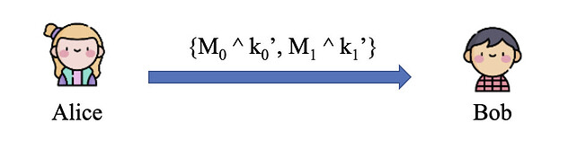

## 1.什么是MPC?

[Secure Muti-Party Compution ,MPC/SMC/SMPC]

（互不信任、且不信任任何trusted party的）多方共同计算某个函数，除了各自的私有输入以及函数输出（及可以从其输入和输出中推断出的信息）之外，不能获知任何额外信息。

举例：百万富翁问题

- 私有输入：自己钱的金额
- 函数输出：数额大小的比较结果
- 可推断出对方钱数范围（比自己的大/小），但无法获知具体的数额。

1. 两个人都是富翁
2. 双方都想知道谁的钱多
3. 都不想暴漏自己的财产

举例：私密拍卖

- 私有输入：自己的出价价格
- 函数输出：自己是否竞拍成功
- 可以推断出自己的出价是否最大，但无法获知他人的出价价格，如果自己未拍成功也无法知道其他人是否拍成功。

## 2.MPC的安全定义

各方之间使用P2P安全信道进行通信

[直觉性的安全定义]

Privacy:不应获得除了输入以外的信息

Correctness：输出应该是正确的

Independence：各方的输入是独立的

Guaranteed Delivery:各方收到输出不应该被阻止

Fairness:输出的交付应该是公平的

基于【模拟/Real-Ideal Paradigm】的安全定义

定义一个理想世界，证明协议至少和某个理想中的可信方一样安全

明确威胁模型

- 敌手的行为

  半诚实（被动）：诚实执行协议但尝试获取诚实方的输入信息

  恶意（主动）：不遵守协议，可执行任意操作-

- 敌手可控制的计算方数量

  t<n/2   /   t>=n/2 （或n/3,n/4...）

Ideal World:

存在一个理想、不可被破坏的Trusted party,接收各方输入，城市的计算某个functionality

Real World：

现实世界，不存在trusted party，只有各方之间根据协议进行交互。

- 半诚实模型

Party的view：自己的输入，随机数，收到的消息

敌手的view：包括所有其控制的parities的view

定义理想世界中的trusted party（ideal functionality）接收各方的输入，诚实计算输出，发送给各方  ---->  构造一个simulator（理想世界中的敌手），证明其view与现实世界敌手的view不可区分  ----> "协议安全的实现定义的functionality"

- 恶意模型

敌手的输入不再是well-defined

敌手可能在获得输出后，使诚实方无法获得输出

定义functionality：在计算法完成后，现将输出发送给敌手，根据敌手的指令选择是否发送给城市方

构造的simulator需要首先【提取】出现实世界中的敌手输入，以模拟现实世界输入的影响

3.不经意传输

Yao's百万富翁问题：

Alice和Bob是两个百万富翁，他们相比较谁更有钱，但都不泄露自己填有多少钱，如何比较？

一个简易的方案：

Step1：Alice准备10个箱子，表示10种价值，大于则放入2，小于则放入0

Step2：Bob选择自己的财富对等的箱子，抹去序号，和Alice一起打开

0表示Alice更有钱，1表示一样，2表示Bob更有钱

公私钥加密实现 1-out-of-2 OT

- 首先，Alice有两个明文信息$M_0$和$M_1$,Bob想要$M_r$（r=0 or 1）
- Alice创建公私钥对pk，sk，生成两个随机密文$m_0$和$m_1$
- Alice发送公钥pk，随机密文$m_0$和$m_1$给Bob

- Bob生成一段随机的明文k
- Bob将$q=Encode_{pk}(k)+m_r$发送给Alice

- Alice计算$k_i'=Decode_{sk}(q-m_i),i={0,1}$      $q=Encode_{pk}(k)+m_r$
- Alice将 {$M_0$^$k_0'$ , $M_1$^$k_1'$}发送给Bob
- 假设r=0，Alice发送的内容为 { $M_0$^$k$ , $M_1$^rand },Bob对k做异或，可以拿到 $M_0$

## 3.混淆电路（Oblivious Tranfer）

