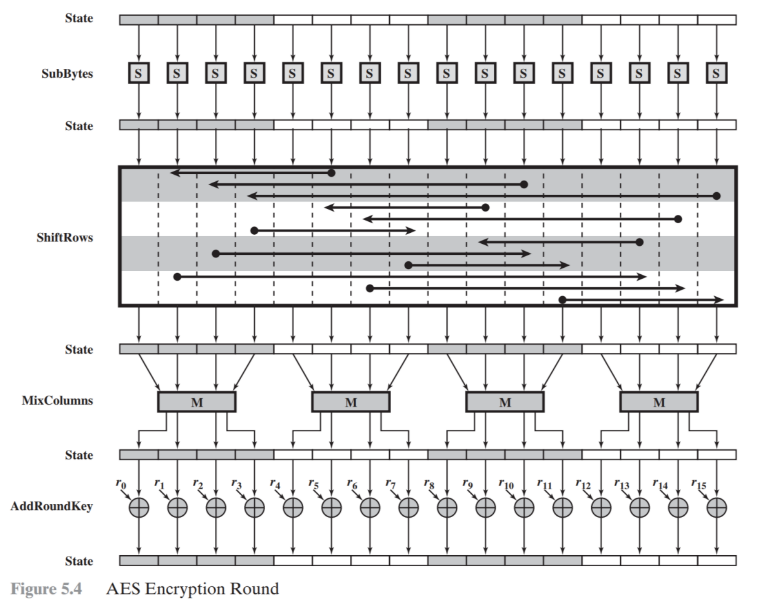

# 密码学 Cryptography

## 密码学基础 Foundations of Cryptography

### 1.对称加密与哈希函数 Symmetric encryption and hash functions

对称加密与哈希函数的核心原理：为实现随机性 

The core principle of symmetric encryption and hash functions: to achieve randomness

- 线性变换：每 **bit** **的输入发生变换，影响** 50%输出，密文随机性高。 Linear transformation: Every **bit** of input is transformed, affecting 50% of the output, and the ciphertext is highly random.

- 非线性变换：S盒子，抵抗解方程组攻击、延展攻击。Nonlinear transformation: S-box, resists attacks from solving systems of equations and extension attacks.

​		**延展性：**基于已有的密文，计算新密文，且新密文能正确解密。Extensibility: Based on the existing ciphertext, a new ciphertext is calculated, and the new ciphertext can be decrypted correctly.

举例：同态加密具有延展性：

Example: Homomorphic encryption is scalable:

- 轮密钥加轮常量加：添加一些随机密钥或常量，提高信息商。Round key plus round constant plus: Add some random keys or constants to improve the information quotient.

#### 1 对称加密 Symmetric encryption

##### 1.1 基本概念 Basic concepts

**初始化：**双方共享一个保密随机数$K$ ，或使用相同的设备生成一个相同的随机数 $K$。**Initialization:** Both parties share a secret random number $K$, or use the same device to generate the same random number $K$.

**加密：**发送方使用设备生成随机数$K$ ，对消息 $X$，如下计算：**Encryption:** The sender uses the device to generate a random number $K$ and calculates the message $X$ as follows:
$$
Y:=K\bigoplus X
$$
发送密文 $Y$。Send ciphertext $Y$.

**解密：**接收方接收密文 $Y$，使用设备生成随机数 $K$，如下计算 **Decryption:** The receiver receives the ciphertext $Y$ and uses the device to generate a random number $K$, which is calculated as follows
$$
X:=Y\bigoplus K
$$
获得消息$X$。Get message $X$.

**双方如何容易地**共享保密随机数 *K* ？信道是否一定要安全，不安全可以吗？

How can both parties easily share a secret random number *K*? Does the channel have to be secure? Can it be insecure?

**答：可以的，这是**公钥密码学的任务。

**Answer: Yes, this is the task of **public key cryptography.

##### 1.2 高级加密标准AES  Advanced Encryption Standard AES

###### 1.2.1 加密流程 Encryption Process

AES 是一个分组密码，每组 128bit。AES is a block cipher with each block containing 128 bits.

轮函数和密钥扩展是AES **最关键部分。**

Round functions and key expansion are the most critical parts of AES.

###### 1.2.2 轮函数 Round functions

轮函数的4中操作：

The 4 operations of the round function:

- 字节替换（SubBytes）
- 行移位（ShiftRows）
- 列混淆（MixColumns）
- 轮密钥加（AddRoundKey）

下图给出 AES 加解密的流程，从图中可以看出：**1**）解密算法的每一步分别对应加密算法的逆操作，2）加解密所有操作的顺序正好是相反的。正是由于这几点（再加上加密算法与解密算法每步的操作互逆）保证了算法的正确性。加解密中每轮的密钥分别由种子密钥经过**密钥扩展算法**得到。算法中 16 字节的明文、密文和轮子密钥都以一个 4x4 的矩阵表示。

The following figure shows the process of AES encryption and decryption. From the figure, we can see that: 1) Each step of the decryption algorithm corresponds to the inverse operation of the encryption algorithm, 2) The order of all encryption and decryption operations is exactly the opposite. It is precisely because of these points (plus the inverse operation of each step of the encryption algorithm and the decryption algorithm) that the correctness of the algorithm is guaranteed. The key for each round of encryption and decryption is obtained by the seed key through the key expansion algorithm. The 16-byte plaintext, ciphertext and round key in the algorithm are all represented by a 4x4 matrix.

 

**字节替代（非线性变换）** Byte substitution (non-linear transformation)

字节代替通过 $S$盒**完成一个字节到另外一个字节的映射。这里直接给出构造好的结果，下图(a)为 $S$ 盒，图(b)为 $S^{-1}$（S 盒的逆）。S 盒用于提供密码算法的**混淆性。

$S$ 和 $S^{-1}$分别为 16x16 的矩阵，完成一个 8 比特输入到 8 比特输出的映射，

**输入的高** **4-bit** **对应的值作为行标，低** **4-bit** **对应的值作为列标。**

输入字节值为 a=a7a6a5a4a3a2a1a0，输出值为 S[a7a6a5a4][a3a2a1a0]，S -1 的变换也同理。

例如：字节 00000000B替换后的值为（S[0][0]=）63H，再通过 S -1即可得到替换前的值，（S -1 [6][3]=）00H。

**等价描述**

1. 按字节值的升序逐行初始化 S 盒子。第 1 行是{00},{01},…,{0F}；第 2 行是{10},{11},…,{1F}。因此，在 **y** **行** **x** **列**的字节值是{yx}

2. S 盒子中每个字节映射为有限域中的逆，其中{00}映射为{00}。

3. S 盒子中的每个字节的 8 位记为 $(b_7,b_6,...b_0)$，对每个字节进行如下**变换**

### 2.公钥加密与数字签名

### 3.密码协议：承诺、零知识证明、秘钥协商

### 4.同态加密

## ECDSA多签系列

### 1.Li17两方签名

 ### 2.GG18多方签名

### 3.GG20多方签名

### 4.CMP20多方签名

### 5.DKLs18两方/20多方签名

### 6.Schnorr/EdDSA多方签名

## zk系列

### 1.Groth16证明系统

### 2.Plonk证明系统

### 3.UltraPlonk证明系统

### 4.SHA256查找方法

### 5.Halo2证明系统

### 6.zkSTARK证明系统

