# ChainLink

## 01 区块链的概念和Web3 

## The concept of blockchain and Web3

### 什么是区块链？ What is blockchain?

区块链是一个分布式账本，这个账本维护了一个连续增长的数据列表，这些有序地数据存储在区块中，这些区块通过密码学连在一起，形成了一条链。

Blockchain is a distributed ledger that maintains a continuously growing list of data. These ordered data are stored in blocks, which are linked together through cryptography to form a chain.

区块是一个数据的容器，并且永久存储在区块链中。A block is a container of data and is permanently stored in the blockchain.

一个区块包含：A block contains:

- 交易 Transactions
- 时间戳 Timestamp
- 上一个区块的哈希 Hash of the previous block
- 随机数（nonce） Random number (nonce)


### 什么是状态机 What is a state machine

有限状态机（finate-state machine，缩写：FSM）又称有限状态自动机，简称状态机，是表示有限个状态以及在这些状态之间的转移和动作等行为的数学计算模型。A finite state machine (FSM), also known as a finite state automaton or state machine for short, is a mathematical computational model that represents a finite number of states and behaviors such as transitions and actions between these states.


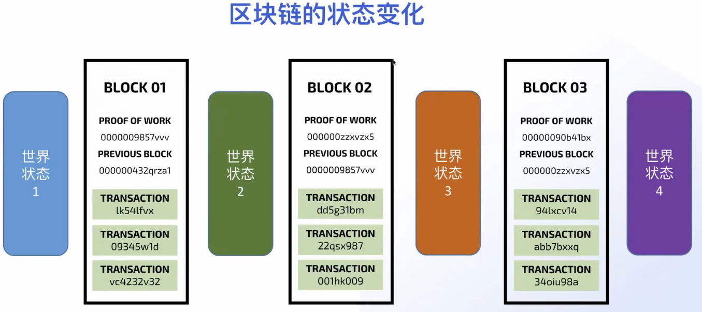

### 区块链基础 Blockchain Basics

- 密码学（Cryptography）

- 分布式系统(Distributed System)

- 博弈论(Game Theory)


#### 区块链中的密码学 

#### Cryptography in blockchain

- 哈希函数（Hash Function）
- 默克尔树（Merkle Tree）
- 公钥和私钥（Public key and Private Key）


将一个任意长度的数据转化为一个固定长度的数据。Convert a data of arbitrary length into a data of fixed length.

哈希函数的特性 Characteristics of hash functions

1、确定性：同样的数据生成的哈希值相同。Determinism: The same data generates the same hash value.

2、单向高效：计算数据的哈希算法很高效。容易通过计算数据的哈希值，但很难从哈希值反推出原始数据。One-way efficiency: The hash algorithm for calculating data is very efficient. It is easy to calculate the hash value of the data, but it is difficult to reverse the original data from the hash value.

3、碰撞抵御：微小的改动会导致生成哈希值完全不同，两个不同的数据生成相同的哈希值的概率很低。Collision resistance: Minor changes will result in completely different hash values, and the probability of two different data generating the same hash value is very low.

比特币中的默克尔树

“Merkle trees are used to summarize all the transactions in  a block,producing an overall digital fingerprint of the entire set of transactions,providing a very efficient process to verify whether a transaction is including in a block”.

默克尔树可以将一个区块的所有交易生成一个数字指纹，提供一种搞笑的验证方式，用以验证区块中是否存在某一笔交易。


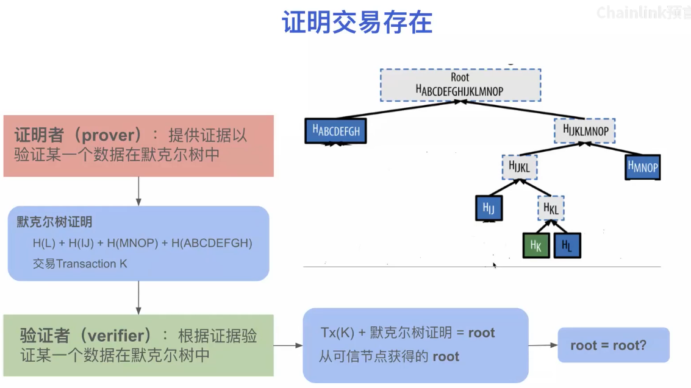

Cryptographic Keys

两种类型的秘钥：Two types of keys:

- 对称加密（单个秘钥）Symmetric encryption (single key)
- 非对称加密（一对秘钥） Asymmetric encryption (a pair of keys)

在区块链中，使用的非对称加密 In blockchain, asymmetric encryption is used


#### 分布式网络

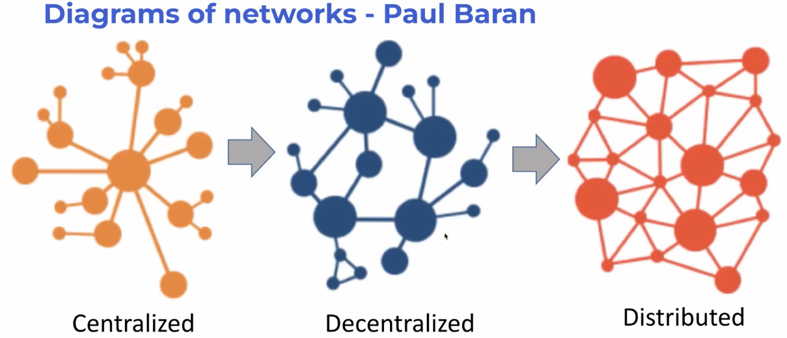

#### 博弈论 Game theory

研究在多方参与的场景中，个体如何决策的一门科学 A science that studies how individuals make decisions in scenarios involving multiple parties

系统中每个个体的决策 The decisions of each individual in the system

- 完全独立 Completely independent
- 依赖于其他个体 Dependent on other individuals

研究最终决策的概率 Study the probability of the final decision

区块链中的博弈论：共识算法 Game theory in blockchain: consensus algorithm

提升不诚实节点的作恶成本，增加诚实节点的经济激励，让作恶的收益小于成本。来保证在区块链网络中个体和个体的交互诚实。Increase the cost of dishonest nodes to commit evil, increase the economic incentives of honest nodes, and make the benefits of committing evil less than the cost. To ensure the honesty of interactions between individuals in the blockchain network.

共识算法就是用来保证所有参与方能够认同同一种共识的算法，它是基于博弈论的理论去实现的。The consensus algorithm is an algorithm used to ensure that all participants can agree on the same consensus, which is implemented based on the theory of game theory.

工作量证明（PoW）

- 正向激励：每次成功修改链上状态，都有经济激励，来激励诚实的节点。Positive incentives: Every successful modification of the on-chain state has economic incentives to motivate honest nodes.
- 负向激励：每次修改链上状态需要进行大量的计算，来提升参与成本。Negative incentives: Every modification of the on-chain state requires a lot of calculations, which increases the cost of participation.
- 哈希算法：提交一次交易很困难，但是验证一次交易很简单。Hash algorithm: Submitting a transaction is difficult, but verifying a transaction is simple.


### web3

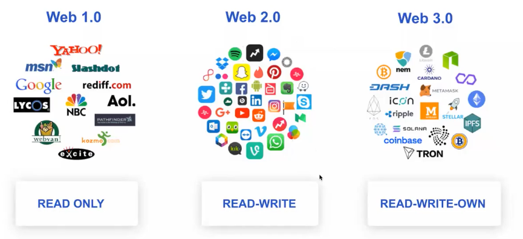


## 02 安装使用钱包&Solidity基础


## 03 预言机，ERC-20 Token和Chainlink喂价

### 智能合约的限制 Limitations of Smart Contracts

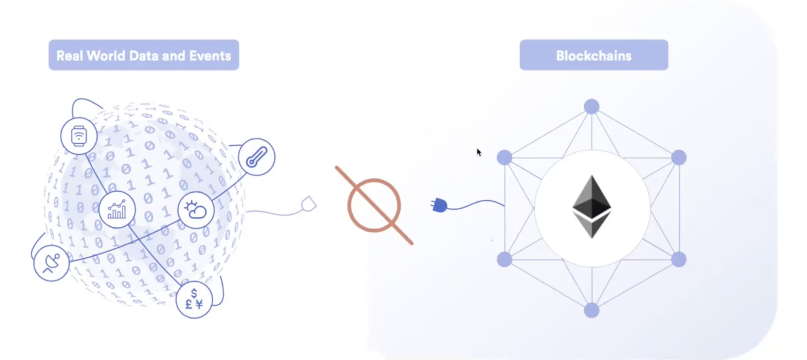

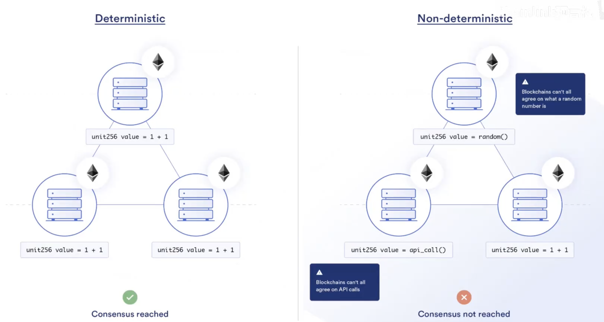

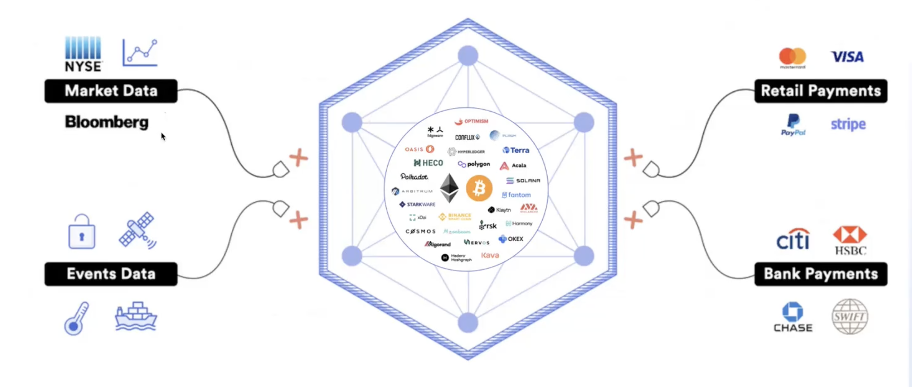

区块链预言机：Blockchain Oracle:

与链下世界发生交互获得计算或者数据的基础设施成为预言机。The infrastructure that interacts with the off-chain world to obtain computation or data is called an oracle.

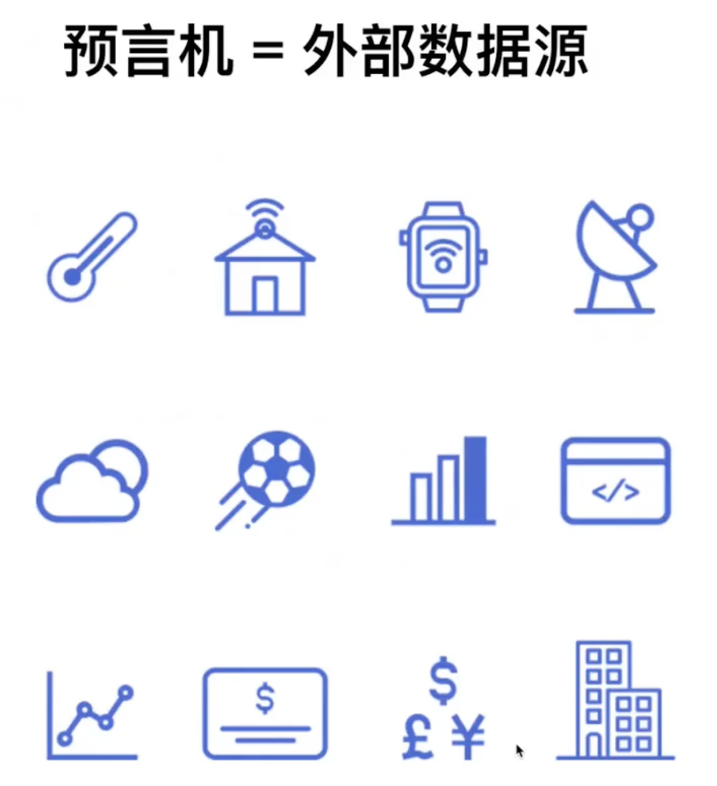

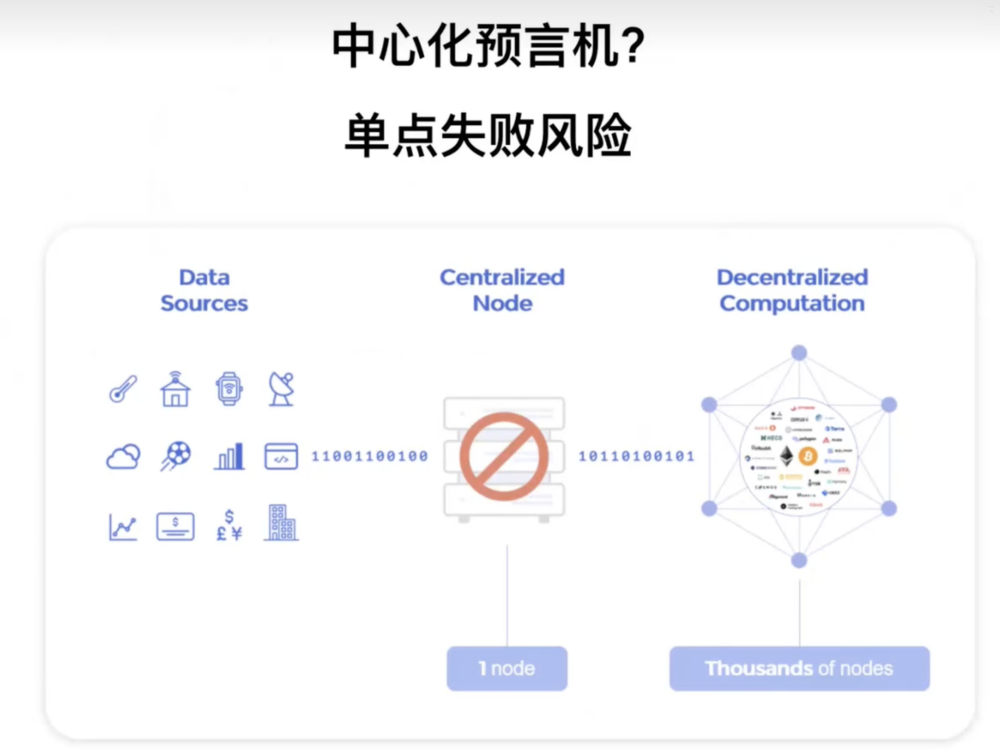

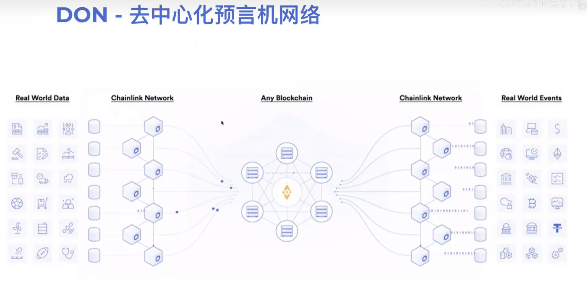

Chainlink是区块链不可知论者

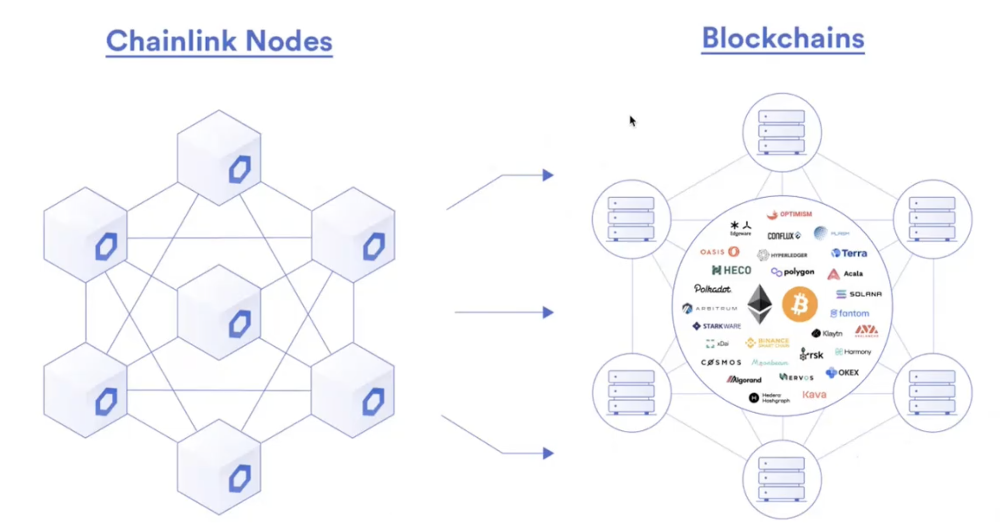

### 区块链预言机 Blockchain Oracle

区块链预言机的标准 Standard for blockchain oracles

Chainlink扩展了智能合约的能力。给链下数据和计算提供了安全的链上入口。Chainlink expands the capabilities of smart contracts. It provides a secure on-chain entry for off-chain data and computation.

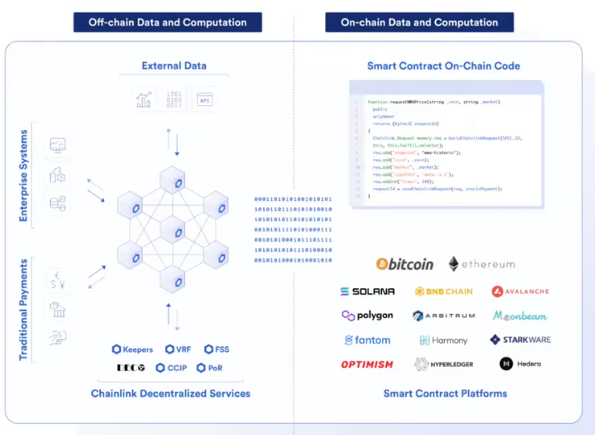


### Chinklink预言机的Web3服务 Chinklink Oracle Web3 Services

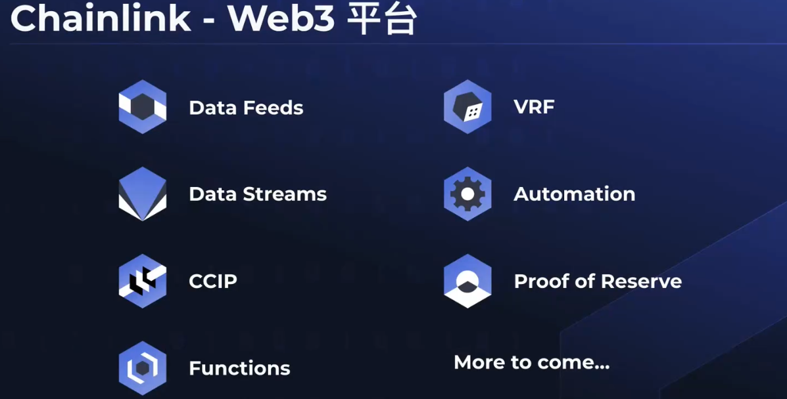

### 如何发布一个通证 How to issue a token

```solidity
// SPDX-License-Identifier: MIT
pragma solidity ^0.8.20;

import "@openzeppelin/contracts/token/ERC20/ERC20.sol";

contract MyToken is ERC20 {
    uint256 minimum_value = 10 * 10 ** 18;
    constructor() ERC20("MyToken", "MTK") {}
    
    function mint() public {
        _mint(msg.sender,minimum_value);
    }
}
```


### 什么是ERC20标准 What is the ERC20 standard?


### 通过继承ERC-20标准来发布通证 Issue tokens by inheriting the ERC-20 standard


### Chainlink Data Feed

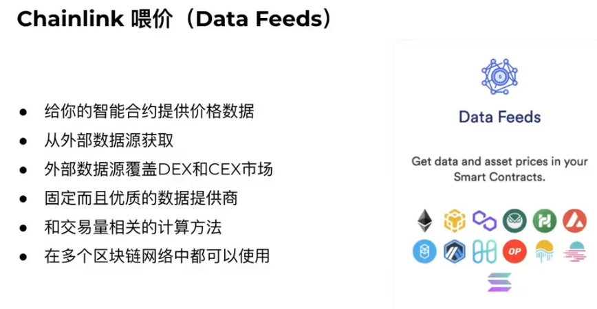

- 给你的智能合约提供价格数据 Provide price data to your smart contract
- 从外部数据源获取 Obtain from external data sources
- 外部数据源覆盖FEX和CEX市场 External data sources cover FEX and CEX markets
- 固定而且优质的数据提供商  Fixed and high-quality data providers
- 和交易量相关的计算方法  Calculation methods related to transaction volume
- 在多个区块联网络中都可以使用  Can be used in multiple blockchain networks

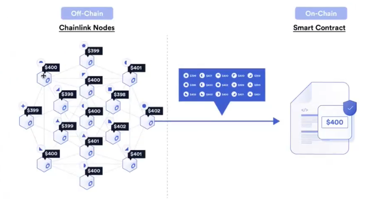

Chainlink Data Feeds are the quickest way to connect your smart contracts to the real-world data such as asset prices, reserve balances, and L2 sequencer health.

Chainlink Data Feeds 是将您的智能合约连接到现实世界数据（例如资产价格、储备余额和 L2 序列器健康状况）的最快方法。

#### data feeds类型 Types of data feeds

Data feeds provide many different types of data for your applications.

- Price Feeds 价格Feeds
- Proof of Reserve Feeds 
- Rate and Volatility Feeds 利率和波动率Feeds
- L2 sequencer uptime feeds  L2排序器uptime feeds

##### Price Feeds

Smart contracts often act in real-time on data such as prices of assets. This is especially true in DeFi. 智能合约经常对资产价格等数据进行实时操作。在[DeFi](https://chain.link/use-cases/defi)中尤其如此。

For example, Synthetix uses Data Feeds to determine prices on their derivatives platform. Lending and borrowing platforms like AAVE use Data Feeds to ensure the total value of the collateral.例如， [Synthetix](https://www.synthetix.io/)使用Data Feeds 确定其衍生品平台上的价格。使用[AAVE](https://aave.com/)等借贷平台Data Feeds 以确保抵押品的总价值。

Data Feeds aggregate many data sources and publish them onchain using a combination of the Decentralized Data Model and Offchain Reporting.Data Feeds 结合[去中心化的数据模型](https://docs.chain.link/architecture-overview/architecture-decentralized-model?parent=dataFeeds)和[链下报告](https://docs.chain.link/architecture-overview/off-chain-reporting?parent=dataFeeds)，聚合众多数据源并将其发布到链上。


### 通过Data Feed来设置mint门槛 Setting mint thresholds via Data Feed


## 04 Chainlink随机数游戏应用

Chainlink VRF可验证的随机函数

为什么在智能合约中难以生成随机数？

- 区块链是一个确定行的系统，所有结果都可以预测，没有随机性
- 对于任何一笔交易，每个节点都需要达成同样的结果（共识算法要求）

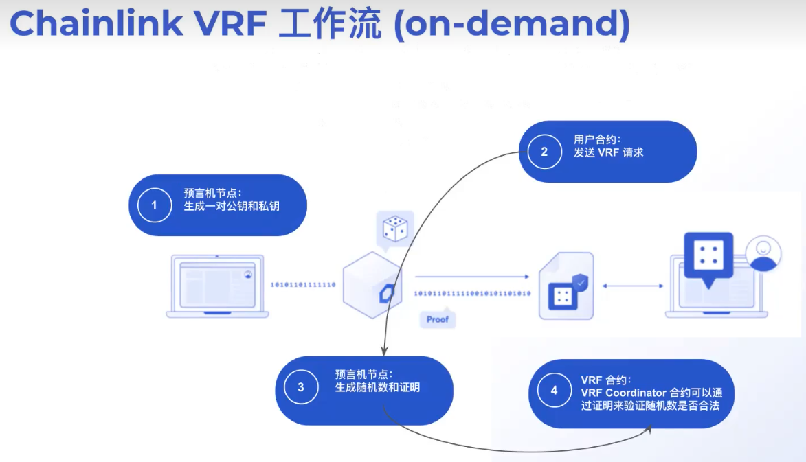

VRF的定义：

在密码学中，可验证随机函数（VRF）是为随机函数，该函数可以生成随机数和证明，其中证明可以保证随机数是合法的。

1.可验证 Verifiability

2.独特性 Uniqueness

3.伪随机 Pseudo-random

VRF中的3个函数：

1.密钥生成函数

​	G(r) => (PK,SK)

​	PK:公钥

​	SK:私钥

2.随机数生成函数

​	E(SK,seed) => (Randomness,Proof)

​	Seed：生成随机数的种子

​	Randomness：VRF返回的随机数

​	Proof：证明随机的合法性

3.验证函数

​	V(PK,seed,Randomness,Proof) => (true or false)

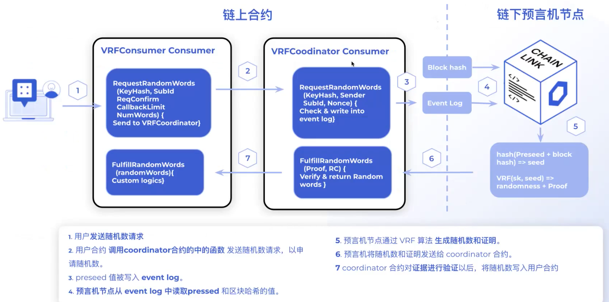

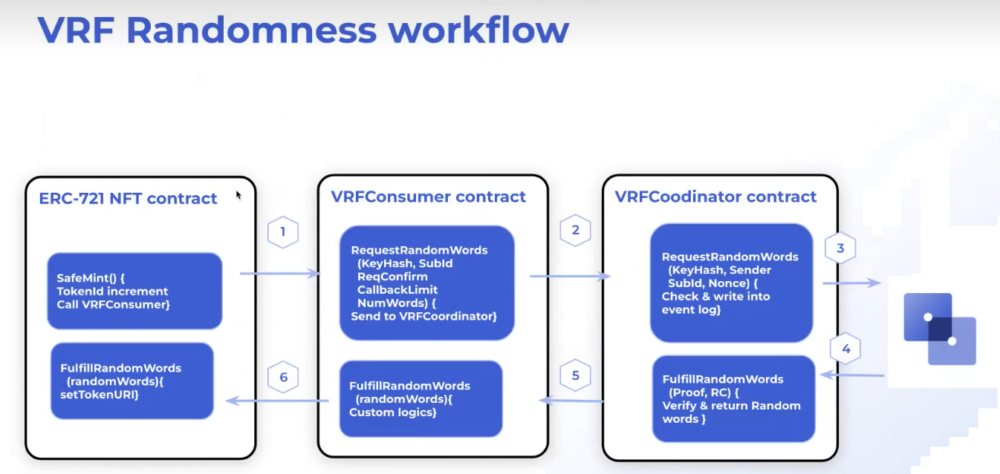

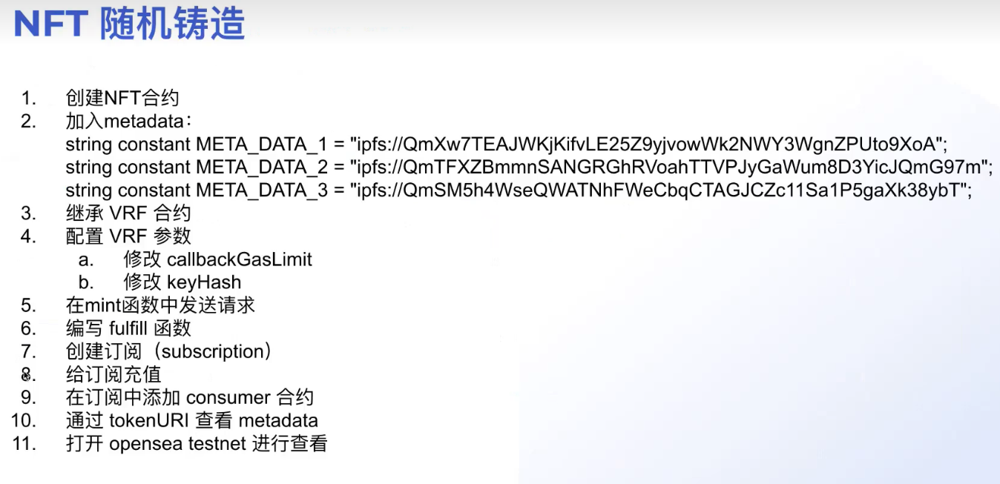


## 05 社区项目介绍


## 06 Chainlink Automation动态NFT应用


## 07 Chainlink Functions获取链下数据


## 08 CCIP跨链Token转移 -USDC


## 09 社区项目介绍