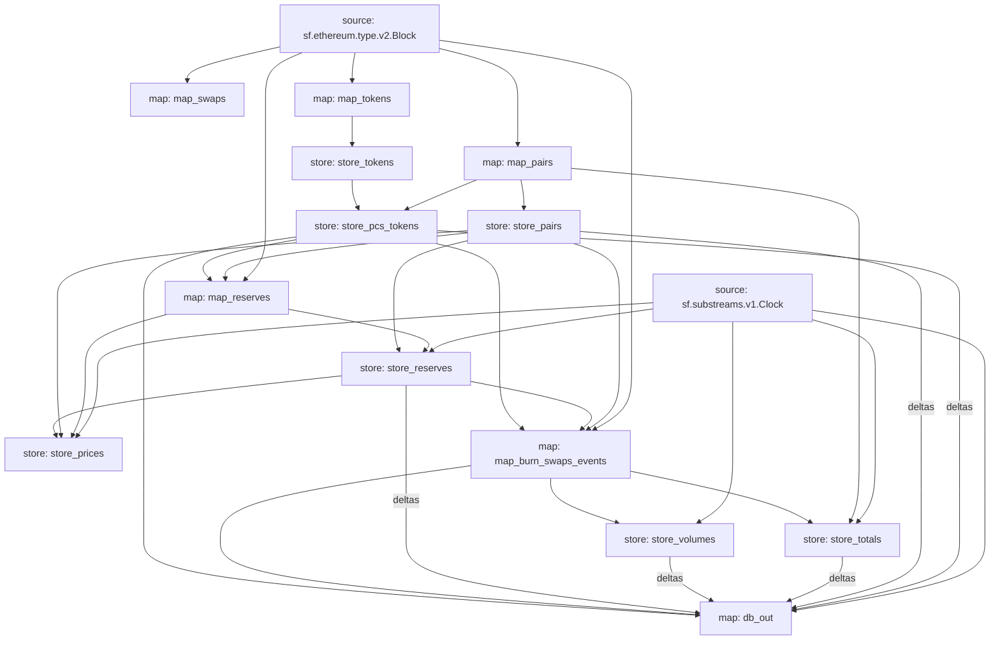

PancakeSwap Substreams
======================

```
# We assume you are at root of project
cd pancakeswap
cargo build --target=wasm32-unknown-unknown --release
```

Run with:

```
substreams run -e bsc.streamingfast.io:443 substreams.yaml store_pairs,map_pairs,db_out,store_volumes,store_totals -s 6810706 -t 6810711
```


## Visual data flow

This is a flow that is executed for each block.  The graph is produced with `substreams graph ./substreams.yaml`.




## Module Kinds
There are two types of modules: map and store. map modules are used for stateless transformations and store modules are used for stateful transformations.

Substreams executes the Rust function associated with module for every block on the blockchain, but there will be times when you will have to save data between blocks. store modules allow you to save in-memory data.

### map modules
map modules are used for data extraction, filtering, and transformation. They should be used when direct extraction is needed avoiding the need to reuse them later in the DAG.

To optimize performance, you should use a single map module instead of multiple map modules to extract single events or functions. It is more efficient to perform the maximum amount of extraction in a single top-level map module and then pass the data to other Substreams modules for consumption. This is the recommended, simplest approach for both backend and consumer development experiences.
Functional map modules have several important use cases and facts to consider, including:

- Extracting model data from an event or function's inputs.

- Reading data from a block and transforming it into a custom protobuf structure.

- Filtering out events or functions for any given number of contracts.

### store modules
store modules are used for the aggregation of values and to persist state that temporarily exists across a block.

Important: Stores should not be used for temporary, free-form data persistence.
Unbounded store modules are discouraged. store modules shouldn't be used as an infinite bucket to dump data into.

Unbounded store modules are discouraged. store modules shouldn't be used as an infinite bucket to dump data into.

Notable facts and use cases for working store modules include:

- store modules should only be used when reading data from another downstream Substreams module.

- store modules cannot be output as a stream, except in development mode.

- store modules are used to implement the Dynamic Data Sources pattern from Subgraphs, keeping track of contracts created to filter the next block with that information.

- Downstream of the Substreams output, do not use store modules to query anything from them. Instead, use a sink to shape the data for proper querying.


不鼓励使用无界存储模块。存储模块不应被用作无限大的存储桶来转储数据。

关于存储模块的使用，需要注意的事实和用例包括：

- 存储模块应仅用于从其他下游 Substreams 模块读取数据。

- 存储模块不能以流的形式输出，除非在开发模式下。

- 存储模块用于实现 Subgraphs 中的动态数据源模式，跟踪已创建的合约，这些合约用于使用该信息过滤下一个区块。

- 在 Substreams 输出的下游，请勿使用存储模块查询任何数据。相反，应使用接收器来调整数据，以便进行正确的查询。


#### Core principle usage of stores
- Do not save keys in stores unless they are going to be read by a downstream module. Substreams stores are a way to aggregate data, but they are not meant to be a storage layer.

- Do not save all transfers of a chain in a store module, rather, output them in a map and have a downstream system store them for querying.

There are limitations impose on store usage. Specifically, each key/value entry must be smaller than 10MiB while a store cannot exceed 1GiB total. Keys being string, each character in the key account for 1 byte of storage space.

