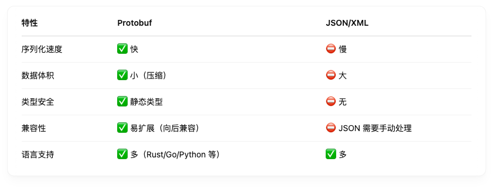
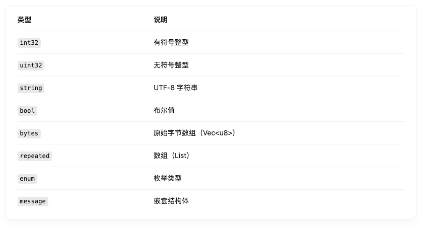

## Protobuf

### 详解Protobuf
当然可以，我们来深入了解一下 Protobuf（Protocol Buffers），它是 Google 开发的、非常高效的序列化协议，常用于服务间通信（如 gRPC）、数据存储、区块链数据结构描述（比如 Substreams）等。

🧠 什么是 Protobuf？
Protocol Buffers (Protobuf) 是一种语言无关、平台无关、可扩展的结构化数据序列化格式。
你可以把它看作是一种更快、更小、更灵活的替代品，和 JSON / XML 一类格式相比：




🧱 核心概念
1. .proto 文件：定义结构的地方

```proto
syntax = "proto3";

message User {
  uint32 id = 1;
  string name = 2;
  repeated string tags = 3;
}

```
含义：

message：一个结构体（类似于 Rust 的 struct）

uint32 / string：字段类型

= 1;：字段编号，必须唯一，用于序列化顺序，不是数组索引

repeated：数组类型

2. 类型一览




3. 编译器：protoc
将 .proto 文件编译为对应语言的代码：

```bash
protoc --rust_out=src user.proto

```
你需要插件（如 Rust 的 prost 或 tonic）来生成代码。

💡 Protobuf 在 Rust 中的使用
使用 Prost（最主流）
1. 添加依赖：

```toml
[dependencies]
prost = "0.12"
prost-types = "0.12"

```
2. 在 build.rs 中生成代码：
```rust
fn main() {
    prost_build::compile_protos(&["proto/user.proto"], &["proto/"]).unwrap();
}


```
3. 示例 .proto:
```proto
syntax = "proto3";

message User {
  uint32 id = 1;
  string name = 2;
}

```
4. 自动生成的代码在 OUT_DIR 中，会被包含到你的 crate 中。

🔄 Protobuf 的进阶优势
向后兼容性：你可以添加新字段，不影响旧客户端

版本控制：字段编号是关键

序列化格式极小：适合网络、区块链等传输密集场景

多语言通信桥梁：你可以用 Protobuf 定义结构，Rust 写逻辑，Python 做工具，Go 提供接口

🛠 应用场景
gRPC 通信

区块链数据处理（如 Substreams）

微服务 API 数据结构

高性能缓存格式（比 JSON 快）


