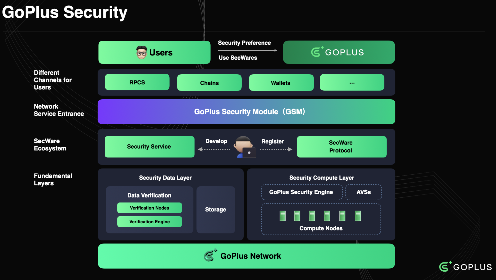
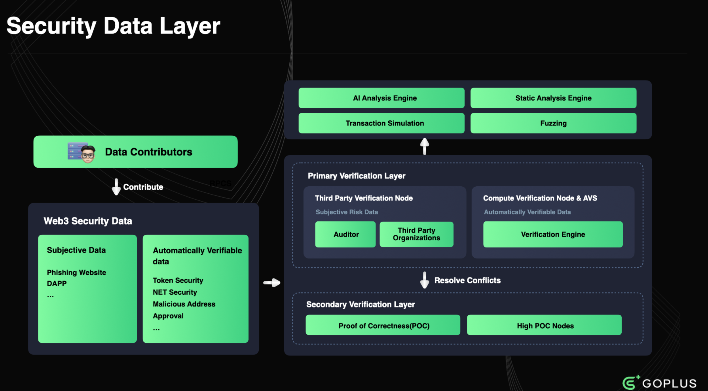

GoPlus Security

## Architecture Overview

### Fundamental Layers 基本层

GoPlus Security is a decentralized security data and security service network designed to cater to users' diverse security needs throughout the transaction process. The network is primarily composed of the [Security Data Layer](https://whitepaper.gopluslabs.io/goplus-network/user-security-network/security-data-layer) and the [Security Compute Layer](https://whitepaper.gopluslabs.io/goplus-network/user-security-network/security-compute-layer) which operates on a permissionless, open, and user-driven basis, allowing any developer to join and provide corresponding security solutions based on users' security requirements at different stages of the transaction lifecycle, such as anti-scam, anti-phishing, and anti-MEV. This approach enables all security developers, data providers and compute node operators to participate and collaborate in offering superior security services to users, ultimately creating a more secure Web3 on-chain interaction environment.

GoPlus Security 是一个去中心化的安全数据和安全服务网络，旨在满足用户在整个交易过程中的多样化安全需求。该网络主要由[安全数据层](https://whitepaper.gopluslabs.io/goplus-network/user-security-network/security-data-layer)和[安全计算层](https://whitepaper.gopluslabs.io/goplus-network/user-security-network/security-compute-layer)组成，以无需许可、开放和用户驱动的方式运行，允许任何开发者加入并根据用户在交易生命周期不同阶段的安全需求（例如反诈骗、反钓鱼和反 MEV）提供相应的安全解决方案。这种方法使所有安全开发者、数据提供商和计算节点运营商能够参与并协作，为用户提供卓越的安全服务，最终创建更安全的 Web3 链上交互环境。

#### Security Data Layer 安全数据层

By leveraging a decentralized approach to collect, process, and store security-related data, the network ensures the integrity, authenticity, and reliability of the data. This decentralized security data layer serves as a solid foundation for the network's security services, enabling more accurate and effective security solutions.

该网络通过去中心化的方式收集、处理和存储安全相关数据，确保数据的完整性、真实性和可靠性。去中心化的安全数据层为网络安全服务奠定了坚实的基础，从而能够提供更精准、更有效的安全解决方案。

#### Security Compute Layer 安全计算层

The GoPlus Security leverages **AVS Operators**, which are distributed nodes responsible for executing security-related computations and validations. These operators handle tasks such as verifying transaction security analysis results, detecting potential security threats, and simulating transactions. By distributing the security computation workload across multiple AVS Operators, the network achieves enhanced scalability, fault tolerance, and improved resilience against single points of failure. **AVS Operators** ensure the stability and efficiency of the network by delivering real-time security services, which are essential to safeguarding users' on-chain interactions.

GoPlus Security 利用**AVS 算子 (AVS Operators)**，这些算子是负责执行安全相关计算和验证的分布式节点。这些算子负责处理诸如验证交易安全分析结果、检测潜在安全威胁以及模拟交易等任务。通过将安全计算工作负载分散到多个 AVS 算子上，网络实现了增强的可扩展性、容错能力以及对单点故障的更高恢复能力。AVS**算子**通过提供实时安全服务来确保网络的稳定性和效率，这对于保障用户的链上交互至关重要。

### GoPlus Security Module

At the heart of the GoPlus Security lies the GoPlus Security Module (GSM), which serves as the entry point and conduit for the entire network's services. GSM integrates various security services into infrastructures and dApps, permeating every aspect of user interaction. With its highly pluggable, lightweight, easy-to-integrate, and multi-chain compatible features, GSM seamlessly integrates with the RPC services, chains, and various RaaS providers, filling the gaps in the architectural of the chains themselves regarding user security issues.

GoPlus Security 的核心是 GoPlus 安全模块 (GSM)，它是整个网络服务的入口和通道。GSM 将各种安全服务集成到基础设施和 dApp 中，渗透到用户交互的各个环节。凭借其高度可插拔、轻量级、易于集成和多链兼容的特性，GSM 可以与 RPC 服务、区块链和各种 RaaS 提供商无缝集成，填补了区块链自身架构在用户安全问题上的空白。

### GoPlus APP

Moreover, GoPlus Security provides all users with a comprehensive security product called GoPlus App. Through this app, users can exercise full control over their asset security and configure various risk control and security policies tailored to their individual needs. GoPlus App and GSM form a close collaboration and interconnection, ultimately achieving a complete closed loop from security intent to secure transactions.

此外，GoPlus Security 还为所有用户提供全面的安全产品 GoPlus App。通过该 App，用户可以全面掌控自身资产安全，并根据自身需求配置各种风控和安全策略。GoPlus App 与 GSM 紧密协作互联，最终实现从安全意图到安全交易的完整闭环。

### Conclusion

In summary, GoPlus Security offers a comprehensive security solution for the Web3 on-chain trading environment through its decentralized security data and service network, open security service ecosystem, highly pluggable and easy-to-integrate GSM, and user-centric security App. The network's architecture not only meets users' security needs but also provides ample opportunities for security developers and service providers to participate, demonstrating immense potential for future growth and adoption. With its emphasis on decentralized security data and innovative Security Compute Nodes, GoPlus Security is well-positioned to revolutionize user security of Web3.

总而言之，GoPlus Security 通过其去中心化的安全数据和服务网络、开放的安全服务生态系统、高度可插拔且易于集成的 GSM 以及以用户为中心的安全应用程序，为 Web3 链上交易环境提供了全面的安全解决方案。该网络的架构不仅满足了用户的安全需求，还为安全开发者和服务提供商提供了充足的参与机会，展现出巨大的未来增长和应用潜力。凭借其对去中心化安全数据和创新安全计算节点的重视，GoPlus Security 已做好准备，彻底革新 Web3 的用户安全。

## Security Data Layer

In the last few years, GoPlus Network has experienced exponential growth, with user security data usage increasing by over 5000 times from what was recorded in 2022 and daily API calls reaching 21 million, demonstrating high levels of user trust. However, as we continue to grow and evolve, we recognize the importance of adopting a more decentralized approach to data generation and verification. Therefore, ensuring the integrity and reliability of user security risk data is of paramount importance for GoPlus Network. To address this critical need, we propose a decentralized Security Data Contribution and Verification Layer that harnesses the power of multi-party participation and automated verification processes. 

This foundational layer of the GoPlus Network offers trustworthy, rich, and real-time security data via a decentralized security data system designed to tackle the complex landscape of Web3 user security by facilitating the collection, verification, and utilization of security-related data. The layered architecture ensures a comprehensive and effective approach to identifying and mitigating security risks, leveraging the collective wisdom and expertise of various stakeholders, including end-users, security researchers, developers, and third-party security service providers.

#### Data Contribution

Security Data Contributors Security data contributors form the foundation of the entire system. They provide valuable information about potential security risks and threats through various channels, including but not limited to:

**End-users:** Regular users of Web3 applications can report security issues they encounter, such as suspicious scam activities, phishing attempts, or rug-pulls.

**Security researchers:** Professional security researchers can contribute their findings on risks, security analysis, and other in-depth user security insights.

**Third-party security companies & organizations:** Specialized security firms can offer comprehensive threat intelligence and risk assessment reports.

Through incentivization and recognition mechanisms, we encourage broad participation to establish a comprehensive and diverse user security database.

#### Data Verification

To ensure the credibility and accuracy of the contributed data, we implement a multi-tiered decentralized verification mechanism. The Security Data Verification system consists of a Primary verification process and a Secondary verification process, working in tandem to validate the security data.

为了确保贡献数据的可信度和准确性，我们实施了多层次的去中心化验证机制。安全数据验证系统由主验证流程和次验证流程组成，两者协同工作以验证安全数据。

##### **Primary verification**

The Primary verification employs a multi-faceted approach to data verification, incorporating trusted third-party entities and automated computational methods:

**Third-Party Verification Nodes:** Reputable entities operate verification nodes that leverage their expertise and resources to assess the veracity of user-contributed information.

**Computational Verification Nodes:** Automated computational methods, are utilized to verify some specific types of security data, employing [SecScan](notion://www.notion.so/o/mxHmBMVLg2XA6Rh1aRqy/s/3j5GFgqQKWTX18n74ll7/~/diff/~/changes/8/~/revisions/tuumkhUwqq0T8s0vCmoq/secscan), advanced algorithms and AI techniques.

**Auditors:** Independent auditors oversee the verification process, ensuring compliance with established protocols and maintaining the integrity of the system.

##### **Secondary verification**

The Secondary verification is triggered when disputes arise in the Primary verification. It is composed of highly specialized security teams and institutions that focus on resolving controversies in Primary verification:

**Elite Security Teams:** Renowned security teams with extensive expertise in Web3 security are enlisted to investigate and resolve complex disputes such as SlowMist, Blocksec, etc. 

**Institutional Arbitrators:** Respected institutions, such as respected university labs and Web3 industry leaders, act as impartial arbitrators to settle disagreements and provide final verdicts.

The Secondary verification ensures that any contentious issues are thoroughly examined and resolved by the most qualified experts in the field.

By seamlessly integrating security data contributors and the multi-tiered verification mechanism, we create a robust and resilient decentralized security data ecosystem. This innovative approach not only enhances the diversity, professionalism, and accuracy of risk data, but also providing users with a robust foundation for risk control and strengthening the underlying risk management models, ultimately serves to protect users' security. By working together, we can lay a solid foundation for the future of digital interactions, enabling all participants to explore the possibilities of a new paradigm of user security data.

### Types of Risk Data **风险数据类型**

GoPlus has identified and prioritized a range of critical security data types. These data types serve as the backbone of our decentralized Security Data Contribution and Verification Layer, providing comprehensive insights into potential security risks and enabling mitigation strategies. Here's an overview of these data types:

GoPlus 已识别并优先处理一系列关键安全数据类型。这些数据类型构成了我们去中心化安全数据贡献和验证层的支柱，能够全面洞察潜在的安全风险并制定缓解策略。以下是这些数据类型的概述：

#### **Token Security Data** **代币安全数据**

This category encompasses analyses of token contracts, highlighting potential risk assessments, and token holder distribution analyses. Additionally, we have introduced an open source [Token Risk Classification](https://whitepaper.gopluslabs.io/goplus-network/user-security-network/security-data-layer/token-risk-classification) standard, a framework designed to categorize the various risks associated with tokens. Token security data plays a vital role in offering stakeholders a detailed understanding of the security aspects of token projects, aiding in the identification and mitigation of associated risks. This classification standard further enhances our ability to assess and communicate the nuances of token-related risks effectively.

此类别涵盖代币合约分析、潜在风险评估以及代币持有者分布分析。此外，我们还引入了开源代[币风险分类](https://whitepaper.gopluslabs.io/goplus-network/user-security-network/security-data-layer/token-risk-classification)标准，该框架旨在对与代币相关的各种风险进行分类。代币安全数据在帮助利益相关者详细了解代币项目的安全方面发挥着至关重要的作用，有助于识别和降低相关风险。该分类标准进一步增强了我们有效评估和传达代币相关风险细微差别的能力。

#### **Malicious Address Data** **恶意地址数据**

Malicious address data includes known blockchain addresses associated with scams, phishing, hacking and other fraudulent activities. By identifying and warning users about these addresses, this data type is crucial in preventing interaction with these malicious addresses and enhancing user security.

#### **NFT Security Data** **NFT 安全数据**

This category encompasses analyses of NFT contracts, highlighting potential risk assessments, and token holder distribution, NFT information analyses.  NFT security data plays a vital role in offering stakeholders a detailed understanding of the security aspects of NFT projects, aiding in the identification and mitigation of associated risks.

#### Approval Risk Data

Approval risk data primarily focuses on potentially hazardous contracts that require user authorization, including contracts that have been compromised in hacker attacks as well as malicious contracts. When users authorize their assets to these contracts, they may face the risk of asset loss. This type of security data is crucial in helping users identify and revoke permissions to dangerous contracts, thereby preventing the authorization of their assets to these risky entities. Approval risk data serves as a vital tool in safeguarding user assets against unauthorized access and potential misuse by highlighting the risks associated with certain contract authorizations.

授权风险数据主要关注需要用户授权的潜在危险合约，包括已遭受黑客攻击的合约以及恶意合约。当用户将资产授权给这些合约时，可能面临资产损失的风险。这类安全数据对于帮助用户识别并撤销对危险合约的权限至关重要，从而防止其资产被授权给这些高风险实体。授权风险数据通过突出显示与某些合约授权相关的风险，是保护用户资产免遭未经授权访问和潜在滥用的重要工具。

#### **dApp Security Data**

This category comprises security audit reports of smart contracts, known vulnerability lists, and community safety feedback. dApp security information provides a comprehensive safety assessment for dApp users, helping them avoid interactions with insecure dApps.

此类别包括智能合约的安全审计报告、已知漏洞列表以及社区安全反馈。dApp安全信息为dApp用户提供全面的安全评估，帮助他们避免与不安全的dApp进行交互。

#### **Specific Malicious Signature Features Data** **特定恶意签名特征数据**

Targeting anomalies and potential risks in blockchain transaction signatures, such as unauthorized transactions or suspicious contract calls, this data helps identify and prevent malicious activities, enhancing transaction security.

针对区块链交易签名中的异常和潜在风险，例如未经授权的交易或可疑的合约调用，这些数据有助于识别和防止恶意活动，增强交易安全性。

#### **Phishing Site Data** **钓鱼网站数据**

Phishing site data involves characteristics of known phishing sites and user feedback, aimed at identifying potential phishing attacks. This data is vital in preventing users from accessing malicious websites and protecting them from data or asset theft.

钓鱼网站数据涵盖已知钓鱼网站的特征和用户反馈，旨在识别潜在的钓鱼攻击。这些数据对于防止用户访问恶意网站并保护用户免遭数据或资产盗窃至关重要。

#### Conclusion

Together, these security data types form the core of our decentralized data contribution system. By integrating and analyzing this data, the network can more effectively identify and respond to security threats, ensuring the safety of users and their assets. This collective effort lays a solid foundation for the future of digital interactions, empowering all participants to navigate the Web3 world with confidence and security. Furthermore, we plan to enrich and expand the variety of security data categories through governance and voting mechanisms in the future. This approach will enhance the diversity and coverage of our security data, strengthening the overall robustness of our security data ecosystem.

这些安全数据类型共同构成了我们去中心化数据贡献系统的核心。通过整合和分析这些数据，网络可以更有效地识别和应对安全威胁，保障用户及其资产的安全。这项共同努力为未来的数字交互奠定了坚实的基础，使所有参与者都能自信安全地畅游 Web3 世界。此外，我们计划在未来通过治理和投票机制来丰富和扩展安全数据类别的多样性。此举将增强我们安全数据的多样性和覆盖范围，从而增强我们安全数据生态系统的整体稳健性。

### Token Risk Classification

Token Risk Classification(TRC) aims at identifying and cataloging scams like honeypots, and intentional backdoors that may be present in token smart contracts within the web3 ecosystem. This classification serves as:

- **A Shield against Malicious Smart Contracts:** By showcasing a defined list of malicious token contract patterns, it empowers users and project teams to recognize and steer clear of contracts with hidden intents, thereby ensuring safer interactions within the decentralized space.
- **A Testing Ground for Developers:** With a clear classification of malicious patterns and real-world examples, developers creating tools to detect these malicious token smart contracts can effectively evaluate their systems against a standardized classification.
- **A Catalyst for Research:** By clarifying the deceitful practices adopted in token smart contracts, we hope to drive more research towards crypto user safety, encouraging the community to devise strategies that deter such behaviors.
- **An Educational Asset:** This Github repository stands as an initiative to amplify awareness, serving as an informational storage hub, shedding light on potential contract pitfalls and deceitful patterns to the advantage of the community.

