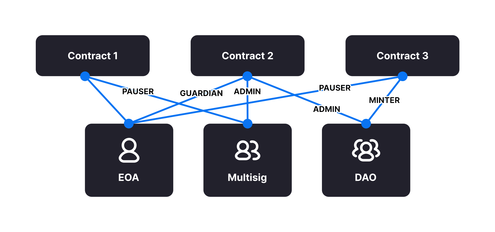
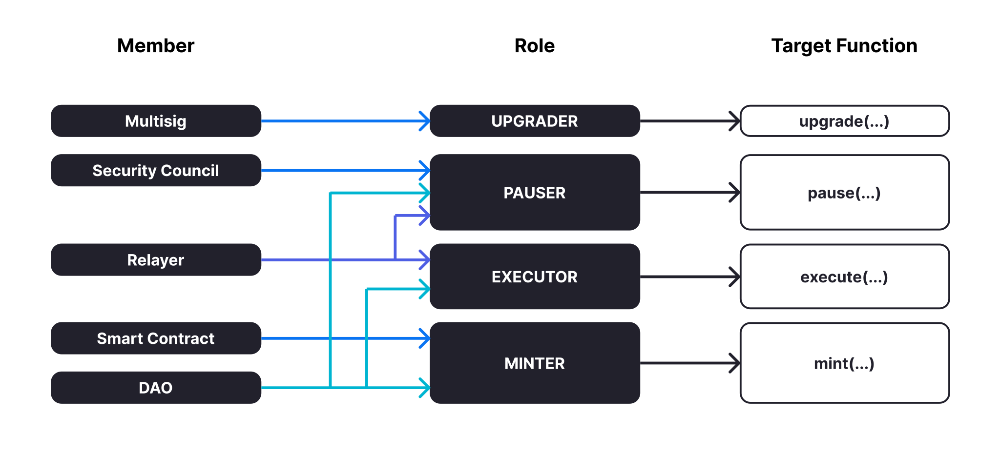

## Contracts

**A library for secure smart contract development.** Build on a solid foundation of community-vetted code.

- Implementations of standards like [ERC20](https://docs.openzeppelin.com/contracts/5.x/erc20) and [ERC721](https://docs.openzeppelin.com/contracts/5.x/erc721).
- Flexible [role-based permissioning](https://docs.openzeppelin.com/contracts/5.x/access-control) scheme.
- Reusable [Solidity components](https://docs.openzeppelin.com/contracts/5.x/utilities) to build custom contracts and complex decentralized systems.

```
OpenZeppelin Contracts uses semantic versioning to communicate backwards compatibility of its API and storage layout. For upgradeable contracts, the storage layout of different major versions should be assumed incompatible, for example, it is unsafe to upgrade from 4.9.3 to 5.0.0. Learn more at Backwards Compatibility.
```

Hardhat (npm)

```
$ npm install @openzeppelin/contracts
```

Foundry (git)

```bash
forge install OpenZeppelin/openzeppelin-contracts
```

Usage

Once installed.you can use the contracts in the library by importing them:

```solidity
// contracts/MyNFT.sol
// SPDX-License-Identifier: MIT
pragma solidity ^0.8.20;

import {ERC721} from "@openzeppelin/contracts/token/ERC721/ERC721.sol";

contract MyNFT is ERC721 {
    constructor() ERC721("MyNFT", "MNFT") {}
}
```


### Contract Wizard

https://docs.openzeppelin.com/contracts/5.x/wizard

#### Extending Contracts

Most of the OpenZeppelin Contracts are expected to be used via [inheritance](https://solidity.readthedocs.io/en/latest/contracts.html#inheritance): you will *inherit* from them when writing your own contracts.

This is the commonly found `is` syntax, like in `contract MyToken is ERC20`.

```

Unlike contracts, Solidity librarys are not inherited from and instead rely on the using for syntax.

OpenZeppelin Contracts has some librarys: most are in the Utils directory.
```

##### Overriding

Inheritance is often used to add the parent contract’s functionality to your own contract, but that’s not all it can do. You can also *change* how some parts of the parent behave using *overrides*.

For example, imagine you want to change [`AccessControl`](https://docs.openzeppelin.com/contracts/5.x/api/access#AccessControl) so that [`revokeRole`](https://docs.openzeppelin.com/contracts/5.x/api/access#AccessControl-revokeRole-bytes32-address-) can no longer be called. This can be achieved using overrides:

```solidity
// contracts/AccessControlModified.sol
// SPDX-License-Identifier: MIT
pragma solidity ^0.8.20;

import {AccessControl} from "@openzeppelin/contracts/access/AccessControl.sol";

contract AccessControlModified is AccessControl {
    error AccessControlNonRevocable();

    // Override the revokeRole function
    function revokeRole(bytes32, address) public pure override {
        revert AccessControlNonRevocable();
    }
}
```

The old `revokeRole` is then replaced by our override, and any calls to it will immediately revert. We cannot *remove* the function from the contract, but reverting on all calls is good enough.

##### Calling `super`

Sometimes you want to *extend* a parent’s behavior, instead of outright changing it to something else. This is where `super` comes in.

The `super` keyword will let you call functions defined in a parent contract, even if they are overridden. This mechanism can be used to add additional checks to a function, emit events, or otherwise add functionality as you see fit.

```
For more information on how overrides work, head over to the official Solidity documentation.
```

Here is a modified version of [`AccessControl`](https://docs.openzeppelin.com/contracts/5.x/api/access#AccessControl) where [`revokeRole`](https://docs.openzeppelin.com/contracts/5.x/api/access#AccessControl-revokeRole-bytes32-address-) cannot be used to revoke the `DEFAULT_ADMIN_ROLE`:

```solidity
// contracts/AccessControlNonRevokableAdmin.sol
// SPDX-License-Identifier: MIT
pragma solidity ^0.8.20;

import {AccessControl} from "@openzeppelin/contracts/access/AccessControl.sol";

contract AccessControlNonRevokableAdmin is AccessControl {
    error AccessControlNonRevokable();

    function revokeRole(bytes32 role, address account) public override {
        if (role == DEFAULT_ADMIN_ROLE) {
            revert AccessControlNonRevokable();
        }

        super.revokeRole(role, account);
    }
}
```

The `super.revokeRole` statement at the end will invoke `AccessControl`'s original version of `revokeRole`, the same code that would’ve run if there were no overrides in place.

```
The same rule is implemented and extended in AccessControlDefaultAdminRules, an extension that also adds enforced security measures for the DEFAULT_ADMIN_ROLE.
```

##### Security

The maintainers of OpenZeppelin Contracts are mainly concerned with the correctness and security of the code as published in the library, and the combinations of base contracts with the official extensions from the library.

Custom overrides, especially to hooks, can disrupt important assumptions and may introduce security risks in the code that was previously secure. While we try to ensure the contracts remain secure in the face of a wide range of potential customizations, this is done in a best-effort manner. While we try to document all important assumptions, this should not be relied upon. Custom overrides should be carefully reviewed and checked against the source code of the contract they are customizing to fully understand their impact and guarantee their security.

The way functions interact internally should not be assumed to stay stable across releases of the library. For example, a function that is used in one context in a particular release may not be used in the same context in the next release. Contracts that override functions should revalidate their assumptions when updating the version of OpenZeppelin Contracts they are built on.

OpenZeppelin 合约的维护者主要关注库中发布的代码的正确性和安全性，以及基础合约与库中官方扩展的组合。

自定义覆盖（尤其是对钩子的覆盖）可能会破坏重要的假设，并可能给先前安全的代码带来安全风险。虽然我们尽力确保合约在面对各种潜在定制时仍然安全，但这已是尽最大努力。虽然我们尽力记录所有重要的假设，但不应依赖这些假设。应仔细审查自定义覆盖，并根据其所定制合约的源代码进行检查，以充分了解其影响并确保其安全性。

不应假设函数内部交互的方式在库的不同版本之间保持稳定。例如，在特定版本中某个上下文中使用的函数可能不会在下一个版本中在相同的上下文中使用。覆盖函数的合约应在更新其所基于的 OpenZeppelin 合约版本时重新验证其假设。

### Backwards Compatibility 向后兼容性

OpenZeppelin Contracts uses semantic versioning to communicate backwards compatibility of its API and storage layout. Patch and minor updates will generally be backwards compatible, with rare exceptions as detailed below. Major updates should be assumed incompatible with previous releases. On this page, we provide details about these guarantees.

OpenZeppelin Contracts 使用语义版本控制来传达其 API 和存储布局的向后兼容性。补丁和次要更新通常向后兼容，但下文所述的少数例外情况除外。主要更新应假定与先前版本不兼容。在本页面，我们提供有关这些保证的详细信息。

#### API

In backwards compatible releases, all changes should be either additions or modifications to internal implementation details. Most code should continue to compile and behave as expected. The exceptions to this rule are listed below.

在向后兼容的版本中，所有更改都应为对内部实现细节的添加或修改。大多数代码应继续按预期进行编译和运行。此规则的例外情况如下所列。

#### Security

Infrequently a patch or minor update will remove or change an API in a breaking way, but only if the previous API is considered insecure. These breaking changes will be noted in the changelog and release notes, and published along with a security advisory.

补丁或小更新偶尔会移除或更改 API，但前提是之前的 API 被认为不安全。这些重大更改将在变更日志和发行说明中注明，并随安全公告一起发布。

#### Draft or Pre-Final ERCs 草案或预最终版 ERC

ERCs that are not Final can change in incompatible ways. For this reason, we avoid shipping implementations of ERCs before they are Final. Some exceptions are made for ERCs that have been published for a long time and that seem unlikely to change. Breaking changes to the ERC specification are still technically possible in those cases, so these implementations are published in files named `draft-*.sol` to make that condition explicit.

非最终版 ERC 可能会以不兼容的方式进行更改。因此，我们避免在 ERC 最终版之前发布其实现。对于已发布很长时间且不太可能更改的 ERC，我们会做出一些例外。在这种情况下，从技术上讲，对 ERC 规范进行重大更改仍然是可能的，因此这些实现会发布在名为 `draft-*.sol` 的文件中，以明确说明这种情况。

#### Virtual & Overrides

Almost all functions in this library are virtual with some exceptions, but this does not mean that overrides are encouraged. There is a subset of functions that are designed to be overridden. By defining overrides outside of this subset you are potentially relying on internal implementation details. We make efforts to preserve backwards compatibility even in these cases but it is extremely difficult and easy to accidentally break. Caution is advised.

Additionally, some minor updates may result in new compilation errors of the kind "two or more base classes define function with same name and parameter types" or "need to specify overridden contract", due to what Solidity considers ambiguity in inherited functions. This should be resolved by adding an override that invokes the function via `super`.

See [Extending Contracts](https://docs.openzeppelin.com/contracts/5.x/extending-contracts) for more about virtual and overrides.

此库中几乎所有函数都是虚函数，但也有一些例外，但这并不意味着鼓励重写。有一些函数子集被设计为可重写。通过定义此子集之外的重写，您可能会依赖内部实现细节。即使在这些情况下，我们也努力保持向后兼容性，但意外中断的可能性极小，而且很容易发生。建议您谨慎操作。

此外，由于 Solidity 认为继承函数存在歧义，一些小更新可能会导致新的编译错误，例如“两个或多个基类定义了具有相同名称和参数类型的函数”或“需要指定重写的合约”。这可以通过添加通过“super”调用该函数的重写来解决。

有关虚函数和重写的更多信息，请参阅[扩展合约](https://docs.openzeppelin.com/contracts/5.x/extending-contracts)。

#### Structs

Struct members with an underscore prefix should be considered "private" and may break in minor versions. Struct data should only be accessed and modified through library functions.

带有下划线前缀的结构体成员应被视为“私有”，并且可能会在小版本中失效。结构体数据只能通过库函数访问和修改。

#### Errors

The specific error format and data that is included with reverts should not be assumed stable unless otherwise specified.

#### Major Releases

Major releases should be assumed incompatible. Nevertheless, the external interfaces of contracts will remain compatible if they are standardized, or if the maintainers judge that changing them would cause significant strain on the ecosystem.

An important aspect that major releases may break is "upgrade compatibility", in particular storage layout compatibility. It will never be safe for a live contract to upgrade from one major release to another

#### Storage Layout

Minor and patch updates always preserve storage layout compatibility. This means that a live contract can be upgraded from one minor to another without corrupting the storage layout. In some cases it may be necessary to initialize new state variables when upgrading, although we expect this to be infrequent.

We recommend using [OpenZeppelin Upgrades Plugins or CLI](https://docs.openzeppelin.com/upgrades-plugins/) to ensure storage layout safety of upgrades.

#### Solidity Version

The minimum Solidity version required to compile the contracts will remain unchanged in minor and patch updates. New contracts introduced in minor releases may make use of newer Solidity features and require a more recent version of the compiler.

### Access Control

Access control—that is, "who is allowed to do this thing"—is incredibly important in the world of smart contracts. The access control of your contract may govern who can mint tokens, vote on proposals, freeze transfers, and many other things. It is therefore **critical** to understand how you implement it, lest someone else [steals your whole system](https://blog.openzeppelin.com/on-the-parity-wallet-multisig-hack-405a8c12e8f7).

#### Ownership and `Ownable`

The most common and basic form of access control is the concept of *ownership*: there’s an account that is the `owner` of a contract and can do administrative tasks on it. This approach is perfectly reasonable for contracts that have a single administrative user.

OpenZeppelin Contracts provides [`Ownable`](https://docs.openzeppelin.com/contracts/5.x/api/access#Ownable) for implementing ownership in your contracts.

```solidity
// SPDX-License-Identifier: MIT

pragma solidity ^0.8.20;

import {Ownable} from "@openzeppelin/contracts/access/Ownable.sol";

contract MyContract is Ownable {
    constructor(address initialOwner) Ownable(initialOwner) {}

    function normalThing() public {
        // anyone can call this normalThing()
    }

    function specialThing() public onlyOwner {
        // only the owner can call specialThing()!
    }
}
```

At deployment, the [`owner`](https://docs.openzeppelin.com/contracts/5.x/api/access#Ownable-owner--) of an `Ownable` contract is set to the provided `initialOwner` parameter.

Ownable also lets you:

- [`transferOwnership`](https://docs.openzeppelin.com/contracts/5.x/api/access#Ownable-transferOwnership-address-) from the owner account to a new one, and
- [`renounceOwnership`](https://docs.openzeppelin.com/contracts/5.x/api/access#Ownable-renounceOwnership--) for the owner to relinquish this administrative privilege, a common pattern after an initial stage with centralized administration is over.

```

Removing the owner altogether will mean that administrative tasks that are protected by onlyOwner will no longer be callable!
```

wnable is a simple and effective way to implement access control, but you should be mindful of the dangers associated with transferring the ownership to an incorrect account that can’t interact with this contract anymore. An alternative to this problem is using [`Ownable2Step`](https://docs.openzeppelin.com/contracts/5.x/api/access#Ownable2Step); a variant of Ownable that requires the new owner to explicitly accept the ownership transfer by calling [`acceptOwnership`](https://docs.openzeppelin.com/contracts/5.x/api/access#Ownable2Step-acceptOwnership--).

Note that **a contract can also be the owner of another one**! This opens the door to using, for example, a [Gnosis Safe](https://safe.global/), an [Aragon DAO](https://aragon.org/), or a totally custom contract that *you* create.

In this way, you can use *composability* to add additional layers of access control complexity to your contracts. Instead of having a single regular Ethereum account (Externally Owned Account, or EOA) as the owner, you could use a 2-of-3 multisig run by your project leads, for example. Prominent projects in the space, such as [MakerDAO](https://makerdao.com/), use systems similar to this one.

#### Role-Based Access Control

While the simplicity of *ownership* can be useful for simple systems or quick prototyping, different levels of authorization are often needed. You may want for an account to have permission to ban users from a system, but not create new tokens. [*Role-Based Access Control (RBAC)*](https://en.wikipedia.org/wiki/Role-based_access_control) offers flexibility in this regard.

In essence, we will be defining multiple *roles*, each allowed to perform different sets of actions. An account may have, for example, 'moderator', 'minter' or 'admin' roles, which you will then check for instead of simply using `onlyOwner`. This check can be enforced through the `onlyRole` modifier. Separately, you will be able to define rules for how accounts can be granted a role, have it revoked, and more.

Most software uses access control systems that are role-based: some users are regular users, some may be supervisors or managers, and a few will often have administrative privileges.

##### Using `AccessControl`

OpenZeppelin Contracts provides [`AccessControl`](https://docs.openzeppelin.com/contracts/5.x/api/access#AccessControl) for implementing role-based access control. Its usage is straightforward: for each role that you want to define, you will create a new *role identifier* that is used to grant, revoke, and check if an account has that role.

Here’s a simple example of using `AccessControl` in an [ERC-20 token](https://docs.openzeppelin.com/contracts/5.x/erc20) to define a 'minter' role, which allows accounts that have it create new tokens:

```solidity
// SPDX-License-Identifier: MIT
pragma solidity ^0.8.20;

import {AccessControl} from "@openzeppelin/contracts/access/AccessControl.sol";
import {ERC20} from "@openzeppelin/contracts/token/ERC20/ERC20.sol";

contract AccessControlERC20MintBase is ERC20, AccessControl {
    // Create a new role identifier for the minter role
    bytes32 public constant MINTER_ROLE = keccak256("MINTER_ROLE");

    error CallerNotMinter(address caller);

    constructor(address minter) ERC20("MyToken", "TKN") {
        // Grant the minter role to a specified account
        _grantRole(MINTER_ROLE, minter);
    }

    function mint(address to, uint256 amount) public {
        // Check that the calling account has the minter role
        if (!hasRole(MINTER_ROLE, msg.sender)) {
            revert CallerNotMinter(msg.sender);
        }
        _mint(to, amount);
    }
}
```

```note
Make sure you fully understand how AccessControl works before using it on your system, or copy-pasting the examples from this guide.
```

While clear and explicit, this isn’t anything we wouldn’t have been able to achieve with `Ownable`. Indeed, where `AccessControl` shines is in scenarios where granular permissions are required, which can be implemented by defining *multiple* roles.

Let’s augment our ERC-20 token example by also defining a 'burner' role, which lets accounts destroy tokens, and by using the `onlyRole` modifier:

```solidity
// SPDX-License-Identifier: MIT
pragma solidity ^0.8.20;

import {AccessControl} from "@openzeppelin/contracts/access/AccessControl.sol";
import {ERC20} from "@openzeppelin/contracts/token/ERC20/ERC20.sol";

contract AccessControlERC20Mint is ERC20, AccessControl {
    bytes32 public constant MINTER_ROLE = keccak256("MINTER_ROLE");
    bytes32 public constant BURNER_ROLE = keccak256("BURNER_ROLE");

    constructor(address minter, address burner) ERC20("MyToken", "TKN") {
        _grantRole(MINTER_ROLE, minter);
        _grantRole(BURNER_ROLE, burner);
    }

    function mint(address to, uint256 amount) public onlyRole(MINTER_ROLE) {
        _mint(to, amount);
    }

    function burn(address from, uint256 amount) public onlyRole(BURNER_ROLE) {
        _burn(from, amount);
    }
}
```

So clean! By splitting concerns this way, more granular levels of permission may be implemented than were possible with the simpler *ownership* approach to access control. Limiting what each component of a system is able to do is known as the [principle of least privilege](https://en.wikipedia.org/wiki/Principle_of_least_privilege), and is a good security practice. Note that each account may still have more than one role, if so desired.

##### Granting and Revoking Roles

The ERC-20 token example above uses `_grantRole`, an `internal` function that is useful when programmatically assigning roles (such as during construction). But what if we later want to grant the 'minter' role to additional accounts?

By default, **accounts with a role cannot grant it or revoke it from other accounts**: all having a role does is making the `hasRole` check pass. To grant and revoke roles dynamically, you will need help from the *role’s admin*.

Every role has an associated admin role, which grants permission to call the `grantRole` and `revokeRole` functions. A role can be granted or revoked by using these if the calling account has the corresponding admin role. Multiple roles may have the same admin role to make management easier. A role’s admin can even be the same role itself, which would cause accounts with that role to be able to also grant and revoke it.

This mechanism can be used to create complex permissioning structures resembling organizational charts, but it also provides an easy way to manage simpler applications. `AccessControl` includes a special role, called `DEFAULT_ADMIN_ROLE`, which acts as the **default admin role for all roles**. An account with this role will be able to manage any other role, unless `_setRoleAdmin` is used to select a new admin role.

Since it is the admin for all roles by default, and in fact it is also its own admin, this role carries significant risk. To mitigate this risk we provide [`AccessControlDefaultAdminRules`](https://docs.openzeppelin.com/contracts/5.x/api/access#AccessControlDefaultAdminRules), a recommended extension of `AccessControl` that adds a number of enforced security measures for this role: the admin is restricted to a single account, with a 2-step transfer procedure with a delay in between steps.

Let’s take a look at the ERC-20 token example, this time taking advantage of the default admin role:

```solidity
// SPDX-License-Identifier: MIT
pragma solidity ^0.8.20;

import {AccessControl} from "@openzeppelin/contracts/access/AccessControl.sol";
import {ERC20} from "@openzeppelin/contracts/token/ERC20/ERC20.sol";

contract AccessControlERC20MintMissing is ERC20, AccessControl {
    bytes32 public constant MINTER_ROLE = keccak256("MINTER_ROLE");
    bytes32 public constant BURNER_ROLE = keccak256("BURNER_ROLE");

    constructor() ERC20("MyToken", "TKN") {
        // Grant the contract deployer the default admin role: it will be able
        // to grant and revoke any roles
        _grantRole(DEFAULT_ADMIN_ROLE, msg.sender);
    }

    function mint(address to, uint256 amount) public onlyRole(MINTER_ROLE) {
        _mint(to, amount);
    }

    function burn(address from, uint256 amount) public onlyRole(BURNER_ROLE) {
        _burn(from, amount);
    }
}
```


Note that, unlike the previous examples, no accounts are granted the 'minter' or 'burner' roles. However, because those roles' admin role is the default admin role, and *that* role was granted to `msg.sender`, that same account can call `grantRole` to give minting or burning permission, and `revokeRole` to remove it.

Dynamic role allocation is often a desirable property, for example in systems where trust in a participant may vary over time. It can also be used to support use cases such as [KYC](https://en.wikipedia.org/wiki/Know_your_customer), where the list of role-bearers may not be known up-front, or may be prohibitively expensive to include in a single transaction.

##### Querying Privileged Accounts

Because accounts might [grant and revoke roles](https://docs.openzeppelin.com/contracts/5.x/access-control#granting-and-revoking) dynamically, it is not always possible to determine which accounts hold a particular role. This is important as it allows proving certain properties about a system, such as that an administrative account is a multisig or a DAO, or that a certain role has been removed from all users, effectively disabling any associated functionality.

Under the hood, `AccessControl` uses `EnumerableSet`, a more powerful variant of Solidity’s `mapping` type, which allows for key enumeration. `getRoleMemberCount` can be used to retrieve the number of accounts that have a particular role, and `getRoleMember` can then be called to get the address of each of these accounts.

```solidity
const minterCount = await myToken.getRoleMemberCount(MINTER_ROLE);

const members = [];
for (let i = 0; i < minterCount; ++i) {
    members.push(await myToken.getRoleMember(MINTER_ROLE, i));
}
```

##### Delayed operation

Access control is essential to prevent unauthorized access to critical functions. These functions may be used to mint tokens, freeze transfers or perform an upgrade that completely changes the smart contract logic. While [`Ownable`](https://docs.openzeppelin.com/contracts/5.x/api/access#Ownable) and [`AccessControl`](https://docs.openzeppelin.com/contracts/5.x/api/access#AccessControl) can prevent unauthorized access, they do not address the issue of a misbehaving administrator attacking their own system to the prejudice of their users.

This is the issue the [`TimelockController`](https://docs.openzeppelin.com/contracts/5.x/api/governance#TimelockController) is addressing.

The [`TimelockController`](https://docs.openzeppelin.com/contracts/5.x/api/governance#TimelockController) is a proxy that is governed by proposers and executors. When set as the owner/admin/controller of a smart contract, it ensures that whichever maintenance operation is ordered by the proposers is subject to a delay. This delay protects the users of the smart contract by giving them time to review the maintenance operation and exit the system if they consider it is in their best interest to do so.

##### Using `TimelockController`

By default, the address that deployed the [`TimelockController`](https://docs.openzeppelin.com/contracts/5.x/api/governance#TimelockController) gets administration privileges over the timelock. This role grants the right to assign proposers, executors, and other administrators.

The first step in configuring the [`TimelockController`](https://docs.openzeppelin.com/contracts/5.x/api/governance#TimelockController) is to assign at least one proposer and one executor. These can be assigned during construction or later by anyone with the administrator role. These roles are not exclusive, meaning an account can have both roles.

Roles are managed using the [`AccessControl`](https://docs.openzeppelin.com/contracts/5.x/api/access#AccessControl) interface and the `bytes32` values for each role are accessible through the `ADMIN_ROLE`, `PROPOSER_ROLE` and `EXECUTOR_ROLE` constants.

There is an additional feature built on top of `AccessControl`: giving the executor role to `address(0)` opens access to anyone to execute a proposal once the timelock has expired. This feature, while useful, should be used with caution.

At this point, with both a proposer and an executor assigned, the timelock can perform operations.

An optional next step is for the deployer to renounce its administrative privileges and leave the timelock self-administered. If the deployer decides to do so, all further maintenance, including assigning new proposers/schedulers or changing the timelock duration will have to follow the timelock workflow. This links the governance of the timelock to the governance of contracts attached to the timelock, and enforce a delay on timelock maintenance operations.

#### Access Management

For a system of contracts, better integrated role management can be achieved with an [`AccessManager`](https://docs.openzeppelin.com/contracts/5.x/api/access#AccessManager) instance. Instead of managing each contract’s permission separately, AccessManager stores all the permissions in a single contract, making your protocol easier to audit and maintain.

Although [`AccessControl`](https://docs.openzeppelin.com/contracts/5.x/api/access#AccessControl) offers a more dynamic solution for adding permissions to your contracts than Ownable, decentralized protocols tend to become more complex after integrating new contract instances and requires you to keep track of permissions separately in each contract. This increases the complexity of permissions management and monitoring across the system.

对于合约系统，使用 [`AccessManager`](https://docs.openzeppelin.com/contracts/5.x/api/access#AccessManager) 实例可以实现更好的集成角色管理。AccessManager 无需单独管理每个合约的权限，而是将所有权限存储在单个合约中，从而使您的协议更易于审计和维护。

虽然 [`AccessControl`](https://docs.openzeppelin.com/contracts/5.x/api/access#AccessControl) 提供了比 Ownable 更动态的合约权限添加解决方案，但去中心化协议在集成新的合约实例后往往会变得更加复杂，并且需要您在每个合约中分别跟踪权限。这增加了整个系统的权限管理和监控的复杂性。



Protocols managing permissions in production systems often require more integrated alternatives to fragmented permissions through multiple `AccessControl` instances.

生产系统中管理权限的协议通常需要通过多个“AccessControl”实例来提供更集成的替代方案来替代分散的权限。

The AccessManager is designed around the concept of role and target functions:

- Roles are granted to accounts (addresses) following a many-to-many approach for flexibility. This means that each user can have one or multiple roles and multiple users can have the same role.
- Access to a restricted target function is limited to one role. A target function is defined by one [function selector](https://docs.soliditylang.org/en/v0.8.20/abi-spec.html#function-selector) on one contract (called target).

For a call to be authorized, the caller must bear the role that is assigned to the current target function (contract address + function selector).



##### Using `AccessManager`

OpenZeppelin Contracts provides [`AccessManager`](https://docs.openzeppelin.com/contracts/5.x/api/access#AccessManager) for managing roles across any number of contracts. The `AccessManager` itself is a contract that can be deployed and used out of the box. It sets an initial admin in the constructor who will be allowed to perform management operations.

In order to restrict access to some functions of your contract, you should inherit from the [`AccessManaged`](https://docs.openzeppelin.com/contracts/5.x/api/access#AccessManaged) contract provided along with the manager. This provides the `restricted` modifier that can be used to protect any externally facing function. Note that you will have to specify the address of the AccessManager instance ([`initialAuthority`](https://docs.openzeppelin.com/contracts/5.x/api/access#AccessManaged-constructor-address-)) in the constructor so the `restricted` modifier knows which manager to use for checking permissions.

Here’s a simple example of an [ERC-20 token](https://docs.openzeppelin.com/contracts/5.x/tokens#ERC20) that defines a `mint` function that is restricted by an [`AccessManager`](https://docs.openzeppelin.com/contracts/5.x/api/access#AccessManager):

```solidity
// SPDX-License-Identifier: MIT
pragma solidity ^0.8.20;

import {AccessManaged} from "@openzeppelin/contracts/access/manager/AccessManaged.sol";
import {ERC20} from "@openzeppelin/contracts/token/ERC20/ERC20.sol";

contract AccessManagedERC20Mint is ERC20, AccessManaged {
    constructor(address manager) ERC20("MyToken", "TKN") AccessManaged(manager) {}

    // Minting is restricted according to the manager rules for this function.
    // The function is identified by its selector: 0x40c10f19.
    // Calculated with bytes4(keccak256('mint(address,uint256)'))
    function mint(address to, uint256 amount) public restricted {
        _mint(to, amount);
    }
}
```

### Tokens

Ah, the "token": blockchain’s most powerful and most misunderstood tool.

A token is a *representation of something in the blockchain*. This something can be money, time, services, shares in a company, a virtual pet, anything. By representing things as tokens, we can allow smart contracts to interact with them, exchange them, create or destroy them.

- But First, Coffee a Primer on Token Contracts

Much of the confusion surrounding tokens comes from two concepts getting mixed up: *token contracts* and the actual *tokens*.

A *token contract* is simply an Ethereum smart contract. "Sending tokens" actually means "calling a method on a smart contract that someone wrote and deployed". At the end of the day, a token contract is not much more than a mapping of addresses to balances, plus some methods to add and subtract from those balances.

It is these balances that represent the *tokens* themselves. Someone "has tokens" when their balance in the token contract is non-zero. That’s it! These balances could be considered money, experience points in a game, deeds of ownership, or voting rights, and each of these tokens would be stored in different token contracts.

- Different Kinds of Tokens

Note that there’s a big difference between having two voting rights and two deeds of ownership: each vote is equal to all others, but houses usually are not! This is called [fungibility](https://en.wikipedia.org/wiki/Fungibility). *Fungible goods* are equivalent and interchangeable, like Ether, fiat currencies, and voting rights. *Non-fungible* goods are unique and distinct, like deeds of ownership, or collectibles.

In a nutshell, when dealing with non-fungibles (like your house) you care about *which ones* you have, while in fungible assets (like your bank account statement) what matters is *how much* you have.

- Standards

Even though the concept of a token is simple, they have a variety of complexities in the implementation. Because everything in Ethereum is just a smart contract, and there are no rules about what smart contracts have to do, the community has developed a variety of **standards** (called EIPs or ERCs) for documenting how a contract can interoperate with other contracts.

You’ve probably heard of the ERC-20 or ERC-721 token standards, and that’s why you’re here. Head to our specialized guides to learn more about these:

- [ERC-20](https://docs.openzeppelin.com/contracts/5.x/erc20): the most widespread token standard for fungible assets, albeit somewhat limited by its simplicity.
- [ERC-721](https://docs.openzeppelin.com/contracts/5.x/erc721): the de-facto solution for non-fungible tokens, often used for collectibles and games.
- [ERC-1155](https://docs.openzeppelin.com/contracts/5.x/erc1155): a novel standard for multi-tokens, allowing for a single contract to represent multiple fungible and non-fungible tokens, along with batched operations for increased gas efficiency.

#### ERC-20

An ERC-20 token contract keeps track of [*fungible* tokens](https://docs.openzeppelin.com/contracts/5.x/tokens#different-kinds-of-tokens): any one token is exactly equal to any other token; no tokens have special rights or behavior associated with them. This makes ERC-20 tokens useful for things like a **medium of exchange currency**, **voting rights**, **staking**, and more.

OpenZeppelin Contracts provides many ERC20-related contracts. On the [`API reference`](https://docs.openzeppelin.com/contracts/5.x/api/token/ERC20) you’ll find detailed information on their properties and usage.

##### Constructing an ERC-20 Token Contract

Using Contracts, we can easily create our own ERC-20 token contract, which will be used to track *Gold* (GLD), an internal currency in a hypothetical game.

Here’s what our GLD token might look like.

```solidity
// contracts/GLDToken.sol
// SPDX-License-Identifier: MIT
pragma solidity ^0.8.20;

import {ERC20} from "@openzeppelin/contracts/token/ERC20/ERC20.sol";

contract GLDToken is ERC20 {
    constructor(uint256 initialSupply) ERC20("Gold", "GLD") {
        _mint(msg.sender, initialSupply);
    }
}
```

Our contracts are often used via [inheritance](https://solidity.readthedocs.io/en/latest/contracts.html#inheritance), and here we’re reusing [`ERC20`](https://docs.openzeppelin.com/contracts/5.x/api/token/ERC20#erc20) for both the basic standard implementation and the [`name`](https://docs.openzeppelin.com/contracts/5.x/api/token/ERC20#ERC20-name--), [`symbol`](https://docs.openzeppelin.com/contracts/5.x/api/token/ERC20#ERC20-symbol--), and [`decimals`](https://docs.openzeppelin.com/contracts/5.x/api/token/ERC20#ERC20-decimals--) optional extensions. Additionally, we’re creating an `initialSupply` of tokens, which will be assigned to the address that deploys the contract.

That’s it! Once deployed, we will be able to query the deployer’s balance:

```typescript
> GLDToken.balanceOf(deployerAddress)
1000000000000000000000
```

We can also [transfer](https://docs.openzeppelin.com/contracts/5.x/api/token/ERC20#IERC20-transfer-address-uint256-) these tokens to other accounts:

```typescript
> GLDToken.transfer(otherAddress, 300000000000000000000)
> GLDToken.balanceOf(otherAddress)
300000000000000000000
> GLDToken.balanceOf(deployerAddress)
700000000000000000000
```

##### A Note on `decimals`

Often, you’ll want to be able to divide your tokens into arbitrary amounts: say, if you own `5 GLD`, you may want to send `1.5 GLD` to a friend, and keep `3.5 GLD` to yourself. Unfortunately, Solidity and the EVM do not support this behavior: only integer (whole) numbers can be used, which poses an issue. You may send `1` or `2` tokens, but not `1.5`.

To work around this, [`ERC20`](https://docs.openzeppelin.com/contracts/5.x/api/token/ERC20#ERC20) provides a [`decimals`](https://docs.openzeppelin.com/contracts/5.x/api/token/ERC20#ERC20-decimals--) field, which is used to specify how many decimal places a token has. To be able to transfer `1.5 GLD`, `decimals` must be at least `1`, since that number has a single decimal place.

How can this be achieved? It’s actually very simple: a token contract can use larger integer values, so that a balance of `50` will represent `5 GLD`, a transfer of `15` will correspond to `1.5 GLD` being sent, and so on.

It is important to understand that `decimals` is *only used for display purposes*. All arithmetic inside the contract is still performed on integers, and it is the different user interfaces (wallets, exchanges, etc.) that must adjust the displayed values according to `decimals`. The total token supply and balance of each account are not specified in `GLD`: you need to divide by `10 ** decimals` to get the actual `GLD` amount.

You’ll probably want to use a `decimals` value of `18`, just like Ether and most ERC-20 token contracts in use, unless you have a very special reason not to. When minting tokens or transferring them around, you will be actually sending the number `num GLD * (10 ** decimals)`.

```

By default, ERC20 uses a value of 18 for decimals. To use a different value, you will need to override the decimals() function in your contract.
```

```solidity
function decimals() public view virtual override returns (uint8) {
  return 16;
}
```

So if you want to send `5` tokens using a token contract with 18 decimals, the method to call will actually be:

```solidity
transfer(recipient, 5 * (10 ** 18));
```


#### ERC-721

We’ve discussed how you can make a *fungible* token using [ERC-20](https://docs.openzeppelin.com/contracts/5.x/erc20), but what if not all tokens are alike? This comes up in situations like **real estate**, **voting rights**, or **collectibles**, where some items are valued more than others, due to their usefulness, rarity, etc. ERC-721 is a standard for representing ownership of [*non-fungible* tokens](https://docs.openzeppelin.com/contracts/5.x/tokens#different-kinds-of-tokens), that is, where each token is unique.

ERC-721 is a more complex standard than ERC-20, with multiple optional extensions, and is split across a number of contracts. The OpenZeppelin Contracts provide flexibility regarding how these are combined, along with custom useful extensions. Check out the [API Reference](https://docs.openzeppelin.com/contracts/5.x/api/token/ERC721) to learn more about these.


### Governance

#### How to set up on-chain governance

In this guide we will learn how OpenZeppelin’s Governor contract works, how to set it up, and how to use it to create proposals, vote for them, and execute them, using tools provided by Ethers.js and Tally.

在本指南中，我们将了解 OpenZeppelin 的 Governor 合约如何运作、如何设置它以及如何使用它来创建提案、对其进行投票和执行提案，使用 Ethers.js 和 Tally 提供的工具。

|      | Find detailed contract documentation at [Governance API](https://docs.openzeppelin.com/contracts/5.x/api/governance). |
| ---- | ------------------------------------------------------------ |
|      |                                                              |


#### Introduction

Decentralized protocols are in constant evolution from the moment they are publicly released. Often, the initial team retains control of this evolution in the first stages, but eventually delegates it to a community of stakeholders. The process by which this community makes decisions is called on-chain governance, and it has become a central component of decentralized protocols, fueling varied decisions such as parameter tweaking, smart contract upgrades, integrations with other protocols, treasury management, grants, etc.

去中心化协议自公开发布之日起便处于不断发展演变之中。通常，初始团队在最初阶段掌控着这一演变的控制权，但最终会将其委托给利益相关者社区。这个社区的决策过程被称为链上治理，它已成为去中心化协议的核心组成部分，推动着各种决策，例如参数调整、智能合约升级、与其他协议的集成、资金管理、拨款等等。

This governance protocol is generally implemented in a special-purpose contract called “Governor”. The GovernorAlpha and GovernorBravo contracts designed by Compound have been very successful and popular so far, with the downside that projects with different requirements have had to fork the code to customize it for their needs, which can pose a high risk of introducing security issues. For OpenZeppelin Contracts, we set out to build a modular system of Governor contracts so that forking is not needed, and different requirements can be accommodated by writing small modules using Solidity inheritance. You will find the most common requirements out of the box in OpenZeppelin Contracts, but writing additional ones is simple, and we will be adding new features as requested by the community in future releases. Additionally, the design of OpenZeppelin Governor requires minimal use of storage and results in more gas efficient operation.

该治理协议通常由名为“Governor”的专用合约实现。Compound 设计的 GovernorAlpha 和 GovernorBravo 合约迄今为止非常成功且广受欢迎，但其缺点是，具有不同需求的项目必须分叉代码来根据自身需求进行定制，这可能会带来很高的安全问题风险。对于 OpenZeppelin 合约，我们着手构建一个模块化的 Governor 合约系统，这样就无需分叉，只需使用 Solidity 继承编写小型模块即可满足不同的需求。OpenZeppelin 合约中已包含最常见的开箱即用需求，但编写其他需求也很简单，我们将根据社区的需求在未来版本中添加新功能。此外，OpenZeppelin Governor 的设计最大限度地减少了存储空间的使用，从而提高了 Gas 的利用效率。

#### Compatibility

OpenZeppelin’s Governor system was designed with a concern for compatibility with existing systems that were based on Compound’s GovernorAlpha and GovernorBravo. Because of this, you will find that many modules are presented in two variants, one of which is built for compatibility with those systems.

OpenZeppelin 的 Governor 系统在设计时就考虑到了与基于 Compound 的 GovernorAlpha 和 GovernorBravo 的现有系统的兼容性。因此，您会发现许多模块都以两种变体呈现，其中一种变体专为与这些系统兼容而构建。

##### ERC20Votes & ERC20VotesComp

The ERC-20 extension to keep track of votes and vote delegation is one such case. The shorter one is the more generic version because it can support token supplies greater than 2^96, while the “Comp” variant is limited in that regard, but exactly fits the interface of the COMP token that is used by GovernorAlpha and Bravo. Both contract variants share the same events, so they are fully compatible when looking at events only.

用于跟踪投票和投票委托的 ERC-20 扩展就是一个例子。较短的版本是更通用的版本，因为它可以支持大于 2^96 的代币供应量，而“Comp”版本在这方面有所限制，但它恰好符合 GovernorAlpha 和 Bravo 使用的 COMP 代币的接口。这两个合约版本共享相同的事件，因此仅从事件来看，它们是完全兼容的。

##### Governor & GovernorStorage

An OpenZeppelin Governor contract is not interface-compatible with Compound’s GovernorAlpha or Bravo. Even though events are fully compatible, proposal lifecycle functions (creation, execution, etc.) have different signatures that are meant to optimize storage use. Other functions from GovernorAlpha and Bravo are likewise not available. It’s possible to opt in some Bravo-like behavior by inheriting from the GovernorStorage module. This module provides proposal enumerability and alternate versions of the `queue`, `execute` and `cancel` function that only take the proposal id. This module reduces the calldata needed by some operations in exchange for an increased storage footprint. This might be a good trade-off for some L2 chains. It also provides primitives for indexer-free frontends.

Note that even with the use of this module, one important difference with Compound’s GovernorBravo is the way that `proposalId`s are calculated. Governor uses the hash of the proposal parameters with the purpose of keeping its data off-chain by event indexing, while the original Bravo implementation uses sequential `proposalId`s.

OpenZeppelin Governor 合约与 Compound 的 GovernorAlpha 或 Bravo 接口不兼容。尽管事件完全兼容，但提案生命周期函数（创建、执行等）的签名有所不同，旨在优化存储使用。GovernorAlpha 和 Bravo 的其他函数同样不可用。可以通过继承 GovernorStorage 模块来选择一些类似 Bravo 的行为。该模块提供提案枚举功能，以及仅接受提案 ID 的队列、执行和取消函数的替代版本。该模块减少了某些操作所需的调用数据，但增加了存储空间。对于某些 L2 链来说，这可能是一个不错的权衡。它还为无索引前端提供了原语。

请注意，即使使用此模块，它与 Compound 的 GovernorBravo 的一个重要区别在于 `proposalId` 的计算方式。Governor 使用提案参数的哈希值，目的是通过事件索引将其数据保持在链下，而原始的 Bravo 实现使用顺序 `proposalId`。

##### GovernorTimelockControl & GovernorTimelockCompound

When using a timelock with your Governor contract, you can use either OpenZeppelin’s TimelockController or Compound’s Timelock. Based on the choice of timelock, you should choose the corresponding Governor module: GovernorTimelockControl or GovernorTimelockCompound respectively. This allows you to migrate an existing GovernorAlpha instance to an OpenZeppelin-based Governor without changing the timelock in use.

##### Tally

[Tally](https://www.tally.xyz/) is a full-fledged application for user owned on-chain governance. It comprises a voting dashboard, proposal creation wizard, real time research and analysis, and educational content.

For all of these options, the Governor will be compatible with Tally: users will be able to create proposals, see voting periods and delays following [IERC6372](https://docs.openzeppelin.com/contracts/5.x/api/interfaces#IERC6372), visualize voting power and advocates, navigate proposals, and cast votes. For proposal creation in particular, projects can also use [Defender Transaction Proposals](https://docs.openzeppelin.com/defender/module/actions#transaction-proposals-reference) as an alternative interface.

In the rest of this guide, we will focus on a fresh deploy of the vanilla OpenZeppelin Governor features without concern for compatibility with GovernorAlpha or Bravo.

[Tally](https://www.tally.xyz/) 是一款功能齐全、用户自主掌控的链上治理应用程序。它包含投票仪表盘、提案创建向导、实时研究分析以及教育内容。

所有这些功能，Governor 都将与 Tally 兼容：用户将能够创建提案、查看 [IERC6372](https://docs.openzeppelin.com/contracts/5.x/api/interfaces#IERC6372) 之后的投票周期和延迟情况、可视化投票权和支持者、浏览提案并进行投票。尤其是在创建提案方面，项目还可以使用 [Defender 交易提案](https://docs.openzeppelin.com/defender/module/actions#transaction-proposals-reference) 作为替代界面。

在本指南的其余部分，我们将重点介绍如何全新部署原生 OpenZeppelin Governor 功能，而无需考虑与 GovernorAlpha 或 Bravo 的兼容性。

##### Setup

###### Token

The voting power of each account in our governance setup will be determined by an ERC-20 token. The token has to implement the ERC20Votes extension. This extension will keep track of historical balances so that voting power is retrieved from past snapshots rather than current balance, which is an important protection that prevents double voting.

```solidity
// SPDX-License-Identifier: MIT
pragma solidity ^0.8.20;

import {ERC20} from "@openzeppelin/contracts/token/ERC20/ERC20.sol";
import {ERC20Permit} from "@openzeppelin/contracts/token/ERC20/extensions/ERC20Permit.sol";
import {ERC20Votes} from "@openzeppelin/contracts/token/ERC20/extensions/ERC20Votes.sol";
import {Nonces} from "@openzeppelin/contracts/utils/Nonces.sol";

contract MyToken is ERC20, ERC20Permit, ERC20Votes {
    constructor() ERC20("MyToken", "MTK") ERC20Permit("MyToken") {}

    // The functions below are overrides required by Solidity.

    function _update(address from, address to, uint256 amount) internal override(ERC20, ERC20Votes) {
        super._update(from, to, amount);
    }

    function nonces(address owner) public view virtual override(ERC20Permit, Nonces) returns (uint256) {
        return super.nonces(owner);
    }
}
```

If your project already has a live token that does not include ERC20Votes and is not upgradeable, you can wrap it in a governance token by using ERC20Wrapper. This will allow token holders to participate in governance by wrapping their tokens 1-to-1.


