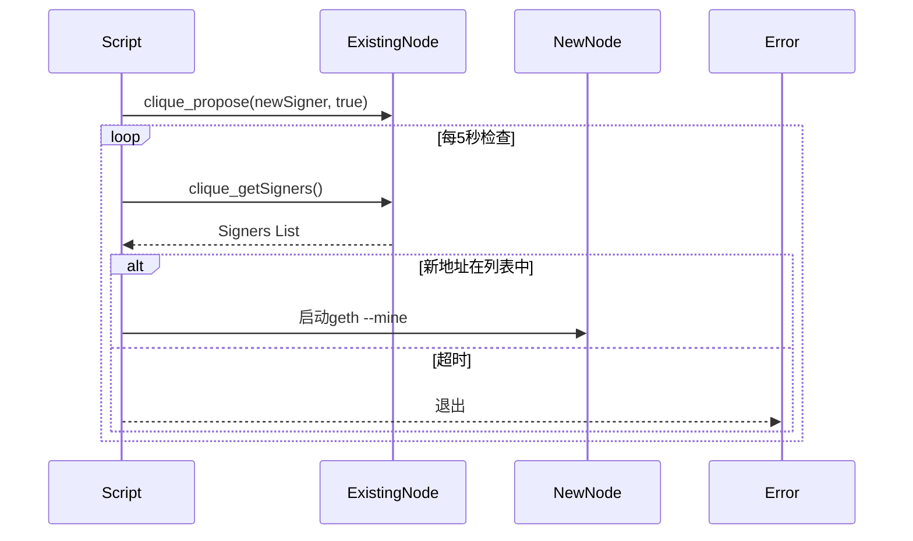

以下是一个完整的 **Clique PoA 私有链动态添加挖矿节点（签名者）的自动化脚本**，使用 **Go 语言** 和 **Geth 的 RPC 接口** 实现。该脚本会自动完成投票、验证和启动新节点。

---

## **1. 脚本功能**
1. **通过 RPC 发起投票**，将新节点加入签名者列表。
2. **验证投票是否通过**（需多数签名者同意）。
3. **自动配置新节点**，启动挖矿。

---

## **2. 完整代码 (`add_poa_signer.go`)**
```go
package main

import (
	"context"
	"fmt"
	"log"
	"os/exec"
	"time"

	"github.com/ethereum/go-ethereum/ethclient"
	"github.com/ethereum/go-ethereum/rpc"
)

const (
	// 配置参数（根据实际情况修改）
	existingNodeRPC = "http://127.0.0.1:8545"    // 现有签名者节点的RPC地址
	newSignerAddr   = "0xcf50ebaebbf3456b91fd9efb81050dac4b1840a4" // 新节点地址
	newNodeDataDir  = "/path/to/new_node_data"    // 新节点数据目录
	networkID       = 12345                       // 私有链网络ID
)

func main() {
	// 1. 连接到现有签名者节点
	client, err := ethclient.Dial(existingNodeRPC)
	if err != nil {
		log.Fatalf("Failed to connect to RPC: %v", err)
	}
	defer client.Close()

	rpcClient, err := rpc.DialContext(context.Background(), existingNodeRPC)
	if err != nil {
		log.Fatalf("Failed to connect to RPC: %v", err)
	}
	defer rpcClient.Close()

	// 2. 发起提案（添加新签名者）
	fmt.Println("Proposing new signer...")
	var result interface{}
	err = rpcClient.Call(&result, "clique_propose", newSignerAddr, true)
	if err != nil {
		log.Fatalf("Proposal failed: %v", err)
	}
	fmt.Println("Proposal submitted. Waiting for votes...")

	// 3. 等待投票通过（检查签名者列表）
	for i := 0; i < 10; i++ { // 重试10次
		time.Sleep(5 * time.Second) // 每5秒检查一次

		var signers []string
		err = rpcClient.Call(&signers, "clique_getSigners")
		if err != nil {
			log.Printf("Failed to get signers: %v", err)
			continue
		}

		for _, signer := range signers {
			if signer == newSignerAddr {
				fmt.Printf("Success! New signer added: %s\n", newSignerAddr)
				startNewNode() // 启动新节点
				return
			}
		}
		fmt.Printf("Waiting... Current signers: %v\n", signers)
	}

	log.Fatalf("Timeout: New signer was not added.")
}

// 启动新节点
func startNewNode() {
	fmt.Println("Starting new node...")
	cmd := exec.Command("geth",
		"--datadir", newNodeDataDir,
		"--networkid", fmt.Sprint(networkID),
		"--syncmode", "full",
		"--mine",
		"--miner.etherbase", newSignerAddr,
		"--unlock", newSignerAddr,
		"--password", newNodeDataDir+"/password.txt", // 密码文件
		"--http",
		"--http.addr", "0.0.0.0",
		"--http.port", "8546", // 避免端口冲突
		"--port", "30304",
		"--verbosity", "3",
	)

	cmd.Stdout = os.Stdout
	cmd.Stderr = os.Stderr

	if err := cmd.Start(); err != nil {
		log.Fatalf("Failed to start new node: %v", err)
	}
	fmt.Printf("New node started with PID %d\n", cmd.Process.Pid)
}
```

---

## **3. 使用步骤**
### **(1) 准备工作**
- **现有 PoA 链**：确保至少有一个签名者节点在运行。
- **新节点账户**：在新节点的 `keystore` 中生成或导入地址 `newSignerAddr`。
- **密码文件**：在新节点数据目录下创建 `password.txt`，包含账户密码。

### **(2) 安装依赖**
```bash
go mod init poa_add_signer
go get github.com/ethereum/go-ethereum
```

### **(3) 运行脚本**
```bash
go run add_poa_signer.go
```

---

## **4. 脚本逻辑详解**
1. **发起提案**  
   - 通过 `clique_propose` RPC 方法请求添加新签名者。
2. **验证投票**  
   - 每隔 5 秒检查 `clique_getSigners`，直到新地址出现。
3. **启动新节点**  
   - 使用 `geth` 命令启动新节点，并启用挖矿。

---

## **5. 关键注意事项**
- **多数投票**：确保 >50% 的现有签名者同意提案（脚本需在多个签名者节点上运行）。
- **端口冲突**：新节点的 `--http.port` 和 `--port` 不能与现有节点冲突。
- **安全建议**：
  - 保护 `password.txt` 文件权限（`chmod 600`）。
  - 生产环境建议使用 **配置文件** 而非命令行参数。

---

## **6. 扩展功能**
- **自动多节点投票**：遍历所有签名者节点，自动发起投票。
- **日志记录**：将操作日志写入文件（如 `logrus` 库）。
- **Docker 支持**：封装为容器，通过环境变量配置参数。

---

## **7. 完整流程图**


---

按此方案，你可以自动化完成 PoA 链的动态扩容。如果需要更复杂的功能（如删除签名者），可以扩展脚本逻辑。