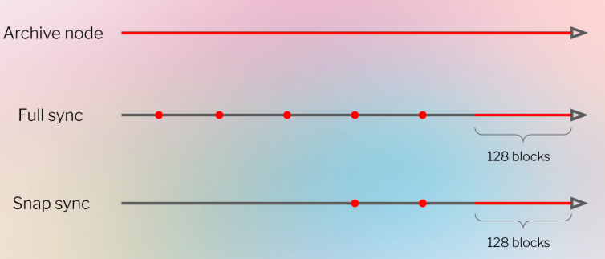

## Fundamentals

### Introduction

This section includes documentation for foundational topics in Geth. The pages here will help you to understand how Geth works from a user perspective and under the hood.

This is where you will find information about how to manage a Geth node and understand how it functions.

For example, the pages here will help you to understand the underlying architecture of your Geth node, how to start it in different configurations using command line options, how to sync the blockchain and how to manage accounts. There is a page on security practices that will help you to keep your Geth node safe from adversaries.

Note also that there is a page explaining common log messages that are often queried on the Geth discord and GitHub - this will help users to interpret the messages displayed to the console and know what actions to take.

本节包含 Geth 基础主题的文档。这些页面将帮助您从用户角度理解 Geth 的工作原理及其底层机制。

在这里，您将找到有关如何管理 Geth 节点及其功能的信息。

例如，这些页面将帮助您了解 Geth 节点的底层架构、如何使用命令行选项以不同的配置启动它、如何同步区块链以及如何管理账户。此外，还有一个关于安全实践的页面，可以帮助您保护 Geth 节点免受攻击。

另请注意，还有一个页面解释了 Geth Discord 和 GitHub 上经常查询的常见日志消息——这将帮助用户解读控制台显示的消息并了解应采取的措施。

#### In this section

- [Node architecture](https://geth.ethereum.org/docs/fundamentals/node-architecture): learn about the three components of an Ethereum node and how they fit together
- [Command line options](https://geth.ethereum.org/docs/fundamentals/command-line-options): see the various command line options that can be used to configure Geth
- [Security](https://geth.ethereum.org/docs/fundamentals/security): learn about basic security best-practises for Geth
- [Sync-modes](https://geth.ethereum.org/docs/fundamentals/sync-modes): learn about the different ways Geth can sync the blockchain
- [Beacon light sync](https://geth.ethereum.org/docs/fundamentals/blsync): learn about the usage of Beacon light client, in integrated mode or standalone mode
- [Account management](https://geth.ethereum.org/docs/fundamentals/account-management): read about how to manage accounts using Clef and Geth
- [Databases](https://geth.ethereum.org/docs/fundamentals/databases): learn about the two parts of database and the recommended database
- [Backup and restore](https://geth.ethereum.org/docs/fundamentals/backup-restore): learn how to backup and restore data for a Geth instance
- [Logs](https://geth.ethereum.org/docs/fundamentals/logs): learn how to interpret the main log messages Geth displays in the console
- [Connecting-to-peers](https://geth.ethereum.org/docs/fundamentals/peer-to-peer): learn about Geth's peer-to-peer networking
- [Pruning](https://geth.ethereum.org/docs/fundamentals/pruning): read about Geth's data pruning options
- [Private networks via kurtosis](https://geth.ethereum.org/docs/fundamentals/kurtosis): learn how to set up a private network of multiple Geth nodes using Kurtosis
- [Private networks](https://geth.ethereum.org/docs/fundamentals/private-network): learn how to set up a private network of multiple Geth nodes
- [Config files](https://geth.ethereum.org/docs/fundamentals/config-files): learn about using config files to tune Geth
- [Mining](https://geth.ethereum.org/docs/fundamentals/mining): read about the mining algorithms Geth used to use to secure Ethereum before the network switched to proof-of-stake.

### Node architecture

An Ethereum node is composed of two clients: an [execution client](https://ethereum.org/en/developers/docs/nodes-and-clients/#execution-clients) and a [consensus client](https://ethereum.org/en/developers/docs/nodes-and-clients/#consensus-clients). Geth is an [execution client](https://ethereum.org/en/developers/docs/nodes-and-clients/#execution-clients). Originally, an execution client alone was enough to run a full Ethereum node. However, ever since Ethereum turned off [proof-of-work](https://ethereum.org/en/developers/docs/consensus-mechanisms/pow/) and implemented [proof-of-stake](https://ethereum.org/en/developers/docs/consensus-mechanisms/pow/), Geth has needed to be coupled to another piece of software called a [“consensus client”](https://ethereum.org/en/developers/docs/nodes-and-clients/#consensus-clients) in order to keep track of the Ethereum blockchain.

The execution client (Geth) is responsible for transaction handling, transaction gossip, state management and supporting the Ethereum Virtual Machine [EVM](https://ethereum.org/en/developers/docs/evm/). However, Geth is **not** responsible for block building, block gossiping or handling consensus logic. These are in the remit of the consensus client.

The relationship between the two Ethereum clients is shown in the schematic below. The two clients each connect to their own respective peer-to-peer (P2P) networks. This is because the execution clients gossip transactions over their P2P network enabling them to manage their local transaction pool. The consensus clients gossip blocks over their P2P network, enabling consensus and chain growth.


For this two-client structure to work, consensus clients must be able to pass bundles of transactions to Geth to be executed. Executing the transactions locally is how the client validates that the transactions do not violate any Ethereum rules and that the proposed update to Ethereum’s state is correct. Likewise, when the node is selected to be a block producer the consensus client must be able to request bundles of transactions from Geth to include in the new block. This inter-client communication is handled by a local RPC connection using the [engine API](https://github.com/ethereum/execution-apis/blob/main/src/engine/).

#### What does Geth do?

As an execution client, Geth is responsible for creating the execution payloads - the list of transactions, updated state trie plus other execution related data - that consensus clients include in their blocks. Geth is also responsible for re-executing transactions that arrive in new blocks to ensure they are valid. Executing transactions is done on Geth's embedded computer, known as the Ethereum Virtual Machine (EVM).

Geth also offers a user-interface to Ethereum by exposing a set of [RPC methods](https://geth.ethereum.org/docs/interacting-with-geth/rpc) that enable users to query the Ethereum blockchain, submit transactions and deploy smart contracts. Often, the RPC calls are abstracted by a library such as [Web3js](https://web3js.readthedocs.io/en/v1.8.0/) or [Web3py](https://web3py.readthedocs.io/en/v5/) for example in Geth's built-in Javascript console, development frameworks or web-apps.

#### What does the consensus client do?

The consensus client deals with all the logic that enables a node to stay in sync with the Ethereum network. This includes receiving blocks from peers and running a fork choice algorithm to ensure the node always follows the chain with the greatest accumulation of attestations (weighted by validator effective balances). The consensus client has its own peer-to-peer network, separate from the network that connects execution clients to each other. The consensus clients share blocks and attestations over their peer-to-peer network. The consensus client itself does not participate in attesting to or proposing blocks - this is done by a validator which is an optional add-on to a consensus client. A consensus client without a validator only keeps up with the head of the chain, allowing the node to stay synced. This enables a user to transact with Ethereum using their execution client, confident that they are on the right chain.

#### Validators

Validators can be added to consensus clients if 32 ETH have been sent to the deposit contract. The validator client comes bundled with the consensus client and can be added to a node at any time. The validator handles attestations and block proposals. They enable a node to accrue rewards or lose ETH via penalties or slashing. Running the validator software also makes a node eligible to be selected to propose a new block.

Read more about [proof-of-stake](https://ethereum.org/en/developers/docs/consensus-mechanisms/pos/).

### Command-line Options

Geth is primarily controlled using the command line. Geth is started using the geth command. It is stopped by pressing ctrl-c.

You can configure Geth using command-line options (a.k.a. flags). Geth also has sub-commands, which can be used to invoke functionality such as the console or blockchain import/export.

The command-line help listing is reproduced below for your convenience. The same information can be obtained at any time from your own Geth instance by running:

```sh
geth --help
```


```bash
NAME:
   geth - the go-ethereum command line interface

USAGE:
   geth [global options] command [command options]

VERSION:
   1.15.11-stable-36b2371c

COMMANDS:
   account                Manage accounts
   attach                 Start an interactive JavaScript environment (connect to node)
   console                Start an interactive JavaScript environment
   db                     Low level database operations
   dump                   Dump a specific block from storage
   dumpconfig             Export configuration values in a TOML format
   dumpgenesis            Dumps genesis block JSON configuration to stdout
   export                 Export blockchain into file
   export-history         Export blockchain history to Era archives
   import                 Import a blockchain file
   import-history         Import an Era archive
   import-preimages       Import the preimage database from an RLP stream
   init                   Bootstrap and initialize a new genesis block
   js                     (DEPRECATED) Execute the specified JavaScript files
   license                Display license information
   prune-history          Prune blockchain history (block bodies and receipts) up to the merge block
   removedb               Remove blockchain and state databases
   show-deprecated-flags  Show flags that have been deprecated
   snapshot               A set of commands based on the snapshot
   verkle                 A set of experimental verkle tree management commands
   version                Print version numbers
   version-check          Checks (online) for known Geth security vulnerabilities
   wallet                 Manage Ethereum presale wallets
   help, h                Shows a list of commands or help for one command

GLOBAL OPTIONS:
   ACCOUNT

   
    --keystore value                                                       ($GETH_KEYSTORE)
          Directory for the keystore (default = inside the datadir)
   
    --lightkdf                          (default: false)                   ($GETH_LIGHTKDF)
          Reduce key-derivation RAM & CPU usage at some expense of KDF strength
   
    --password value                                                       ($GETH_PASSWORD)
          Password file to use for non-interactive password input
   
    --pcscdpath value                   (default: "/run/pcscd/pcscd.comm") ($GETH_PCSCDPATH)
          Path to the smartcard daemon (pcscd) socket file
   
    --signer value                                                         ($GETH_SIGNER)
          External signer (url or path to ipc file)
   
    --usb                               (default: false)                   ($GETH_USB)
          Enable monitoring and management of USB hardware wallets

   ALIASED (deprecated)

   
    --allow-insecure-unlock             (default: false)                   ($GETH_ALLOW_INSECURE_UNLOCK)
          Allow insecure account unlocking when account-related RPCs are exposed by http
          (deprecated)
   
    --cache.trie.journal value                                             ($GETH_CACHE_TRIE_JOURNAL)
          Disk journal directory for trie cache to survive node restarts
   
    --cache.trie.rejournal value        (default: 0s)                      ($GETH_CACHE_TRIE_REJOURNAL)
          Time interval to regenerate the trie cache journal
   
    --light.egress value                (default: 0)                       ($GETH_LIGHT_EGRESS)
          Outgoing bandwidth limit for serving light clients (deprecated)
   
    --light.ingress value               (default: 0)                       ($GETH_LIGHT_INGRESS)
          Incoming bandwidth limit for serving light clients (deprecated)
   
    --light.maxpeers value              (default: 0)                       ($GETH_LIGHT_MAXPEERS)
          Maximum number of light clients to serve, or light servers to attach to
          (deprecated)
   
    --light.nopruning                   (default: false)                   ($GETH_LIGHT_NOPRUNING)
          Disable ancient light chain data pruning (deprecated)
   
    --light.nosyncserve                 (default: false)                   ($GETH_LIGHT_NOSYNCSERVE)
          Enables serving light clients before syncing (deprecated)
   
    --light.serve value                 (default: 0)                       ($GETH_LIGHT_SERVE)
          Maximum percentage of time allowed for serving LES requests (deprecated)
   
    --log.backtrace value                                                  ($GETH_LOG_BACKTRACE)
          Request a stack trace at a specific logging statement (deprecated)
   
    --log.debug                         (default: false)                   ($GETH_LOG_DEBUG)
          Prepends log messages with call-site location (deprecated)
   
    --metrics.expensive                 (default: false)                   ($GETH_METRICS_EXPENSIVE)
          Enable expensive metrics collection and reporting (deprecated)
   
    --mine                              (default: false)                   ($GETH_MINE)
          Enable mining (deprecated)
   
    --miner.etherbase value                                                ($GETH_MINER_ETHERBASE)
          0x prefixed public address for block mining rewards (deprecated)
   
    --miner.newpayload-timeout value    (default: 2s)                      ($GETH_MINER_NEWPAYLOAD_TIMEOUT)
          Specify the maximum time allowance for creating a new payload (deprecated)
   
    --nousb                             (default: false)                   ($GETH_NOUSB)
          Disables monitoring for and managing USB hardware wallets (deprecated)
   
    --rpc.enabledeprecatedpersonal      (default: false)                   ($GETH_RPC_ENABLEDEPRECATEDPERSONAL)
          This used to enable the 'personal' namespace.
   
    --txlookuplimit value               (default: 2350000)                 ($GETH_TXLOOKUPLIMIT)
          Number of recent blocks to maintain transactions index for (default = about one
          year, 0 = entire chain) (deprecated, use history.transactions instead)
   
    --unlock value                                                         ($GETH_UNLOCK)
          Comma separated list of accounts to unlock (deprecated)
   
    --v5disc                            (default: false)                   ($GETH_V5DISC)
          Enables the experimental RLPx V5 (Topic Discovery) mechanism (deprecated, use
          --discv5 instead)
   
    --whitelist value                                                      ($GETH_WHITELIST)
          Comma separated block number-to-hash mappings to enforce (<number>=<hash>)
          (deprecated in favor of --eth.requiredblocks)

   API AND CONSOLE

   
    --authrpc.addr value                (default: "localhost")             ($GETH_AUTHRPC_ADDR)
          Listening address for authenticated APIs
   
    --authrpc.jwtsecret value                                              ($GETH_AUTHRPC_JWTSECRET)
          Path to a JWT secret to use for authenticated RPC endpoints
   
    --authrpc.port value                (default: 8551)                    ($GETH_AUTHRPC_PORT)
          Listening port for authenticated APIs
   
    --authrpc.vhosts value              (default: "localhost")             ($GETH_AUTHRPC_VHOSTS)
          Comma separated list of virtual hostnames from which to accept requests (server
          enforced). Accepts '*' wildcard.
   
    --exec value                                                           ($GETH_EXEC)
          Execute JavaScript statement
   
    --graphql                           (default: false)                   ($GETH_GRAPHQL)
          Enable GraphQL on the HTTP-RPC server. Note that GraphQL can only be started if
          an HTTP server is started as well.
   
    --graphql.corsdomain value                                             ($GETH_GRAPHQL_CORSDOMAIN)
          Comma separated list of domains from which to accept cross origin requests
          (browser enforced)
   
    --graphql.vhosts value              (default: "localhost")             ($GETH_GRAPHQL_VHOSTS)
          Comma separated list of virtual hostnames from which to accept requests (server
          enforced). Accepts '*' wildcard.
   
    --header value, -H value                                               ($GETH_HEADER)
          Pass custom headers to the RPC server when using --remotedb or the geth attach
          console. This flag can be given multiple times.
   
    --http                              (default: false)                   ($GETH_HTTP)
          Enable the HTTP-RPC server
   
    --http.addr value                   (default: "localhost")             ($GETH_HTTP_ADDR)
          HTTP-RPC server listening interface
   
    --http.api value                                                       ($GETH_HTTP_API)
          API's offered over the HTTP-RPC interface
   
    --http.corsdomain value                                                ($GETH_HTTP_CORSDOMAIN)
          Comma separated list of domains from which to accept cross origin requests
          (browser enforced)
   
    --http.port value                   (default: 8545)                    ($GETH_HTTP_PORT)
          HTTP-RPC server listening port
   
    --http.rpcprefix value                                                 ($GETH_HTTP_RPCPREFIX)
          HTTP path prefix on which JSON-RPC is served. Use '/' to serve on all paths.
   
    --http.vhosts value                 (default: "localhost")             ($GETH_HTTP_VHOSTS)
          Comma separated list of virtual hostnames from which to accept requests (server
          enforced). Accepts '*' wildcard.
   
    --ipcdisable                        (default: false)                   ($GETH_IPCDISABLE)
          Disable the IPC-RPC server
   
    --ipcpath value                                                        ($GETH_IPCPATH)
          Filename for IPC socket/pipe within the datadir (explicit paths escape it)
   
    --jspath value                      (default: .)                       ($GETH_JSPATH)
          JavaScript root path for `loadScript`
   
    --preload value                                                        ($GETH_PRELOAD)
          Comma separated list of JavaScript files to preload into the console
   
    --rpc.allow-unprotected-txs         (default: false)                   ($GETH_RPC_ALLOW_UNPROTECTED_TXS)
          Allow for unprotected (non EIP155 signed) transactions to be submitted via RPC
   
    --rpc.batch-request-limit value     (default: 1000)                    ($GETH_RPC_BATCH_REQUEST_LIMIT)
          Maximum number of requests in a batch
   
    --rpc.batch-response-max-size value (default: 25000000)                ($GETH_RPC_BATCH_RESPONSE_MAX_SIZE)
          Maximum number of bytes returned from a batched call
   
    --rpc.evmtimeout value              (default: 5s)                      ($GETH_RPC_EVMTIMEOUT)
          Sets a timeout used for eth_call (0=infinite)
   
    --rpc.gascap value                  (default: 50000000)                ($GETH_RPC_GASCAP)
          Sets a cap on gas that can be used in eth_call/estimateGas (0=infinite)
   
    --rpc.txfeecap value                (default: 1)                       ($GETH_RPC_TXFEECAP)
          Sets a cap on transaction fee (in ether) that can be sent via the RPC APIs (0 =
          no cap)
   
    --ws                                (default: false)                   ($GETH_WS)
          Enable the WS-RPC server
   
    --ws.addr value                     (default: "localhost")             ($GETH_WS_ADDR)
          WS-RPC server listening interface
   
    --ws.api value                                                         ($GETH_WS_API)
          API's offered over the WS-RPC interface
   
    --ws.origins value                                                     ($GETH_WS_ORIGINS)
          Origins from which to accept websockets requests
   
    --ws.port value                     (default: 8546)                    ($GETH_WS_PORT)
          WS-RPC server listening port
   
    --ws.rpcprefix value                                                   ($GETH_WS_RPCPREFIX)
          HTTP path prefix on which JSON-RPC is served. Use '/' to serve on all paths.

   BEACON CHAIN

   
    --beacon.api value                                                     ($GETH_BEACON_API)
          Beacon node (CL) light client API URL. This flag can be given multiple times.
   
    --beacon.api.header value                                              ($GETH_BEACON_API_HEADER)
          Pass custom HTTP header fields to the remote beacon node API in "key:value"
          format. This flag can be given multiple times.
   
    --beacon.checkpoint value                                              ($GETH_BEACON_CHECKPOINT)
          Beacon chain weak subjectivity checkpoint block hash
   
    --beacon.checkpoint.file value                                         ($GETH_BEACON_CHECKPOINT_FILE)
          Beacon chain weak subjectivity checkpoint import/export file
   
    --beacon.config value                                                  ($GETH_BEACON_CONFIG)
          Beacon chain config YAML file
   
    --beacon.genesis.gvroot value                                          ($GETH_BEACON_GENESIS_GVROOT)
          Beacon chain genesis validators root
   
    --beacon.genesis.time value         (default: 0)                       ($GETH_BEACON_GENESIS_TIME)
          Beacon chain genesis time
   
    --beacon.nofilter                   (default: false)                   ($GETH_BEACON_NOFILTER)
          Disable future slot signature filter
   
    --beacon.threshold value            (default: 342)                     ($GETH_BEACON_THRESHOLD)
          Beacon sync committee participation threshold

   DEVELOPER CHAIN

   
    --dev                               (default: false)                   ($GETH_DEV)
          Ephemeral proof-of-authority network with a pre-funded developer account, mining
          enabled
   
    --dev.gaslimit value                (default: 11500000)                ($GETH_DEV_GASLIMIT)
          Initial block gas limit
   
    --dev.period value                  (default: 0)                       ($GETH_DEV_PERIOD)
          Block period to use in developer mode (0 = mine only if transaction pending)

   ETHEREUM

   
    --config value                                                         ($GETH_CONFIG)
          TOML configuration file
   
    --datadir value                     (default: /root/.ethereum)         ($GETH_DATADIR)
          Data directory for the databases and keystore
   
    --datadir.ancient value                                                ($GETH_DATADIR_ANCIENT)
          Root directory for ancient data (default = inside chaindata)
   
    --datadir.minfreedisk value                                            ($GETH_DATADIR_MINFREEDISK)
          Minimum free disk space in MB, once reached triggers auto shut down (default =
          --cache.gc converted to MB, 0 = disabled)
   
    --db.engine value                                                      ($GETH_DB_ENGINE)
          Backing database implementation to use ('pebble' or 'leveldb')
   
    --eth.requiredblocks value                                             ($GETH_ETH_REQUIREDBLOCKS)
          Comma separated block number-to-hash mappings to require for peering
          (<number>=<hash>)
   
    --exitwhensynced                    (default: false)                   ($GETH_EXITWHENSYNCED)
          Exits after block synchronisation completes
   
    --holesky                           (default: false)                   ($GETH_HOLESKY)
          Holesky network: pre-configured proof-of-stake test network
   
    --hoodi                             (default: false)                   ($GETH_HOODI)
          Hoodi network: pre-configured proof-of-stake test network
   
    --mainnet                           (default: false)                   ($GETH_MAINNET)
          Ethereum mainnet
   
    --networkid value                   (default: 0)                       ($GETH_NETWORKID)
          Explicitly set network id (integer)(For testnets: use --sepolia, --holesky,
          --hoodi instead)
   
    --override.prague value             (default: 0)                       ($GETH_OVERRIDE_PRAGUE)
          Manually specify the Prague fork timestamp, overriding the bundled setting
   
    --override.verkle value             (default: 0)                       ($GETH_OVERRIDE_VERKLE)
          Manually specify the Verkle fork timestamp, overriding the bundled setting
   
    --sepolia                           (default: false)                   ($GETH_SEPOLIA)
          Sepolia network: pre-configured proof-of-work test network
   
    --snapshot                          (default: true)                    ($GETH_SNAPSHOT)
          Enables snapshot-database mode (default = enable)

   GAS PRICE ORACLE

   
    --gpo.blocks value                  (default: 20)                      ($GETH_GPO_BLOCKS)
          Number of recent blocks to check for gas prices
   
    --gpo.ignoreprice value             (default: 2)                       ($GETH_GPO_IGNOREPRICE)
          Gas price below which gpo will ignore transactions
   
    --gpo.maxprice value                (default: 500000000000)            ($GETH_GPO_MAXPRICE)
          Maximum transaction priority fee (or gasprice before London fork) to be
          recommended by gpo
   
    --gpo.percentile value              (default: 60)                      ($GETH_GPO_PERCENTILE)
          Suggested gas price is the given percentile of a set of recent transaction gas
          prices

   LOGGING AND DEBUGGING

   
    --go-execution-trace value                                             ($GETH_GO_EXECUTION_TRACE)
          Write Go execution trace to the given file
   
    --log.compress                      (default: false)                   ($GETH_LOG_COMPRESS)
          Compress the log files
   
    --log.file value                                                       ($GETH_LOG_FILE)
          Write logs to a file
   
    --log.format value                                                     ($GETH_LOG_FORMAT)
          Log format to use (json|logfmt|terminal)
   
    --log.maxage value                  (default: 30)                      ($GETH_LOG_MAXAGE)
          Maximum number of days to retain a log file
   
    --log.maxbackups value              (default: 10)                      ($GETH_LOG_MAXBACKUPS)
          Maximum number of log files to retain
   
    --log.maxsize value                 (default: 100)                     ($GETH_LOG_MAXSIZE)
          Maximum size in MBs of a single log file
   
    --log.rotate                        (default: false)                   ($GETH_LOG_ROTATE)
          Enables log file rotation
   
    --log.vmodule value                                                    ($GETH_LOG_VMODULE)
          Per-module verbosity: comma-separated list of <pattern>=<level> (e.g.
          eth/*=5,p2p=4)
   
    --pprof                             (default: false)                   ($GETH_PPROF)
          Enable the pprof HTTP server
   
    --pprof.addr value                  (default: "127.0.0.1")             ($GETH_PPROF_ADDR)
          pprof HTTP server listening interface
   
    --pprof.blockprofilerate value      (default: 0)                       ($GETH_PPROF_BLOCKPROFILERATE)
          Turn on block profiling with the given rate
   
    --pprof.cpuprofile value                                               ($GETH_PPROF_CPUPROFILE)
          Write CPU profile to the given file
   
    --pprof.memprofilerate value        (default: 524288)                  ($GETH_PPROF_MEMPROFILERATE)
          Turn on memory profiling with the given rate
   
    --pprof.port value                  (default: 6060)                    ($GETH_PPROF_PORT)
          pprof HTTP server listening port
   
    --remotedb value                                                       ($GETH_REMOTEDB)
          URL for remote database
   
    --verbosity value                   (default: 3)                       ($GETH_VERBOSITY)
          Logging verbosity: 0=silent, 1=error, 2=warn, 3=info, 4=debug, 5=detail

   METRICS AND STATS

   
    --ethstats value                                                       ($GETH_ETHSTATS)
          Reporting URL of a ethstats service (nodename:secret@host:port)
   
    --metrics                           (default: false)                   ($GETH_METRICS)
          Enable metrics collection and reporting
   
    --metrics.addr value                                                   ($GETH_METRICS_ADDR)
          Enable stand-alone metrics HTTP server listening interface.
   
    --metrics.influxdb                  (default: false)                   ($GETH_METRICS_INFLUXDB)
          Enable metrics export/push to an external InfluxDB database
   
    --metrics.influxdb.bucket value     (default: "geth")                  ($GETH_METRICS_INFLUXDB_BUCKET)
          InfluxDB bucket name to push reported metrics to (v2 only)
   
    --metrics.influxdb.database value   (default: "geth")                  ($GETH_METRICS_INFLUXDB_DATABASE)
          InfluxDB database name to push reported metrics to
   
    --metrics.influxdb.endpoint value   (default: "http://localhost:8086") ($GETH_METRICS_INFLUXDB_ENDPOINT)
          InfluxDB API endpoint to report metrics to
   
    --metrics.influxdb.organization value (default: "geth")                  ($GETH_METRICS_INFLUXDB_ORGANIZATION)
          InfluxDB organization name (v2 only)
   
    --metrics.influxdb.password value   (default: "test")                  ($GETH_METRICS_INFLUXDB_PASSWORD)
          Password to authorize access to the database
   
    --metrics.influxdb.tags value       (default: "host=localhost")        ($GETH_METRICS_INFLUXDB_TAGS)
          Comma-separated InfluxDB tags (key/values) attached to all measurements
   
    --metrics.influxdb.token value      (default: "test")                  ($GETH_METRICS_INFLUXDB_TOKEN)
          Token to authorize access to the database (v2 only)
   
    --metrics.influxdb.username value   (default: "test")                  ($GETH_METRICS_INFLUXDB_USERNAME)
          Username to authorize access to the database
   
    --metrics.influxdbv2                (default: false)                   ($GETH_METRICS_INFLUXDBV2)
          Enable metrics export/push to an external InfluxDB v2 database
   
    --metrics.port value                (default: 6060)                    ($GETH_METRICS_PORT)
          Metrics HTTP server listening port.
          Please note that --metrics.addr must be set
          to start the server.

   MINER

   
    --miner.extradata value                                                ($GETH_MINER_EXTRADATA)
          Block extra data set by the miner (default = client version)
   
    --miner.gaslimit value              (default: 36000000)                ($GETH_MINER_GASLIMIT)
          Target gas ceiling for mined blocks
   
    --miner.gasprice value              (default: 1000000)                 ($GETH_MINER_GASPRICE)
          Minimum gas price for mining a transaction
   
    --miner.pending.feeRecipient value                                     ($GETH_MINER_PENDING_FEERECIPIENT)
          0x prefixed public address for the pending block producer (not used for actual
          block production)
   
    --miner.recommit value              (default: 2s)                      ($GETH_MINER_RECOMMIT)
          Time interval to recreate the block being mined

   MISC

   
    --help, -h                          (default: false)                  
          show help
   
    --synctarget value                                                     ($GETH_SYNCTARGET)
          Hash of the block to full sync to (dev testing feature)
   
    --version, -v                       (default: false)                  
          print the version

   NETWORKING

   
    --bootnodes value                                                      ($GETH_BOOTNODES)
          Comma separated enode URLs for P2P discovery bootstrap
   
    --discovery.dns value                                                  ($GETH_DISCOVERY_DNS)
          Sets DNS discovery entry points (use "" to disable DNS)
   
    --discovery.port value              (default: 30303)                   ($GETH_DISCOVERY_PORT)
          Use a custom UDP port for P2P discovery
   
    --discovery.v4, --discv4            (default: true)                    ($GETH_DISCOVERY_V4)
          Enables the V4 discovery mechanism
   
    --discovery.v5, --discv5            (default: true)                    ($GETH_DISCOVERY_V5)
          Enables the V5 discovery mechanism
   
    --identity value                                                       ($GETH_IDENTITY)
          Custom node name
   
    --maxpeers value                    (default: 50)                      ($GETH_MAXPEERS)
          Maximum number of network peers (network disabled if set to 0)
   
    --maxpendpeers value                (default: 0)                       ($GETH_MAXPENDPEERS)
          Maximum number of pending connection attempts (defaults used if set to 0)
   
    --nat value                         (default: "any")                   ($GETH_NAT)
          NAT port mapping mechanism
          (any|none|upnp|pmp|pmp:<IP>|extip:<IP>|stun:<IP:PORT>)
   
    --netrestrict value                                                    ($GETH_NETRESTRICT)
          Restricts network communication to the given IP networks (CIDR masks)
   
    --nodekey value                                                        ($GETH_NODEKEY)
          P2P node key file
   
    --nodekeyhex value                                                     ($GETH_NODEKEYHEX)
          P2P node key as hex (for testing)
   
    --nodiscover                        (default: false)                   ($GETH_NODISCOVER)
          Disables the peer discovery mechanism (manual peer addition)
   
    --port value                        (default: 30303)                   ($GETH_PORT)
          Network listening port

   PERFORMANCE TUNING

   
    --cache value                       (default: 1024)                    ($GETH_CACHE)
          Megabytes of memory allocated to internal caching (default = 4096 mainnet full
          node, 128 light mode)
   
    --cache.blocklogs value             (default: 32)                      ($GETH_CACHE_BLOCKLOGS)
          Size (in number of blocks) of the log cache for filtering
   
    --cache.database value              (default: 50)                      ($GETH_CACHE_DATABASE)
          Percentage of cache memory allowance to use for database io
   
    --cache.gc value                    (default: 25)                      ($GETH_CACHE_GC)
          Percentage of cache memory allowance to use for trie pruning (default = 25% full
          mode, 0% archive mode)
   
    --cache.noprefetch                  (default: false)                   ($GETH_CACHE_NOPREFETCH)
          Disable heuristic state prefetch during block import (less CPU and disk IO, more
          time waiting for data)
   
    --cache.preimages                   (default: false)                   ($GETH_CACHE_PREIMAGES)
          Enable recording the SHA3/keccak preimages of trie keys
   
    --cache.snapshot value              (default: 10)                      ($GETH_CACHE_SNAPSHOT)
          Percentage of cache memory allowance to use for snapshot caching (default = 10%
          full mode, 20% archive mode)
   
    --cache.trie value                  (default: 15)                      ($GETH_CACHE_TRIE)
          Percentage of cache memory allowance to use for trie caching (default = 15% full
          mode, 30% archive mode)
   
    --crypto.kzg value                  (default: "gokzg")                 ($GETH_CRYPTO_KZG)
          KZG library implementation to use; gokzg (recommended) or ckzg
   
    --fdlimit value                     (default: 0)                       ($GETH_FDLIMIT)
          Raise the open file descriptor resource limit (default = system fd limit)

   STATE HISTORY MANAGEMENT

   
    --gcmode value                      (default: "full")                  ($GETH_GCMODE)
          Blockchain garbage collection mode, only relevant in state.scheme=hash ("full",
          "archive")
   
    --history.chain value               (default: "all")                   ($GETH_HISTORY_CHAIN)
          Blockchain history retention ("all" or "postmerge")
   
    --history.logs value                (default: 2350000)                 ($GETH_HISTORY_LOGS)
          Number of recent blocks to maintain log search index for (default = about one
          year, 0 = entire chain)
   
    --history.logs.disable              (default: false)                   ($GETH_HISTORY_LOGS_DISABLE)
          Do not maintain log search index
   
    --history.logs.export value                                            ($GETH_HISTORY_LOGS_EXPORT)
          Export checkpoints to file in go source file format
   
    --history.state value               (default: 90000)                   ($GETH_HISTORY_STATE)
          Number of recent blocks to retain state history for, only relevant in
          state.scheme=path (default = 90,000 blocks, 0 = entire chain)
   
    --history.transactions value        (default: 2350000)                 ($GETH_HISTORY_TRANSACTIONS)
          Number of recent blocks to maintain transactions index for (default = about one
          year, 0 = entire chain)
   
    --state.scheme value                                                   ($GETH_STATE_SCHEME)
          Scheme to use for storing ethereum state ('hash' or 'path')
   
    --syncmode value                    (default: "snap")                  ($GETH_SYNCMODE)
          Blockchain sync mode ("snap" or "full")

   TRANSACTION POOL (BLOB)

   
    --blobpool.datacap value            (default: 2684354560)              ($GETH_BLOBPOOL_DATACAP)
          Disk space to allocate for pending blob transactions (soft limit)
   
    --blobpool.datadir value            (default: "blobpool")              ($GETH_BLOBPOOL_DATADIR)
          Data directory to store blob transactions in
   
    --blobpool.pricebump value          (default: 100)                     ($GETH_BLOBPOOL_PRICEBUMP)
          Price bump percentage to replace an already existing blob transaction

   TRANSACTION POOL (EVM)

   
    --txpool.accountqueue value         (default: 64)                      ($GETH_TXPOOL_ACCOUNTQUEUE)
          Maximum number of non-executable transaction slots permitted per account
   
    --txpool.accountslots value         (default: 16)                      ($GETH_TXPOOL_ACCOUNTSLOTS)
          Minimum number of executable transaction slots guaranteed per account
   
    --txpool.globalqueue value          (default: 1024)                    ($GETH_TXPOOL_GLOBALQUEUE)
          Maximum number of non-executable transaction slots for all accounts
   
    --txpool.globalslots value          (default: 5120)                    ($GETH_TXPOOL_GLOBALSLOTS)
          Maximum number of executable transaction slots for all accounts
   
    --txpool.journal value              (default: "transactions.rlp")      ($GETH_TXPOOL_JOURNAL)
          Disk journal for local transaction to survive node restarts
   
    --txpool.lifetime value             (default: 3h0m0s)                  ($GETH_TXPOOL_LIFETIME)
          Maximum amount of time non-executable transaction are queued
   
    --txpool.locals value                                                  ($GETH_TXPOOL_LOCALS)
          Comma separated accounts to treat as locals (no flush, priority inclusion)
   
    --txpool.nolocals                   (default: false)                   ($GETH_TXPOOL_NOLOCALS)
          Disables price exemptions for locally submitted transactions
   
    --txpool.pricebump value            (default: 10)                      ($GETH_TXPOOL_PRICEBUMP)
          Price bump percentage to replace an already existing transaction
   
    --txpool.pricelimit value           (default: 1)                       ($GETH_TXPOOL_PRICELIMIT)
          Minimum gas price tip to enforce for acceptance into the pool
   
    --txpool.rejournal value            (default: 1h0m0s)                  ($GETH_TXPOOL_REJOURNAL)
          Time interval to regenerate the local transaction journal

   VIRTUAL MACHINE

   
    --vmdebug                           (default: false)                   ($GETH_VMDEBUG)
          Record information useful for VM and contract debugging
   
    --vmtrace value                                                        ($GETH_VMTRACE)
          Name of tracer which should record internal VM operations (costly)
   
    --vmtrace.jsonconfig value          (default: "{}")                    ($GETH_VMTRACE_JSONCONFIG)
          Tracer configuration (JSON)


COPYRIGHT:
   Copyright 2013-2025 The go-ethereum Authors
```


### Security

#### Downloading Geth

Download Geth using the links on the [Downloads](https://geth.ethereum.org/downloads) page. The SHA256 hashes of the downloaded files can be used to confirm precise consistency with our releases. This protects against malicious code being inadvertently downloaded from an adversarial source. The same measures should also be taken to download trusted consensus client software.

#### Networking security

The local machine's firewall settings should:

- Block all traffic to 8545, or whatever custom port has been defined for JSON-RPC requests to the node, except for traffic from explicitly defined trusted machines.
- Allow traffic on TCP 30303 or whichever custom port has been defined for peer-to-peer communications. This allows the node to connect to peers.
- Allow traffic on UDP 30303 or whichever custom port has been defined for peer-to-peer communications. This allows node discovery.

#### API security

Geth has a number of API endpoints; the legacy json-rpc, the new trusted "beacon" json-rpc API, as well as graphql endpoint. Neither of these endpoints are designed to withstand attacks by hostile clients, nor handle huge amounts of clients/traffic.

Exposing API endpoints towards "the internet", or any untrusted/hostile network,

- Increase the risk of crashes due to OOM,
- Increase the risk of not keeping up with chain progression, due to resource starvation (IO or CPU),
- Increase the risk of attempts to steal funds via spurious signing-requests (depending on what namespaces are exposed).

We do not recommend exposing API endpoints publicly, and any user who wishes to do so should carefully consider setting up
proxies, WAFs, application level filtering, rate limiting, logging, tls terminator and monitoring to improve resilience.

#### Account security

Account security comes down to keeping private keys and account passwords backed up and inaccessible to adversaries. This is something that users take responsibility for. Geth provides an encrypted store for keys that are unlocked using an account password. If the key files or the passwords are lost, the account is impossible to access and the funds are effectively lost forever. If access to the unencrypted keys is obtained by an adversary they gain control of any funds associated with the account.

Geth has built-in account management tools. However, Clef is recommended as an external account management and signing tool. It can be run decoupled from Geth and can even be run on dedicated secure external hardware such as a VM or a secure USB drive. This is considered best practice because the user is required to manually review all actions that touch sensitive data, except where specific predefined rules are implemented. Signing is done locally to Clef rather than giving key access to a node. Geth's built-in management tools are intended to be deprecated in the near future.

**Back up your keystore and passwords safely and securely!**

####  Other security considerations

Even with a perfectly secure node, users can still be manipulated by attackers into exposing security weaknesses or inadvertently interact with insecure smart contracts. For an overview, please see the Ethereum [security best practice webpage](https://ethereum.org/en/security) and this introduction to [smart contract security](https://ethereum.org/en/developers/docs/smart-contracts/security).


### Sync nodes

Syncing is the process by which Geth catches up to the latest Ethereum block and current global state. There are several ways to sync a Geth node that differ in their speed, storage requirements and trust assumptions. Now that Ethereum uses proof-of-stake based consensus, a consensus client is required for Geth to sync.


#### Full node


There are two types of full node that use different mechanisms to sync up to the head of the chain:

##### Snap (default)

Snap sync starts from a relatively recent block and syncs from there to the head of the chain, keeping only the most recent 128 block states in memory. The block header to sync up to is provided by the consensus client. Between the initial sync block and the 128 most recent blocks, the node stores occasional snapshots that can be used to rebuild any intermediate state "on-the-fly". The difference between the snap-synced node and a full block-by-block synced node is that a snap synced node started from an initial checkpoint that was more recent than the genesis block. Snap sync is much faster than a full block-by-block sync from genesis. To start a node with snap sync pass --syncmode snap at startup.

Snap 同步从相对较新的区块开始，并以此为起点同步至链头，内存中仅保留最近的 128 个区块状态。同步所需的区块头由共识客户端提供。在初始同步区块和最近的 128 个区块之间，节点会存储一些快照，可用于“动态”重建任何中间状态。Snap 同步节点与完全逐块同步节点的区别在于，Snap 同步节点从比创世区块更新的初始检查点开始。Snap 同步比完全逐块同步（从创世区块开始）要快得多。要使用 Snap 同步启动节点，请在启动时传递 --syncmode snap 参数。




